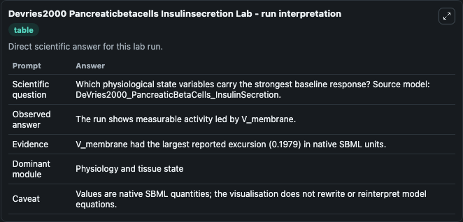
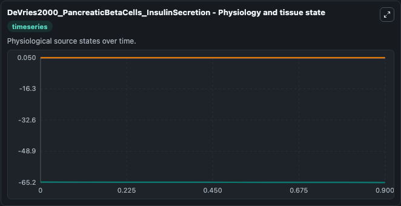
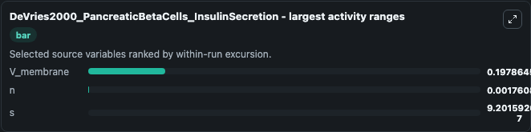
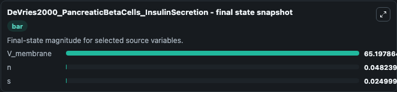
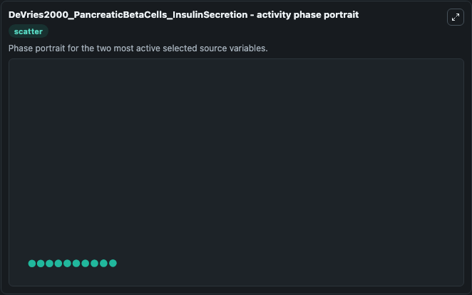

# Devries2000 Pancreaticbetacells Insulinsecretion

This Biosimulant lab wraps `Devries2000 Pancreaticbetacells Insulinsecretion` as a runnable systems biology model with a companion visualization module.
This a model from the article: Channel sharing in pancreatic beta -cells revisited: enhancement of emergentbursting by noise. It can be used to explore the configured dynamics and compare scenario outcomes across configurations.

## What You'll See

The lab asks: Which physiological state variables carry the strongest baseline response? Source model: DeVries2000_PancreaticBetaCells_InsulinSecretion. It runs for 1.0 time units with a communication step of 0.1. The run uses the model defaults declared by the curated SBML wrapper. The generated visualizations focus on V_membrane, n, and s, combining trajectory, endpoint-comparison, and summary-table views from one completed dark-mode run.

In this captured run, **V_membrane** moved from -65.000 to -65.198 across 1.0 simulation windows.


### Output Visualizations



*Summary table for Devries2000 Pancreaticbetacells Insulinsecretion, reporting the scientific question, observed answer, dominant module, and caveat.*



*Trajectories of V_membrane, n, and s across the 1.0 simulation. In this run **V_membrane** fell from -65.000 to -65.198 — the largest movements among the focused observables.*



*Largest-excursion ranking of the focused observables — the absolute movement magnitude during the run. Top 3: **V_membrane** = 0.1979, **n** = 0.00176, **s** = 9.2e-07.*



*Endpoint snapshot of the focused observables — final values from the captured run. Top 3 by value: **V_membrane** = 65.198, **n** = 0.0482, **s** = 0.0250.*



*Visualization card from the Devries2000 Pancreaticbetacells Insulinsecretion dark-mode run.*


## Model Context

- Core model: `models/core`
- Visualization model: `models/visualisation`
- Standard: `other`
- Upstream source: `biomodels_ebi:BIOMD0000000371`
- License: `CC0`

## Inputs

| Input | Maps To | Default | Notes |
|---|---|---|---|
| Initial V Membrane | `systemsbiology_sbml_devries2000_pancreaticbetacells_insulinsecretion_biomd0000000371_model.initial_v_membrane` | | Source state initial condition exposed as a model-specific control because no explicit intervention parameter is identifiable. Maps to SBML symbol `V_membrane`. |
| Initial Model State N | `systemsbiology_sbml_devries2000_pancreaticbetacells_insulinsecretion_biomd0000000371_model.initial_model_state_n` | | Source state initial condition exposed as a model-specific control because no explicit intervention parameter is identifiable. Maps to SBML symbol `n`. |
| Initial Model State S | `systemsbiology_sbml_devries2000_pancreaticbetacells_insulinsecretion_biomd0000000371_model.initial_model_state_s` | | Source state initial condition exposed as a model-specific control because no explicit intervention parameter is identifiable. Maps to SBML symbol `s`. |

## Outputs

| Output | Maps To | Role |
|---|---|---|
| `state` | `systemsbiology_sbml_devries2000_pancreaticbetacells_insulinsecretion_biomd0000000371_model.state` | Available to the visualization model and downstream workflows. |
| `summary` | `systemsbiology_sbml_devries2000_pancreaticbetacells_insulinsecretion_biomd0000000371_model.summary` | Available to the visualization model and downstream workflows. |
| `species_labels` | `systemsbiology_sbml_devries2000_pancreaticbetacells_insulinsecretion_biomd0000000371_model.species_labels` | Available to the visualization model and downstream workflows. |
| `v_membrane` | `systemsbiology_sbml_devries2000_pancreaticbetacells_insulinsecretion_biomd0000000371_model.v_membrane` | Available to the visualization model and downstream workflows. |
| `model_state_n` | `systemsbiology_sbml_devries2000_pancreaticbetacells_insulinsecretion_biomd0000000371_model.model_state_n` | Available to the visualization model and downstream workflows. |
| `model_state_s` | `systemsbiology_sbml_devries2000_pancreaticbetacells_insulinsecretion_biomd0000000371_model.model_state_s` | Available to the visualization model and downstream workflows. |

## Runtime

- Duration: `1.0`
- Communication step: `0.1`

## Running Locally

```bash
biosimulant labs serve
```
