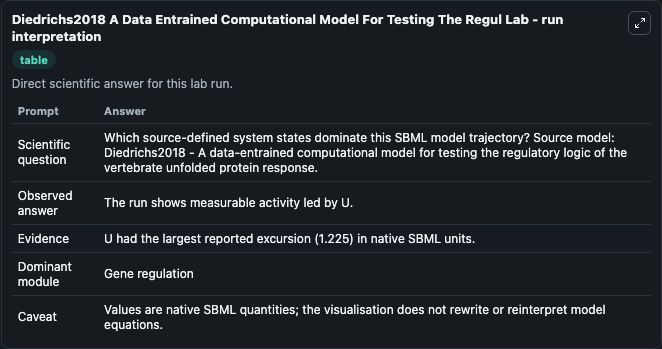
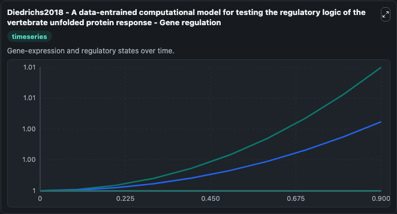
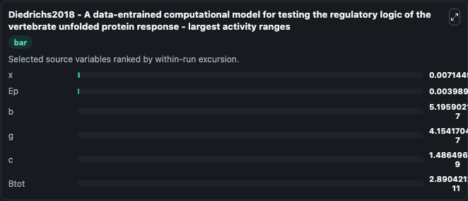
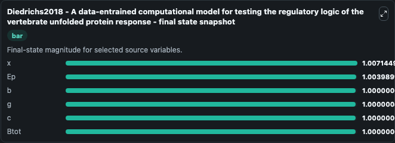
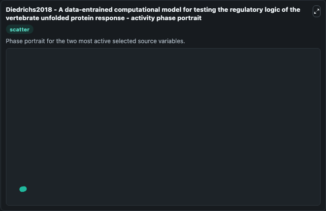

# Diedrichs2018 A Data Entrained Computational Model For Testing The Regul

This Biosimulant lab wraps `Diedrichs2018 A Data Entrained Computational Model For Testing The Regul` as a runnable systems biology model with a companion visualization module.
A data-entrained computational model fortesting the regulatory logic of the vertebrate unfolded proteinresponse This model is described in the article: A data-entrained computational model for testing. It can be used to explore the configured dynamics and compare scenario outcomes across configurations.

## What You'll See

The lab asks: Which source-defined system states dominate this SBML model trajectory? Source model: Diedrichs2018 - A data-entrained computational model for testing the regulatory logic of the vertebrate unfolded protein response. It runs for 1.0 time units with a communication step of 0.1. The run uses the model defaults declared by the curated SBML wrapper. The generated visualizations focus on x, g, c, b, Ep, and Btot, combining trajectory, endpoint-comparison, and summary-table views from one completed dark-mode run.

In this captured run, **x** moved from 1.000 to 1.007 across 1.0 simulation windows.


### Output Visualizations



*Summary table for Diedrichs2018 A Data Entrained Computational Model For Testing The Regul, reporting the scientific question, observed answer, dominant module, and caveat.*



*Trajectories of x, Ep, b, g, c, and Btot across the 1.0 simulation. In this run **x** climbed from 1.000 to 1.007 — the largest movements among the focused observables.*



*Largest-excursion ranking of the focused observables — the absolute movement magnitude during the run. Top 3: **x** = 0.00714, **Ep** = 0.00399, **b** = 5.2e-07, with 3 more observables below.*



*Endpoint snapshot of the focused observables — final values from the captured run. Top 3 by value: **x** = 1.007, **Ep** = 1.004, **b** = 1.000, with 3 more observables below.*



*Visualization card from the Diedrichs2018 A Data Entrained Computational Model For Testing The Regul dark-mode run.*


## Model Context

- Core model: `models/core`
- Visualization model: `models/visualisation`
- Standard: `other`
- Upstream source: `biomodels_ebi:BIOMD0000000703`
- License: `CC0`

## Inputs

| Input | Maps To | Default | Notes |
|---|---|---|---|
| Stress | `systemsbiology_sbml_diedrichs2018_a_data_entrained_computational_mod_biomd0000000703_model.stress` | | Source parameter exposed because its SBML label indicates a boundary, stimulus, dose, ligand, protocol, substrate, or environmental control. Maps to SBML symbol `Stress`. |

## Outputs

| Output | Maps To | Role |
|---|---|---|
| `state` | `systemsbiology_sbml_diedrichs2018_a_data_entrained_computational_mod_biomd0000000703_model.state` | Available to the visualization model and downstream workflows. |
| `summary` | `systemsbiology_sbml_diedrichs2018_a_data_entrained_computational_mod_biomd0000000703_model.summary` | Available to the visualization model and downstream workflows. |
| `species_labels` | `systemsbiology_sbml_diedrichs2018_a_data_entrained_computational_mod_biomd0000000703_model.species_labels` | Available to the visualization model and downstream workflows. |
| `model_state_x` | `systemsbiology_sbml_diedrichs2018_a_data_entrained_computational_mod_biomd0000000703_model.model_state_x` | Available to the visualization model and downstream workflows. |
| `model_state_g` | `systemsbiology_sbml_diedrichs2018_a_data_entrained_computational_mod_biomd0000000703_model.model_state_g` | Available to the visualization model and downstream workflows. |
| `model_state_c` | `systemsbiology_sbml_diedrichs2018_a_data_entrained_computational_mod_biomd0000000703_model.model_state_c` | Available to the visualization model and downstream workflows. |
| `model_state_b` | `systemsbiology_sbml_diedrichs2018_a_data_entrained_computational_mod_biomd0000000703_model.model_state_b` | Available to the visualization model and downstream workflows. |
| `model_state_ep` | `systemsbiology_sbml_diedrichs2018_a_data_entrained_computational_mod_biomd0000000703_model.model_state_ep` | Available to the visualization model and downstream workflows. |
| `btot` | `systemsbiology_sbml_diedrichs2018_a_data_entrained_computational_mod_biomd0000000703_model.btot` | Available to the visualization model and downstream workflows. |

## Runtime

- Duration: `1.0`
- Communication step: `0.1`

## Running Locally

```bash
biosimulant labs serve
```
