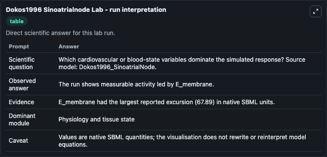
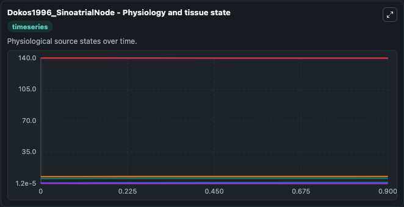
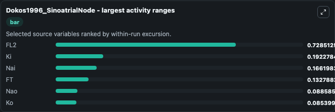
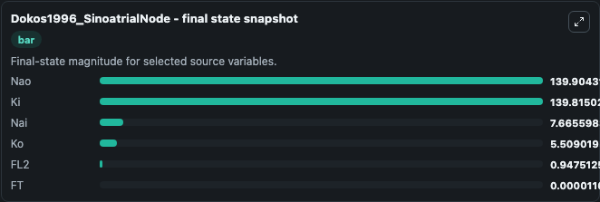
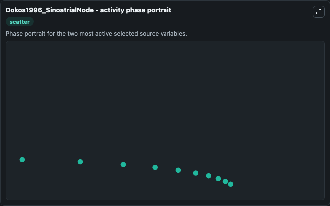

# Dokos1996 Sinoatrialnode

This Biosimulant lab wraps `Dokos1996 Sinoatrialnode` as a runnable systems biology model with a companion visualization module.
This a model from the article: Ion currents underlying sinoatrial node pacemaker activity: a new single cellmathematical model. It can be used to explore the configured dynamics and compare scenario outcomes across configurations.

## What You'll See

The lab asks: Which cardiovascular or blood-state variables dominate the simulated response? Source model: Dokos1996_SinoatrialNode. It runs for 1.0 time units with a communication step of 0.1. The run uses the model defaults declared by the curated SBML wrapper. The generated visualizations focus on Nao, Nai, Ko, Ki, FT, and FL2, combining trajectory, endpoint-comparison, and summary-table views from one completed dark-mode run.

In this captured run, **FL2** moved from 0.2190 to 0.9475 across 1.0 simulation windows.


### Output Visualizations



*Summary table for Dokos1996 Sinoatrialnode, reporting the scientific question, observed answer, dominant module, and caveat.*



*Trajectories of FL2, Ki, Nai, FT, Nao, and Ko across the 1.0 simulation. In this run **FL2** climbed from 0.2190 to 0.9475 and **Ki** fell from 140.0 to 139.8 — the largest movements among the focused observables.*



*Largest-excursion ranking of the focused observables — the absolute movement magnitude during the run. Top 3: **FL2** = 0.7285, **Ki** = 0.1923, **Nai** = 0.1662, with 3 more observables below.*



*Endpoint snapshot of the focused observables — final values from the captured run. Top 3 by value: **Nao** = 139.9, **Ki** = 139.8, **Nai** = 7.666, with 3 more observables below.*



*Visualization card from the Dokos1996 Sinoatrialnode dark-mode run.*


## Model Context

- Core model: `models/core`
- Visualization model: `models/visualisation`
- Standard: `other`
- Upstream source: `biomodels_ebi:MODEL0912503622`
- License: `CC0`

## Inputs

| Input | Maps To | Default | Notes |
|---|---|---|---|
| Initial Model State Nao | `systemsbiology_sbml_dokos1996_sinoatrialnode_model0912503622_model.initial_model_state_nao` | | Source state initial condition exposed as a model-specific control because no explicit intervention parameter is identifiable. Maps to SBML symbol `Nao`. |
| Initial Model State Nai | `systemsbiology_sbml_dokos1996_sinoatrialnode_model0912503622_model.initial_model_state_nai` | | Source state initial condition exposed as a model-specific control because no explicit intervention parameter is identifiable. Maps to SBML symbol `Nai`. |
| Initial Model State Ko | `systemsbiology_sbml_dokos1996_sinoatrialnode_model0912503622_model.initial_model_state_ko` | | Source state initial condition exposed as a model-specific control because no explicit intervention parameter is identifiable. Maps to SBML symbol `Ko`. |
| Initial Model State Ki | `systemsbiology_sbml_dokos1996_sinoatrialnode_model0912503622_model.initial_model_state_ki` | | Source state initial condition exposed as a model-specific control because no explicit intervention parameter is identifiable. Maps to SBML symbol `Ki`. |
| Initial Model State Ft | `systemsbiology_sbml_dokos1996_sinoatrialnode_model0912503622_model.initial_model_state_ft` | | Source state initial condition exposed as a model-specific control because no explicit intervention parameter is identifiable. Maps to SBML symbol `fT`. |
| Initial Model State FL2 | `systemsbiology_sbml_dokos1996_sinoatrialnode_model0912503622_model.initial_model_state_fl2` | | Source state initial condition exposed as a model-specific control because no explicit intervention parameter is identifiable. Maps to SBML symbol `fL2`. |

## Outputs

| Output | Maps To | Role |
|---|---|---|
| `state` | `systemsbiology_sbml_dokos1996_sinoatrialnode_model0912503622_model.state` | Available to the visualization model and downstream workflows. |
| `summary` | `systemsbiology_sbml_dokos1996_sinoatrialnode_model0912503622_model.summary` | Available to the visualization model and downstream workflows. |
| `species_labels` | `systemsbiology_sbml_dokos1996_sinoatrialnode_model0912503622_model.species_labels` | Available to the visualization model and downstream workflows. |
| `nao` | `systemsbiology_sbml_dokos1996_sinoatrialnode_model0912503622_model.nao` | Available to the visualization model and downstream workflows. |
| `nai` | `systemsbiology_sbml_dokos1996_sinoatrialnode_model0912503622_model.nai` | Available to the visualization model and downstream workflows. |
| `model_state_ko` | `systemsbiology_sbml_dokos1996_sinoatrialnode_model0912503622_model.model_state_ko` | Available to the visualization model and downstream workflows. |
| `model_state_ki` | `systemsbiology_sbml_dokos1996_sinoatrialnode_model0912503622_model.model_state_ki` | Available to the visualization model and downstream workflows. |
| `model_state_ft` | `systemsbiology_sbml_dokos1996_sinoatrialnode_model0912503622_model.model_state_ft` | Available to the visualization model and downstream workflows. |
| `fl2` | `systemsbiology_sbml_dokos1996_sinoatrialnode_model0912503622_model.fl2` | Available to the visualization model and downstream workflows. |

## Runtime

- Duration: `1.0`
- Communication step: `0.1`

## Running Locally

```bash
biosimulant labs serve
```
