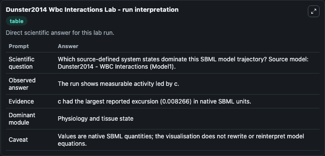
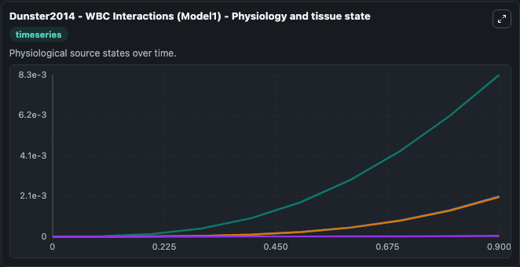
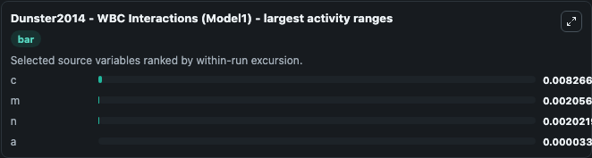
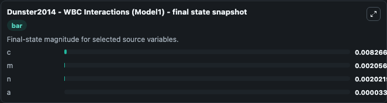
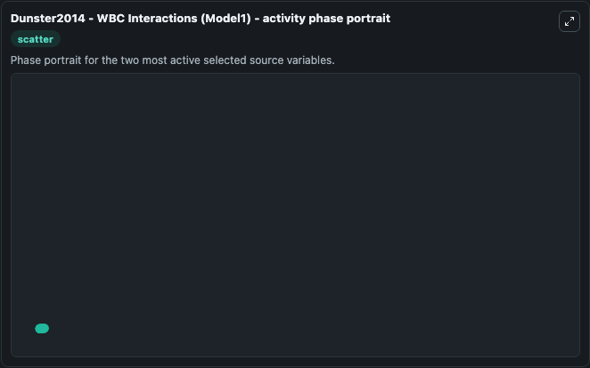

# Dunster2014 Wbc Interactions

This Biosimulant lab wraps `Dunster2014 Wbc Interactions` as a runnable systems biology model with a companion visualization module.
Dunster2014 - WBC Interactions (Model1) This is a sub-model of a three-stepinflammatory response modelling study. It can be used to explore the configured dynamics and compare scenario outcomes across configurations.

## What You'll See

The lab asks: Which source-defined system states dominate this SBML model trajectory? Source model: Dunster2014 - WBC Interactions (Model1). It runs for 1.0 time units with a communication step of 0.1. The run uses the model defaults declared by the curated SBML wrapper. The generated visualizations focus on n, m, c, and a, combining trajectory, endpoint-comparison, and summary-table views from one completed dark-mode run.

In this captured run, **c** moved from 0 to 0.00827 across 1.0 simulation windows.


### Output Visualizations



*Summary table for Dunster2014 Wbc Interactions, reporting the scientific question, observed answer, dominant module, and caveat.*



*Trajectories of c, m, n, and a across the 1.0 simulation. In this run **c** climbed from 0 to 0.00827 — the largest movements among the focused observables.*



*Largest-excursion ranking of the focused observables — the absolute movement magnitude during the run. Top 3: **c** = 0.00827, **m** = 0.00206, **n** = 0.00202, with 1 more observable below.*



*Endpoint snapshot of the focused observables — final values from the captured run. Top 3 by value: **c** = 0.00827, **m** = 0.00206, **n** = 0.00202, with 1 more observable below.*



*Visualization card from the Dunster2014 Wbc Interactions dark-mode run.*


## Model Context

- Core model: `models/core`
- Visualization model: `models/visualisation`
- Standard: `other`
- Upstream source: `biomodels_ebi:BIOMD0000000616`
- License: `CC0`

## Inputs

| Input | Maps To | Default | Notes |
|---|---|---|---|
| Initial Model State N | `systemsbiology_sbml_dunster2014_wbc_interactions_model1_biomd0000000616_model.initial_model_state_n` | | Source state initial condition exposed as a model-specific control because no explicit intervention parameter is identifiable. Maps to SBML symbol `n`. |
| Initial Model State M | `systemsbiology_sbml_dunster2014_wbc_interactions_model1_biomd0000000616_model.initial_model_state_m` | | Source state initial condition exposed as a model-specific control because no explicit intervention parameter is identifiable. Maps to SBML symbol `m`. |
| Initial Model State C | `systemsbiology_sbml_dunster2014_wbc_interactions_model1_biomd0000000616_model.initial_model_state_c` | | Source state initial condition exposed as a model-specific control because no explicit intervention parameter is identifiable. Maps to SBML symbol `c`. |
| Initial Model State A | `systemsbiology_sbml_dunster2014_wbc_interactions_model1_biomd0000000616_model.initial_model_state_a` | | Source state initial condition exposed as a model-specific control because no explicit intervention parameter is identifiable. Maps to SBML symbol `a`. |

## Outputs

| Output | Maps To | Role |
|---|---|---|
| `state` | `systemsbiology_sbml_dunster2014_wbc_interactions_model1_biomd0000000616_model.state` | Available to the visualization model and downstream workflows. |
| `summary` | `systemsbiology_sbml_dunster2014_wbc_interactions_model1_biomd0000000616_model.summary` | Available to the visualization model and downstream workflows. |
| `species_labels` | `systemsbiology_sbml_dunster2014_wbc_interactions_model1_biomd0000000616_model.species_labels` | Available to the visualization model and downstream workflows. |
| `model_state_n` | `systemsbiology_sbml_dunster2014_wbc_interactions_model1_biomd0000000616_model.model_state_n` | Available to the visualization model and downstream workflows. |
| `model_state_m` | `systemsbiology_sbml_dunster2014_wbc_interactions_model1_biomd0000000616_model.model_state_m` | Available to the visualization model and downstream workflows. |
| `model_state_c` | `systemsbiology_sbml_dunster2014_wbc_interactions_model1_biomd0000000616_model.model_state_c` | Available to the visualization model and downstream workflows. |
| `model_state_a` | `systemsbiology_sbml_dunster2014_wbc_interactions_model1_biomd0000000616_model.model_state_a` | Available to the visualization model and downstream workflows. |

## Runtime

- Duration: `1.0`
- Communication step: `0.1`

## Running Locally

```bash
biosimulant labs serve
```
