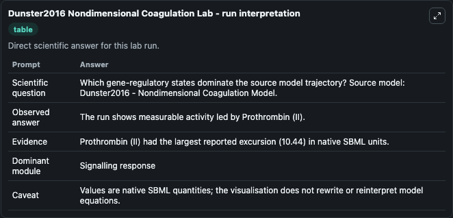
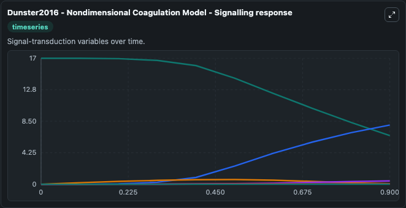
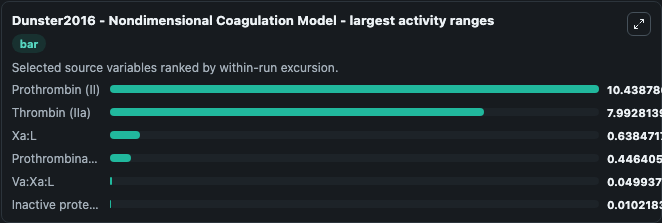
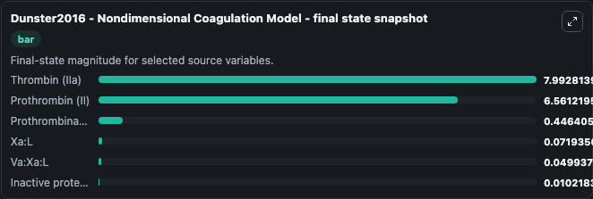
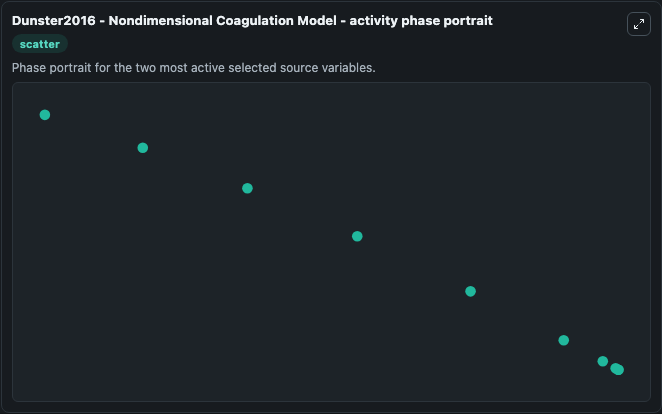

# Dunster2016 Nondimensional Coagulation

This Biosimulant lab wraps `Dunster2016 Nondimensional Coagulation` as a runnable systems biology model with a companion visualization module.
We undertake a mathematical investigation of a model for the generation of thrombin, an enzyme central to haemostatic blood coagulation, as well as to thrombotic disorders, that is the end product of. It can be used to explore the configured dynamics and compare scenario outcomes across configurations.

## What You'll See

The lab asks: Which gene-regulatory states dominate the source model trajectory? Source model: Dunster2016 - Nondimensional Coagulation Model. It runs for 1.0 time units with a communication step of 0.1. The run uses the model defaults declared by the curated SBML wrapper. The generated visualizations focus on Prothrombin (II), Xa:L, Va:Xa:L, Thrombin (IIa), Prothrombinase (Va:Xa), and Inactive protein C, combining trajectory, endpoint-comparison, and summary-table views from one completed dark-mode run.

In this captured run, **Prothrombin (II)** moved from 17.000 to 6.561 across 1.0 simulation windows.


### Output Visualizations



*Summary table for Dunster2016 Nondimensional Coagulation, reporting the scientific question, observed answer, dominant module, and caveat.*



*Trajectories of Prothrombin (II), Thrombin (IIa), Xa:L, Prothrombinase (Va:Xa), Va:Xa:L, and Inactive protein C across the 1.0 simulation. In this run **Thrombin (IIa)** climbed from 0 to 7.993 and **Prothrombin (II)** fell from 17.000 to 6.561 — the largest movements among the focused observables.*



*Largest-excursion ranking of the focused observables — the absolute movement magnitude during the run. Top 3: **Prothrombin (II)** = 10.439, **Thrombin (IIa)** = 7.993, **Xa:L** = 0.6385, with 3 more observables below.*



*Endpoint snapshot of the focused observables — final values from the captured run. Top 3 by value: **Thrombin (IIa)** = 7.993, **Prothrombin (II)** = 6.561, **Prothrombinase (Va:Xa)** = 0.4464, with 3 more observables below.*



*Visualization card from the Dunster2016 Nondimensional Coagulation dark-mode run.*


## Model Context

- Core model: `models/core`
- Visualization model: `models/visualisation`
- Standard: `other`
- Upstream source: `biomodels_ebi:BIOMD0000000925`
- License: `CC0`

## Inputs

| Input | Maps To | Default | Notes |
|---|---|---|---|
| Initial Prothrombin Ii | `systemsbiology_sbml_dunster2016_nondimensional_coagulation_model_biomd0000000925_model.initial_prothrombin_ii` | | Source state initial condition exposed as a model-specific control because no explicit intervention parameter is identifiable. Maps to SBML symbol `Prothrombin__II`. |
| Initial Xa L | `systemsbiology_sbml_dunster2016_nondimensional_coagulation_model_biomd0000000925_model.initial_xa_l` | | Source state initial condition exposed as a model-specific control because no explicit intervention parameter is identifiable. Maps to SBML symbol `Xa_L`. |
| Initial Va Xa L | `systemsbiology_sbml_dunster2016_nondimensional_coagulation_model_biomd0000000925_model.initial_va_xa_l` | | Source state initial condition exposed as a model-specific control because no explicit intervention parameter is identifiable. Maps to SBML symbol `Va_Xa_L`. |
| Initial Thrombin I Ia | `systemsbiology_sbml_dunster2016_nondimensional_coagulation_model_biomd0000000925_model.initial_thrombin_i_ia` | | Source state initial condition exposed as a model-specific control because no explicit intervention parameter is identifiable. Maps to SBML symbol `Thrombin__IIa`. |
| Initial Prothrombinase Va Xa | `systemsbiology_sbml_dunster2016_nondimensional_coagulation_model_biomd0000000925_model.initial_prothrombinase_va_xa` | | Source state initial condition exposed as a model-specific control because no explicit intervention parameter is identifiable. Maps to SBML symbol `Prothrombinase__Va_Xa`. |
| Initial Inactive Protein C | `systemsbiology_sbml_dunster2016_nondimensional_coagulation_model_biomd0000000925_model.initial_inactive_protein_c` | | Source state initial condition exposed as a model-specific control because no explicit intervention parameter is identifiable. Maps to SBML symbol `Inactive_protein_C`. |

## Outputs

| Output | Maps To | Role |
|---|---|---|
| `state` | `systemsbiology_sbml_dunster2016_nondimensional_coagulation_model_biomd0000000925_model.state` | Available to the visualization model and downstream workflows. |
| `summary` | `systemsbiology_sbml_dunster2016_nondimensional_coagulation_model_biomd0000000925_model.summary` | Available to the visualization model and downstream workflows. |
| `species_labels` | `systemsbiology_sbml_dunster2016_nondimensional_coagulation_model_biomd0000000925_model.species_labels` | Available to the visualization model and downstream workflows. |
| `prothrombin_ii` | `systemsbiology_sbml_dunster2016_nondimensional_coagulation_model_biomd0000000925_model.prothrombin_ii` | Available to the visualization model and downstream workflows. |
| `xa_l` | `systemsbiology_sbml_dunster2016_nondimensional_coagulation_model_biomd0000000925_model.xa_l` | Available to the visualization model and downstream workflows. |
| `va_xa_l` | `systemsbiology_sbml_dunster2016_nondimensional_coagulation_model_biomd0000000925_model.va_xa_l` | Available to the visualization model and downstream workflows. |
| `thrombin_i_ia` | `systemsbiology_sbml_dunster2016_nondimensional_coagulation_model_biomd0000000925_model.thrombin_i_ia` | Available to the visualization model and downstream workflows. |
| `prothrombinase_va_xa` | `systemsbiology_sbml_dunster2016_nondimensional_coagulation_model_biomd0000000925_model.prothrombinase_va_xa` | Available to the visualization model and downstream workflows. |
| `inactive_protein_c` | `systemsbiology_sbml_dunster2016_nondimensional_coagulation_model_biomd0000000925_model.inactive_protein_c` | Available to the visualization model and downstream workflows. |

## Runtime

- Duration: `1.0`
- Communication step: `0.1`

## Running Locally

```bash
biosimulant labs serve
```
