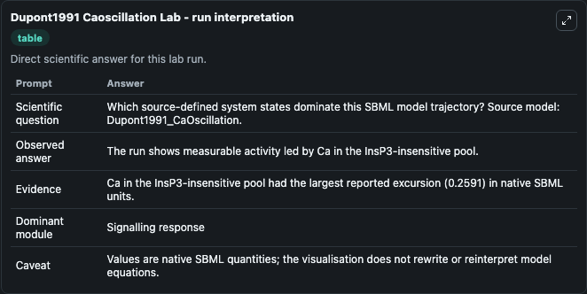
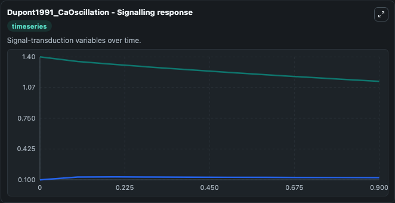
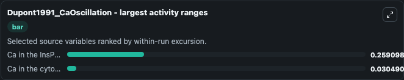
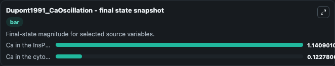
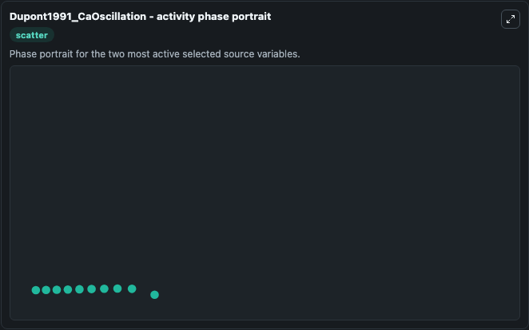

# Dupont1991 Caoscillation

This Biosimulant lab wraps `Dupont1991 Caoscillation` as a runnable systems biology model with a companion visualization module.
This model is according to the paper Signal-induced Ca2+ oscillations: Properties of a model based on Ca2+-induced Ca2+ release. It can be used to explore the configured dynamics and compare scenario outcomes across configurations.

## What You'll See

The lab asks: Which source-defined system states dominate this SBML model trajectory? Source model: Dupont1991_CaOscillation. It runs for 1.0 time units with a communication step of 0.1. The run uses the model defaults declared by the curated SBML wrapper. The generated visualizations focus on Ca in the InsP3-insensitive pool, and Ca in the cytosol, combining trajectory, endpoint-comparison, and summary-table views from one completed dark-mode run.

In this captured run, **Ca in the InsP3-insensitive pool** moved from 1.400 to 1.141 across 1.0 simulation windows.


### Output Visualizations



*Summary table for Dupont1991 Caoscillation, reporting the scientific question, observed answer, dominant module, and caveat.*



*Trajectories of Ca in the InsP3-insensitive pool, and Ca in the cytosol across the 1.0 simulation. In this run **Ca in the cytosol** climbed from 0.1000 to 0.1228 and **Ca in the InsP3-insensitive pool** fell from 1.400 to 1.141 — the largest movements among the focused observables.*



*Largest-excursion ranking of the focused observables — the absolute movement magnitude during the run. Top 2: **Ca in the InsP3-insensitive pool** = 0.2591, **Ca in the cytosol** = 0.0305.*



*Endpoint snapshot of the focused observables — final values from the captured run. Top 2 by value: **Ca in the InsP3-insensitive pool** = 1.141, **Ca in the cytosol** = 0.1228.*



*Visualization card from the Dupont1991 Caoscillation dark-mode run.*


## Model Context

- Core model: `models/core`
- Visualization model: `models/visualisation`
- Standard: `other`
- Upstream source: `biomodels_ebi:BIOMD0000000117`
- License: `CC0`

## Inputs

| Input | Maps To | Default | Notes |
|---|---|---|---|
| Initial Ca In The Ins P3 Insensitive Pool | `systemsbiology_sbml_dupont1991_caoscillation_biomd0000000117_model.initial_ca_in_the_ins_p3_insensitive_pool` | | Source state initial condition exposed as a model-specific control because no explicit intervention parameter is identifiable. Maps to SBML symbol `y`. |
| Initial Ca In The Cytosol | `systemsbiology_sbml_dupont1991_caoscillation_biomd0000000117_model.initial_ca_in_the_cytosol` | | Source state initial condition exposed as a model-specific control because no explicit intervention parameter is identifiable. Maps to SBML symbol `z`. |

## Outputs

| Output | Maps To | Role |
|---|---|---|
| `state` | `systemsbiology_sbml_dupont1991_caoscillation_biomd0000000117_model.state` | Available to the visualization model and downstream workflows. |
| `summary` | `systemsbiology_sbml_dupont1991_caoscillation_biomd0000000117_model.summary` | Available to the visualization model and downstream workflows. |
| `species_labels` | `systemsbiology_sbml_dupont1991_caoscillation_biomd0000000117_model.species_labels` | Available to the visualization model and downstream workflows. |
| `ca_in_the_ins_p3_insensitive_pool` | `systemsbiology_sbml_dupont1991_caoscillation_biomd0000000117_model.ca_in_the_ins_p3_insensitive_pool` | Available to the visualization model and downstream workflows. |
| `ca_in_the_cytosol` | `systemsbiology_sbml_dupont1991_caoscillation_biomd0000000117_model.ca_in_the_cytosol` | Available to the visualization model and downstream workflows. |

## Runtime

- Duration: `1.0`
- Communication step: `0.1`

## Running Locally

```bash
biosimulant labs serve
```
