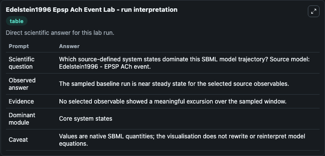
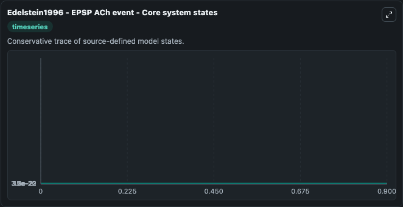
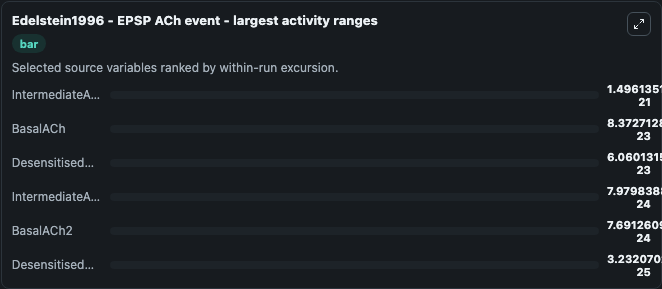
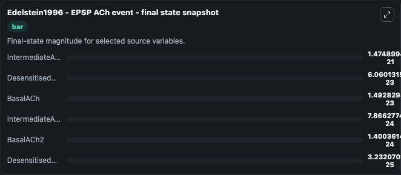
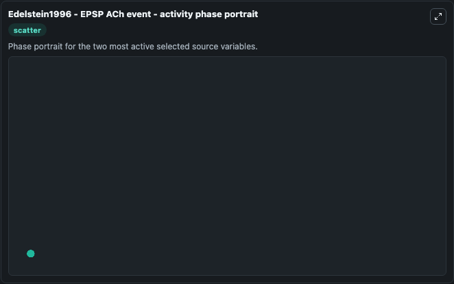

# Edelstein1996 Epsp Ach Event

This Biosimulant lab wraps `Edelstein1996 Epsp Ach Event` as a runnable systems biology model with a companion visualization module.
Edelstein1996 - EPSP ACh event Model of a nicotinic Excitatory Post-Synaptic Potential in a Torpedo electric organ. It can be used to explore the configured dynamics and compare scenario outcomes across configurations.

## What You'll See

The lab asks: Which source-defined system states dominate this SBML model trajectory? Source model: Edelstein1996 - EPSP ACh event. It runs for 1.0 time units with a communication step of 0.1. The run uses the model defaults declared by the curated SBML wrapper. The generated visualizations focus on IntermediateACh2, IntermediateACh, DesensitisedACh2, DesensitisedACh, BasalACh2, and BasalACh, combining trajectory, endpoint-comparison, and summary-table views from one completed dark-mode run.

In this captured run, **IntermediateACh2** moved from 0 to 1.47e-21 across 1.0 simulation windows.


### Output Visualizations



*Summary table for Edelstein1996 Epsp Ach Event, reporting the scientific question, observed answer, dominant module, and caveat.*



*Trajectories of IntermediateACh2, BasalACh, DesensitisedACh2, IntermediateACh, BasalACh2, and DesensitisedACh across the 1.0 simulation. In this run **IntermediateACh2** climbed from 0 to 1.47e-21 — the largest movements among the focused observables.*



*Largest-excursion ranking of the focused observables — the absolute movement magnitude during the run. Top 3: **IntermediateACh2** = 1.5e-21, **BasalACh** = 8.37e-23, **DesensitisedACh2** = 6.06e-23, with 3 more observables below.*



*Endpoint snapshot of the focused observables — final values from the captured run. Top 3 by value: **IntermediateACh2** = 1.47e-21, **DesensitisedACh2** = 6.06e-23, **BasalACh** = 1.49e-23, with 3 more observables below.*



*Visualization card from the Edelstein1996 Epsp Ach Event dark-mode run.*


## Model Context

- Core model: `models/core`
- Visualization model: `models/visualisation`
- Standard: `other`
- Upstream source: `biomodels_ebi:BIOMD0000000001`
- License: `CC0`

## Inputs

| Input | Maps To | Default | Notes |
|---|---|---|---|
| Initial Intermediate A CH2 | `systemsbiology_sbml_edelstein1996_epsp_ach_event_biomd0000000001_model.initial_intermediate_a_ch2` | | Source state initial condition exposed as a model-specific control because no explicit intervention parameter is identifiable. Maps to SBML symbol `ILL`. |
| Initial Intermediate A Ch | `systemsbiology_sbml_edelstein1996_epsp_ach_event_biomd0000000001_model.initial_intermediate_a_ch` | | Source state initial condition exposed as a model-specific control because no explicit intervention parameter is identifiable. Maps to SBML symbol `IL`. |
| Initial Desensitised A CH2 | `systemsbiology_sbml_edelstein1996_epsp_ach_event_biomd0000000001_model.initial_desensitised_a_ch2` | | Source state initial condition exposed as a model-specific control because no explicit intervention parameter is identifiable. Maps to SBML symbol `DLL`. |
| Initial Desensitised A Ch | `systemsbiology_sbml_edelstein1996_epsp_ach_event_biomd0000000001_model.initial_desensitised_a_ch` | | Source state initial condition exposed as a model-specific control because no explicit intervention parameter is identifiable. Maps to SBML symbol `DL`. |
| Initial Basal A CH2 | `systemsbiology_sbml_edelstein1996_epsp_ach_event_biomd0000000001_model.initial_basal_a_ch2` | | Source state initial condition exposed as a model-specific control because no explicit intervention parameter is identifiable. Maps to SBML symbol `BLL`. |
| Initial Basal A Ch | `systemsbiology_sbml_edelstein1996_epsp_ach_event_biomd0000000001_model.initial_basal_a_ch` | | Source state initial condition exposed as a model-specific control because no explicit intervention parameter is identifiable. Maps to SBML symbol `BL`. |

## Outputs

| Output | Maps To | Role |
|---|---|---|
| `state` | `systemsbiology_sbml_edelstein1996_epsp_ach_event_biomd0000000001_model.state` | Available to the visualization model and downstream workflows. |
| `summary` | `systemsbiology_sbml_edelstein1996_epsp_ach_event_biomd0000000001_model.summary` | Available to the visualization model and downstream workflows. |
| `species_labels` | `systemsbiology_sbml_edelstein1996_epsp_ach_event_biomd0000000001_model.species_labels` | Available to the visualization model and downstream workflows. |
| `intermediate_a_ch2` | `systemsbiology_sbml_edelstein1996_epsp_ach_event_biomd0000000001_model.intermediate_a_ch2` | Available to the visualization model and downstream workflows. |
| `intermediate_a_ch` | `systemsbiology_sbml_edelstein1996_epsp_ach_event_biomd0000000001_model.intermediate_a_ch` | Available to the visualization model and downstream workflows. |
| `desensitised_a_ch2` | `systemsbiology_sbml_edelstein1996_epsp_ach_event_biomd0000000001_model.desensitised_a_ch2` | Available to the visualization model and downstream workflows. |
| `desensitised_a_ch` | `systemsbiology_sbml_edelstein1996_epsp_ach_event_biomd0000000001_model.desensitised_a_ch` | Available to the visualization model and downstream workflows. |
| `basal_a_ch2` | `systemsbiology_sbml_edelstein1996_epsp_ach_event_biomd0000000001_model.basal_a_ch2` | Available to the visualization model and downstream workflows. |
| `basal_a_ch` | `systemsbiology_sbml_edelstein1996_epsp_ach_event_biomd0000000001_model.basal_a_ch` | Available to the visualization model and downstream workflows. |

## Runtime

- Duration: `1.0`
- Communication step: `0.1`

## Running Locally

```bash
biosimulant labs serve
```
