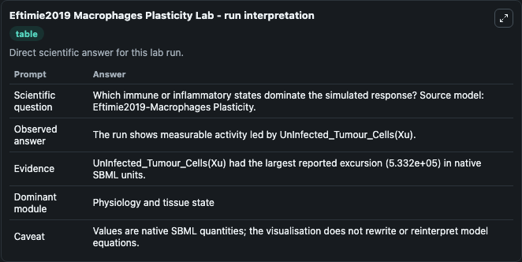
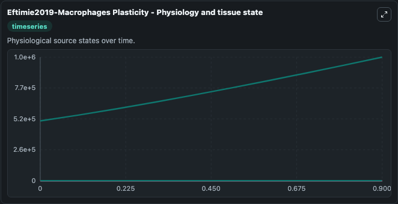
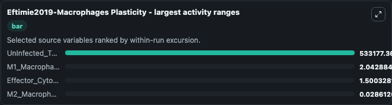
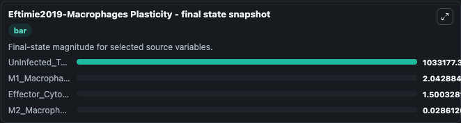
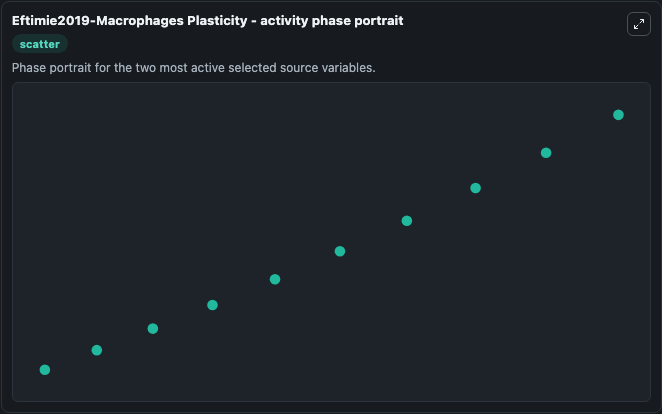

# Eftimie2019 Macrophages Plasticity

This Biosimulant lab wraps `Eftimie2019 Macrophages Plasticity` as a runnable systems biology model with a companion visualization module.
This paper describes the complex interactions between two extreme types of macrophages (M1 and M2 cells), effector T cells and an oncolytic Vesicular Stomatitis Virus (VSV), on the growth/elimination. It can be used to explore the configured dynamics and compare scenario outcomes across configurations.

## What You'll See

The lab asks: Which immune or inflammatory states dominate the simulated response? Source model: Eftimie2019-Macrophages Plasticity. It runs for 1.0 time units with a communication step of 0.1. The run uses the model defaults declared by the curated SBML wrapper. The generated visualizations focus on Virus(Xv), M2_Macrophage(Xm2), M1_Macrophage(Xm1), Infected_Tumour_Cells(Xi), UnInfected_Tumour_Cells(Xu), and Effector_Cytotoxic_CD8_TCells (Xe), combining trajectory, endpoint-comparison, and summary-table views from one completed dark-mode run.

In this captured run, **UnInfected_Tumour_Cells(Xu)** moved from 5e+05 to 1.03e+06 across 1.0 simulation windows.


### Output Visualizations



*Summary table for Eftimie2019 Macrophages Plasticity, reporting the scientific question, observed answer, dominant module, and caveat.*



*Trajectories of UnInfected_Tumour_Cells(Xu), M1_Macrophage(Xm1), Effector_Cytotoxic_CD8_TCells (Xe), M2_Macrophage(Xm2), Virus(Xv), and Infected_Tumour_Cells(Xi) across the 1.0 simulation. In this run **UnInfected_Tumour_Cells(Xu)** climbed from 5e+05 to 1.03e+06 — the largest movements among the focused observables.*



*Largest-excursion ranking of the focused observables — the absolute movement magnitude during the run. Top 3: **UnInfected_Tumour_Cells(Xu)** = 5.33e+05, **M1_Macrophage(Xm1)** = 2.043, **Effector_Cytotoxic_CD8_TCells (Xe)** = 1.500, with 1 more observable below.*



*Endpoint snapshot of the focused observables — final values from the captured run. Top 3 by value: **UnInfected_Tumour_Cells(Xu)** = 1.03e+06, **M1_Macrophage(Xm1)** = 2.043, **Effector_Cytotoxic_CD8_TCells (Xe)** = 1.500, with 1 more observable below.*



*Visualization card from the Eftimie2019 Macrophages Plasticity dark-mode run.*


## Model Context

- Core model: `models/core`
- Visualization model: `models/visualisation`
- Standard: `other`
- Upstream source: `biomodels_ebi:BIOMD0000000806`
- License: `CC0`

## Inputs

| Input | Maps To | Default | Notes |
|---|---|---|---|
| Initial Virus Xv | `systemsbiology_sbml_eftimie2019_macrophages_plasticity_biomd0000000806_model.initial_virus_xv` | | Source state initial condition exposed as a model-specific control because no explicit intervention parameter is identifiable. Maps to SBML symbol `Virus_Xv`. |
| Initial M2 Macrophage XM2 | `systemsbiology_sbml_eftimie2019_macrophages_plasticity_biomd0000000806_model.initial_m2_macrophage_xm2` | | Source state initial condition exposed as a model-specific control because no explicit intervention parameter is identifiable. Maps to SBML symbol `M2_Macrophage_Xm2`. |
| Initial M1 Macrophage XM1 | `systemsbiology_sbml_eftimie2019_macrophages_plasticity_biomd0000000806_model.initial_m1_macrophage_xm1` | | Source state initial condition exposed as a model-specific control because no explicit intervention parameter is identifiable. Maps to SBML symbol `M1_Macrophage_Xm1`. |
| Initial Infected Tumour Cells Xi | `systemsbiology_sbml_eftimie2019_macrophages_plasticity_biomd0000000806_model.initial_infected_tumour_cells_xi` | | Source state initial condition exposed as a model-specific control because no explicit intervention parameter is identifiable. Maps to SBML symbol `Infected_Tumour_Cells_Xi`. |
| Initial Un Infected Tumour Cells Xu | `systemsbiology_sbml_eftimie2019_macrophages_plasticity_biomd0000000806_model.initial_un_infected_tumour_cells_xu` | | Source state initial condition exposed as a model-specific control because no explicit intervention parameter is identifiable. Maps to SBML symbol `UnInfected_Tumour_Cells_Xu`. |
| Initial Effector Cytotoxic CD8 T Cells Xe | `systemsbiology_sbml_eftimie2019_macrophages_plasticity_biomd0000000806_model.initial_effector_cytotoxic_cd8_t_cells_xe` | | Source state initial condition exposed as a model-specific control because no explicit intervention parameter is identifiable. Maps to SBML symbol `Effector_Cytotoxic_CD8_TCells__Xe`. |

## Outputs

| Output | Maps To | Role |
|---|---|---|
| `state` | `systemsbiology_sbml_eftimie2019_macrophages_plasticity_biomd0000000806_model.state` | Available to the visualization model and downstream workflows. |
| `summary` | `systemsbiology_sbml_eftimie2019_macrophages_plasticity_biomd0000000806_model.summary` | Available to the visualization model and downstream workflows. |
| `species_labels` | `systemsbiology_sbml_eftimie2019_macrophages_plasticity_biomd0000000806_model.species_labels` | Available to the visualization model and downstream workflows. |
| `virus_xv` | `systemsbiology_sbml_eftimie2019_macrophages_plasticity_biomd0000000806_model.virus_xv` | Available to the visualization model and downstream workflows. |
| `m2_macrophage_xm2` | `systemsbiology_sbml_eftimie2019_macrophages_plasticity_biomd0000000806_model.m2_macrophage_xm2` | Available to the visualization model and downstream workflows. |
| `m1_macrophage_xm1` | `systemsbiology_sbml_eftimie2019_macrophages_plasticity_biomd0000000806_model.m1_macrophage_xm1` | Available to the visualization model and downstream workflows. |
| `infected_tumour_cells_xi` | `systemsbiology_sbml_eftimie2019_macrophages_plasticity_biomd0000000806_model.infected_tumour_cells_xi` | Available to the visualization model and downstream workflows. |
| `un_infected_tumour_cells_xu` | `systemsbiology_sbml_eftimie2019_macrophages_plasticity_biomd0000000806_model.un_infected_tumour_cells_xu` | Available to the visualization model and downstream workflows. |
| `effector_cytotoxic_cd8_t_cells_xe` | `systemsbiology_sbml_eftimie2019_macrophages_plasticity_biomd0000000806_model.effector_cytotoxic_cd8_t_cells_xe` | Available to the visualization model and downstream workflows. |

## Runtime

- Duration: `1.0`
- Communication step: `0.1`

## Running Locally

```bash
biosimulant labs serve
```
