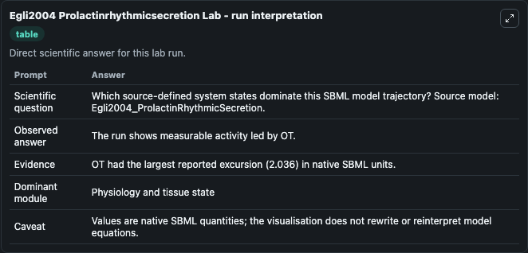
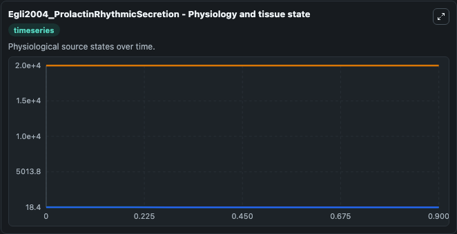
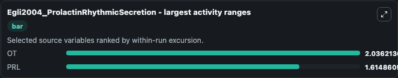
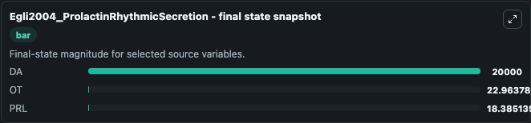
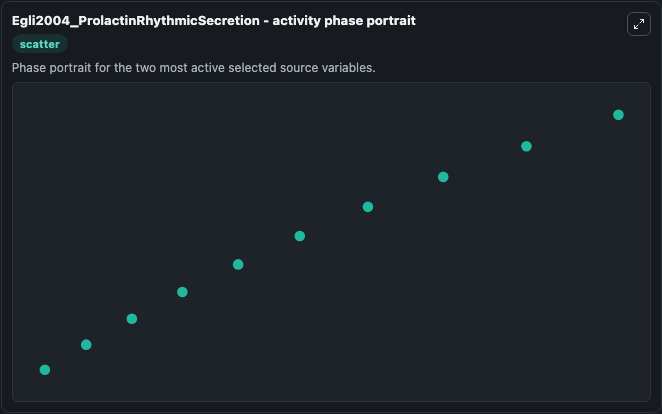

# Egli2004 Prolactinrhythmicsecretion

This Biosimulant lab wraps `Egli2004 Prolactinrhythmicsecretion` as a runnable systems biology model with a companion visualization module.
This a model from the article: Rhythmic secretion of prolactin in rats: action of oxytocin coordinated byvasoactive intestinal polypeptide of suprachiasmatic nucleus origin. It can be used to explore the configured dynamics and compare scenario outcomes across configurations.

## What You'll See

The lab asks: Which source-defined system states dominate this SBML model trajectory? Source model: Egli2004_ProlactinRhythmicSecretion. It runs for 1.0 time units with a communication step of 0.1. The run uses the model defaults declared by the curated SBML wrapper. The generated visualizations focus on PRL, OT, and DA, combining trajectory, endpoint-comparison, and summary-table views from one completed dark-mode run.

In this captured run, **OT** moved from 25.000 to 22.964 across 1.0 simulation windows.


### Output Visualizations



*Summary table for Egli2004 Prolactinrhythmicsecretion, reporting the scientific question, observed answer, dominant module, and caveat.*



*Trajectories of OT, PRL, and DA across the 1.0 simulation. In this run **OT** fell from 25.000 to 22.964 — the largest movements among the focused observables.*



*Largest-excursion ranking of the focused observables — the absolute movement magnitude during the run. Top 2: **OT** = 2.036, **PRL** = 1.615.*



*Endpoint snapshot of the focused observables — final values from the captured run. Top 3 by value: **DA** = 2e+04, **OT** = 22.964, **PRL** = 18.385.*



*Visualization card from the Egli2004 Prolactinrhythmicsecretion dark-mode run.*


## Model Context

- Core model: `models/core`
- Visualization model: `models/visualisation`
- Standard: `other`
- Upstream source: `biomodels_ebi:MODEL0912452142`
- License: `CC0`

## Inputs

| Input | Maps To | Default | Notes |
|---|---|---|---|
| Initial Model State Prl | `systemsbiology_sbml_egli2004_prolactinrhythmicsecretion_model0912452142_model.initial_model_state_prl` | | Source state initial condition exposed as a model-specific control because no explicit intervention parameter is identifiable. Maps to SBML symbol `PRL`. |
| Initial Model State Ot | `systemsbiology_sbml_egli2004_prolactinrhythmicsecretion_model0912452142_model.initial_model_state_ot` | | Source state initial condition exposed as a model-specific control because no explicit intervention parameter is identifiable. Maps to SBML symbol `OT`. |
| Initial Model State Da | `systemsbiology_sbml_egli2004_prolactinrhythmicsecretion_model0912452142_model.initial_model_state_da` | | Source state initial condition exposed as a model-specific control because no explicit intervention parameter is identifiable. Maps to SBML symbol `DA`. |

## Outputs

| Output | Maps To | Role |
|---|---|---|
| `state` | `systemsbiology_sbml_egli2004_prolactinrhythmicsecretion_model0912452142_model.state` | Available to the visualization model and downstream workflows. |
| `summary` | `systemsbiology_sbml_egli2004_prolactinrhythmicsecretion_model0912452142_model.summary` | Available to the visualization model and downstream workflows. |
| `species_labels` | `systemsbiology_sbml_egli2004_prolactinrhythmicsecretion_model0912452142_model.species_labels` | Available to the visualization model and downstream workflows. |
| `prl` | `systemsbiology_sbml_egli2004_prolactinrhythmicsecretion_model0912452142_model.prl` | Available to the visualization model and downstream workflows. |
| `model_state_ot` | `systemsbiology_sbml_egli2004_prolactinrhythmicsecretion_model0912452142_model.model_state_ot` | Available to the visualization model and downstream workflows. |
| `model_state_da` | `systemsbiology_sbml_egli2004_prolactinrhythmicsecretion_model0912452142_model.model_state_da` | Available to the visualization model and downstream workflows. |

## Runtime

- Duration: `1.0`
- Communication step: `0.1`

## Running Locally

```bash
biosimulant labs serve
```
