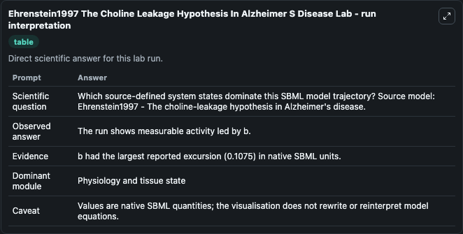
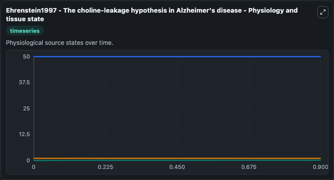
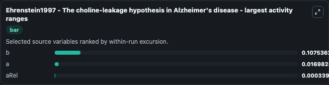
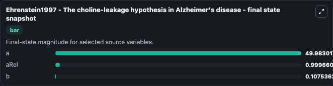
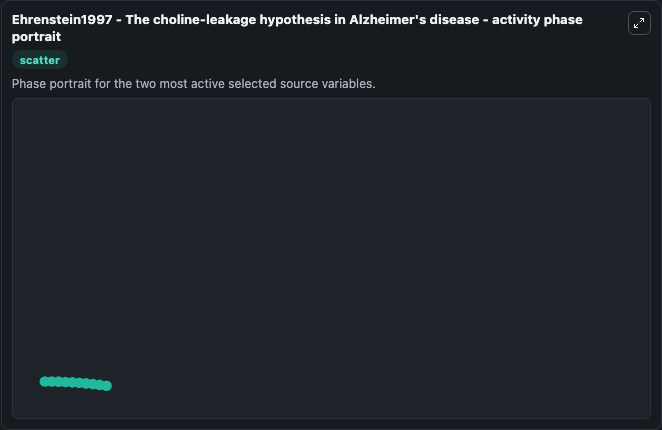

# Ehrenstein1997 The Choline Leakage Hypothesis In Alzheimer S Disease

This Biosimulant lab wraps `Ehrenstein1997 The Choline Leakage Hypothesis In Alzheimer S Disease` as a runnable systems biology model with a companion visualization module.
Ehrenstein1997 - The choline-leakagehypothesis in Alzheimer's disease This model is described in the article: The choline-leakage hypothesis for the loss of acetylcholine in Alzheimer's disease. It can be used to explore the configured dynamics and compare scenario outcomes across configurations.

## What You'll See

The lab asks: Which source-defined system states dominate this SBML model trajectory? Source model: Ehrenstein1997 - The choline-leakage hypothesis in Alzheimer's disease. It runs for 1.0 time units with a communication step of 0.1. The run uses the model defaults declared by the curated SBML wrapper. The generated visualizations focus on aRel, a, and b, combining trajectory, endpoint-comparison, and summary-table views from one completed dark-mode run.

In this captured run, **b** moved from 0 to 0.1075 across 1.0 simulation windows.


### Output Visualizations



*Summary table for Ehrenstein1997 The Choline Leakage Hypothesis In Alzheimer S Disease, reporting the scientific question, observed answer, dominant module, and caveat.*



*Trajectories of b, a, and aRel across the 1.0 simulation. In this run **b** climbed from 0 to 0.1075 and **a** fell from 50.000 to 49.983 — the largest movements among the focused observables.*



*Largest-excursion ranking of the focused observables — the absolute movement magnitude during the run. Top 3: **b** = 0.1075, **a** = 0.0170, **aRel** = 0.00034.*



*Trajectories of b, a, and aRel across the 1.0 simulation. In this run **b** climbed from 0 to 0.1075 and **a** fell from 50.000 to 49.983 — the largest movements among the focused observables.*



*Visualization card from the Ehrenstein1997 The Choline Leakage Hypothesis In Alzheimer S Disease dark-mode run.*


## Model Context

- Core model: `models/core`
- Visualization model: `models/visualisation`
- Standard: `other`
- Upstream source: `biomodels_ebi:BIOMD0000000553`
- License: `CC0`

## Inputs

| Input | Maps To | Default | Notes |
|---|---|---|---|
| Initial A Rel | `systemsbiology_sbml_ehrenstein1997_the_choline_leakage_hypothesis_in_biomd0000000553_model.initial_a_rel` | | Source state initial condition exposed as a model-specific control because no explicit intervention parameter is identifiable. Maps to SBML symbol `aRel`. |
| Initial Model State A | `systemsbiology_sbml_ehrenstein1997_the_choline_leakage_hypothesis_in_biomd0000000553_model.initial_model_state_a` | | Source state initial condition exposed as a model-specific control because no explicit intervention parameter is identifiable. Maps to SBML symbol `a`. |
| Initial Model State B | `systemsbiology_sbml_ehrenstein1997_the_choline_leakage_hypothesis_in_biomd0000000553_model.initial_model_state_b` | | Source state initial condition exposed as a model-specific control because no explicit intervention parameter is identifiable. Maps to SBML symbol `b`. |

## Outputs

| Output | Maps To | Role |
|---|---|---|
| `state` | `systemsbiology_sbml_ehrenstein1997_the_choline_leakage_hypothesis_in_biomd0000000553_model.state` | Available to the visualization model and downstream workflows. |
| `summary` | `systemsbiology_sbml_ehrenstein1997_the_choline_leakage_hypothesis_in_biomd0000000553_model.summary` | Available to the visualization model and downstream workflows. |
| `species_labels` | `systemsbiology_sbml_ehrenstein1997_the_choline_leakage_hypothesis_in_biomd0000000553_model.species_labels` | Available to the visualization model and downstream workflows. |
| `a_rel` | `systemsbiology_sbml_ehrenstein1997_the_choline_leakage_hypothesis_in_biomd0000000553_model.a_rel` | Available to the visualization model and downstream workflows. |
| `model_state_a` | `systemsbiology_sbml_ehrenstein1997_the_choline_leakage_hypothesis_in_biomd0000000553_model.model_state_a` | Available to the visualization model and downstream workflows. |
| `model_state_b` | `systemsbiology_sbml_ehrenstein1997_the_choline_leakage_hypothesis_in_biomd0000000553_model.model_state_b` | Available to the visualization model and downstream workflows. |

## Runtime

- Duration: `1.0`
- Communication step: `0.1`

## Running Locally

```bash
biosimulant labs serve
```
