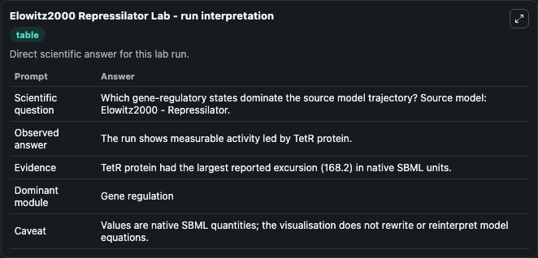
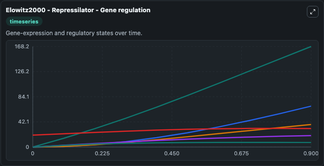
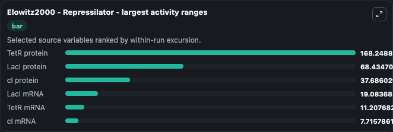
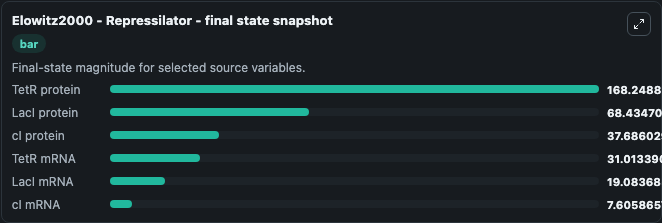
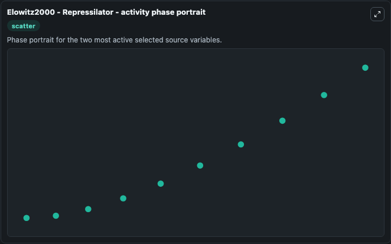

# Elowitz2000 Repressilator

This Biosimulant lab wraps `Elowitz2000 Repressilator` as a runnable systems biology model with a companion visualization module.
Elowitz2000 - Repressilator This model describes the deterministic version of the repressilator system. It can be used to explore the configured dynamics and compare scenario outcomes across configurations.

## What You'll See

The lab asks: Which gene-regulatory states dominate the source model trajectory? Source model: Elowitz2000 - Repressilator. It runs for 1.0 time units with a communication step of 0.1. The run uses the model defaults declared by the curated SBML wrapper. The generated visualizations focus on cI protein, TetR protein, LacI protein, TetR mRNA, cI mRNA, and LacI mRNA, combining trajectory, endpoint-comparison, and summary-table views from one completed dark-mode run.

In this captured run, **TetR protein** moved from 0 to 168.2 across 1.0 simulation windows.


### Output Visualizations



*Summary table for Elowitz2000 Repressilator, reporting the scientific question, observed answer, dominant module, and caveat.*



*Trajectories of TetR protein, LacI protein, cI protein, LacI mRNA, TetR mRNA, and cI mRNA across the 1.0 simulation. In this run **TetR protein** climbed from 0 to 168.2 — the largest movements among the focused observables.*



*Largest-excursion ranking of the focused observables — the absolute movement magnitude during the run. Top 3: **TetR protein** = 168.2, **LacI protein** = 68.435, **cI protein** = 37.686, with 3 more observables below.*



*Endpoint snapshot of the focused observables — final values from the captured run. Top 3 by value: **TetR protein** = 168.2, **LacI protein** = 68.435, **cI protein** = 37.686, with 3 more observables below.*



*Visualization card from the Elowitz2000 Repressilator dark-mode run.*


## Model Context

- Core model: `models/core`
- Visualization model: `models/visualisation`
- Standard: `other`
- Upstream source: `biomodels_ebi:BIOMD0000000012`
- License: `CC0`

## Inputs

| Input | Maps To | Default | Notes |
|---|---|---|---|
| Initial C I Protein | `systemsbiology_sbml_elowitz2000_repressilator_biomd0000000012_model.initial_c_i_protein` | | Source state initial condition exposed as a model-specific control because no explicit intervention parameter is identifiable. Maps to SBML symbol `PZ`. |
| Initial Tet R Protein | `systemsbiology_sbml_elowitz2000_repressilator_biomd0000000012_model.initial_tet_r_protein` | | Source state initial condition exposed as a model-specific control because no explicit intervention parameter is identifiable. Maps to SBML symbol `PY`. |
| Initial Lac I Protein | `systemsbiology_sbml_elowitz2000_repressilator_biomd0000000012_model.initial_lac_i_protein` | | Source state initial condition exposed as a model-specific control because no explicit intervention parameter is identifiable. Maps to SBML symbol `PX`. |
| Initial Tet R MRNA | `systemsbiology_sbml_elowitz2000_repressilator_biomd0000000012_model.initial_tet_r_mrna` | | Source state initial condition exposed as a model-specific control because no explicit intervention parameter is identifiable. Maps to SBML symbol `Y`. |
| Initial C I MRNA | `systemsbiology_sbml_elowitz2000_repressilator_biomd0000000012_model.initial_c_i_mrna` | | Source state initial condition exposed as a model-specific control because no explicit intervention parameter is identifiable. Maps to SBML symbol `Z`. |
| Initial Lac I MRNA | `systemsbiology_sbml_elowitz2000_repressilator_biomd0000000012_model.initial_lac_i_mrna` | | Source state initial condition exposed as a model-specific control because no explicit intervention parameter is identifiable. Maps to SBML symbol `X`. |

## Outputs

| Output | Maps To | Role |
|---|---|---|
| `state` | `systemsbiology_sbml_elowitz2000_repressilator_biomd0000000012_model.state` | Available to the visualization model and downstream workflows. |
| `summary` | `systemsbiology_sbml_elowitz2000_repressilator_biomd0000000012_model.summary` | Available to the visualization model and downstream workflows. |
| `species_labels` | `systemsbiology_sbml_elowitz2000_repressilator_biomd0000000012_model.species_labels` | Available to the visualization model and downstream workflows. |
| `c_i_protein` | `systemsbiology_sbml_elowitz2000_repressilator_biomd0000000012_model.c_i_protein` | Available to the visualization model and downstream workflows. |
| `tet_r_protein` | `systemsbiology_sbml_elowitz2000_repressilator_biomd0000000012_model.tet_r_protein` | Available to the visualization model and downstream workflows. |
| `lac_i_protein` | `systemsbiology_sbml_elowitz2000_repressilator_biomd0000000012_model.lac_i_protein` | Available to the visualization model and downstream workflows. |
| `tet_r_mrna` | `systemsbiology_sbml_elowitz2000_repressilator_biomd0000000012_model.tet_r_mrna` | Available to the visualization model and downstream workflows. |
| `c_i_mrna` | `systemsbiology_sbml_elowitz2000_repressilator_biomd0000000012_model.c_i_mrna` | Available to the visualization model and downstream workflows. |
| `lac_i_mrna` | `systemsbiology_sbml_elowitz2000_repressilator_biomd0000000012_model.lac_i_mrna` | Available to the visualization model and downstream workflows. |

## Runtime

- Duration: `1.0`
- Communication step: `0.1`

## Running Locally

```bash
biosimulant labs serve
```
