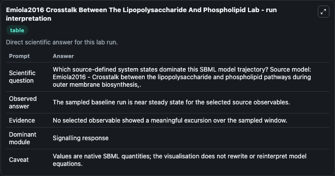
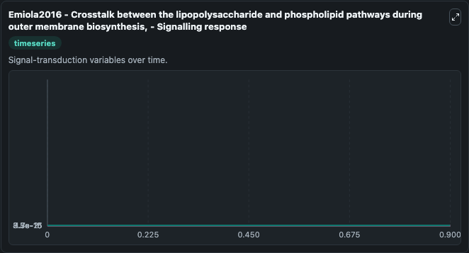
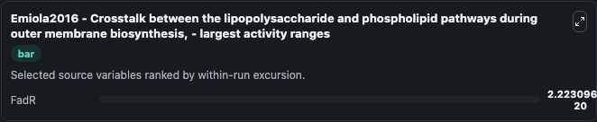
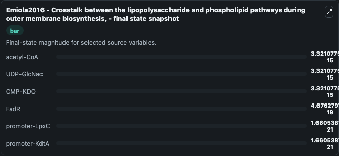

# Emiola2016 Crosstalk Between The Lipopolysaccharide And Phospholipid

This Biosimulant lab wraps `Emiola2016 Crosstalk Between The Lipopolysaccharide And Phospholipid` as a runnable systems biology model with a companion visualization module.
Systems Biology Emiola2016Crosstalk Between The Lipopolysacchar Model1601080000Model captures core biological behavior in the context of systemsbiology, sbml, biomodels_ebi using a biomodels_ebi-sourced OTHER m. It can be used to explore the configured dynamics and compare scenario outcomes across configurations.

## What You'll See

The lab asks: Which source-defined system states dominate this SBML model trajectory? Source model: Emiola2016 - Crosstalk between the lipopolysaccharide and phospholipid pathways during outer membrane biosynthesis,. It runs for 1.0 time units with a communication step of 0.1. The run uses the model defaults declared by the curated SBML wrapper. The generated visualizations focus on promoter-LpxC, promoter-KdtA, acetyl-CoA, UDP-GlcNac, CMP-KDO, and FadR, combining trajectory, endpoint-comparison, and summary-table views from one completed dark-mode run.

In this captured run, **FadR** moved from 4.9e-19 to 4.68e-19 across 1.0 simulation windows.


### Output Visualizations



*Summary table for Emiola2016 Crosstalk Between The Lipopolysaccharide And Phospholipid, reporting the scientific question, observed answer, dominant module, and caveat.*



*Trajectories of FadR, promoter-LpxC, promoter-KdtA, acetyl-CoA, UDP-GlcNac, and CMP-KDO across the 1.0 simulation. In this run **FadR** fell from 4.9e-19 to 4.68e-19 — the largest movements among the focused observables.*



*Largest-excursion ranking of the focused observables — the absolute movement magnitude during the run. Top 1: **FadR** = 2.22e-20.*



*Endpoint snapshot of the focused observables — final values from the captured run. Top 3 by value: **acetyl-CoA** = 3.32e-15, **UDP-GlcNac** = 3.32e-15, **CMP-KDO** = 3.32e-15, with 3 more observables below.*


## Model Context

- Core model: `models/core`
- Visualization model: `models/visualisation`
- Standard: `other`
- Upstream source: `biomodels_ebi:MODEL1601080000`
- License: `CC0`

## Inputs

| Input | Maps To | Default | Notes |
|---|---|---|---|
| Initial Promoter Lpx C | `systemsbiology_sbml_emiola2016_crosstalk_between_the_lipopolysacchar_model1601080000_model.initial_promoter_lpx_c` | | Source state initial condition exposed as a model-specific control because no explicit intervention parameter is identifiable. Maps to SBML symbol `promoter_LpxC`. |
| Initial Promoter Kdt A | `systemsbiology_sbml_emiola2016_crosstalk_between_the_lipopolysacchar_model1601080000_model.initial_promoter_kdt_a` | | Source state initial condition exposed as a model-specific control because no explicit intervention parameter is identifiable. Maps to SBML symbol `promoter_KdtA`. |
| Initial Acetyl Co A | `systemsbiology_sbml_emiola2016_crosstalk_between_the_lipopolysacchar_model1601080000_model.initial_acetyl_co_a` | | Source state initial condition exposed as a model-specific control because no explicit intervention parameter is identifiable. Maps to SBML symbol `acetyl_CoA`. |
| Initial Udp Glc Nac | `systemsbiology_sbml_emiola2016_crosstalk_between_the_lipopolysacchar_model1601080000_model.initial_udp_glc_nac` | | Source state initial condition exposed as a model-specific control because no explicit intervention parameter is identifiable. Maps to SBML symbol `UDP_GlcNac`. |
| Initial Cmp Kdo | `systemsbiology_sbml_emiola2016_crosstalk_between_the_lipopolysacchar_model1601080000_model.initial_cmp_kdo` | | Source state initial condition exposed as a model-specific control because no explicit intervention parameter is identifiable. Maps to SBML symbol `CMP_KDO`. |
| Initial Fad R | `systemsbiology_sbml_emiola2016_crosstalk_between_the_lipopolysacchar_model1601080000_model.initial_fad_r` | | Source state initial condition exposed as a model-specific control because no explicit intervention parameter is identifiable. Maps to SBML symbol `FadR_0`. |

## Outputs

| Output | Maps To | Role |
|---|---|---|
| `state` | `systemsbiology_sbml_emiola2016_crosstalk_between_the_lipopolysacchar_model1601080000_model.state` | Available to the visualization model and downstream workflows. |
| `summary` | `systemsbiology_sbml_emiola2016_crosstalk_between_the_lipopolysacchar_model1601080000_model.summary` | Available to the visualization model and downstream workflows. |
| `species_labels` | `systemsbiology_sbml_emiola2016_crosstalk_between_the_lipopolysacchar_model1601080000_model.species_labels` | Available to the visualization model and downstream workflows. |
| `promoter_lpx_c` | `systemsbiology_sbml_emiola2016_crosstalk_between_the_lipopolysacchar_model1601080000_model.promoter_lpx_c` | Available to the visualization model and downstream workflows. |
| `promoter_kdt_a` | `systemsbiology_sbml_emiola2016_crosstalk_between_the_lipopolysacchar_model1601080000_model.promoter_kdt_a` | Available to the visualization model and downstream workflows. |
| `acetyl_co_a` | `systemsbiology_sbml_emiola2016_crosstalk_between_the_lipopolysacchar_model1601080000_model.acetyl_co_a` | Available to the visualization model and downstream workflows. |
| `udp_glc_nac` | `systemsbiology_sbml_emiola2016_crosstalk_between_the_lipopolysacchar_model1601080000_model.udp_glc_nac` | Available to the visualization model and downstream workflows. |
| `cmp_kdo` | `systemsbiology_sbml_emiola2016_crosstalk_between_the_lipopolysacchar_model1601080000_model.cmp_kdo` | Available to the visualization model and downstream workflows. |
| `fad_r` | `systemsbiology_sbml_emiola2016_crosstalk_between_the_lipopolysacchar_model1601080000_model.fad_r` | Available to the visualization model and downstream workflows. |

## Runtime

- Duration: `1.0`
- Communication step: `0.1`

## Running Locally

```bash
biosimulant labs serve
```
