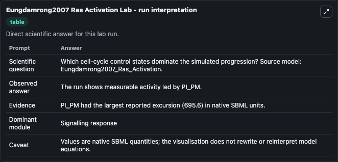
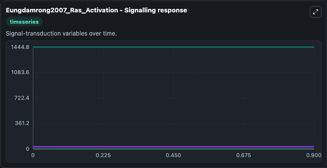
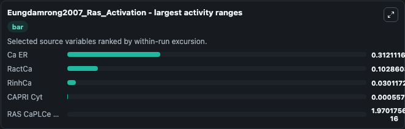
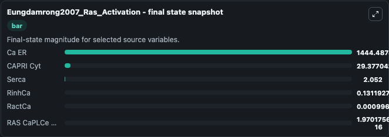
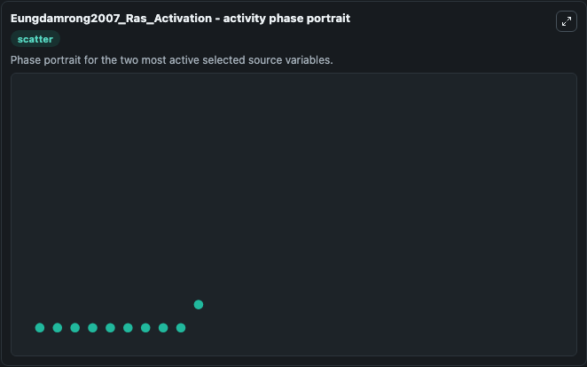

# Eungdamrong2007 Ras Activation

This Biosimulant lab wraps `Eungdamrong2007 Ras Activation` as a runnable systems biology model with a companion visualization module.
The model reproduces the time profiles of Golgi Ras-GTP and plasma membrane Ras-GTP, subjected to a palmitoylation rate of 0.00015849 second inverse. It can be used to explore the configured dynamics and compare scenario outcomes across configurations.

## What You'll See

The lab asks: Which cell-cycle control states dominate the simulated progression? Source model: Eungdamrong2007_Ras_Activation. It runs for 1.0 time units with a communication step of 0.1. The run uses the model defaults declared by the curated SBML wrapper. The generated visualizations focus on RactCa, Ca ER, Serca, CAPRI Cyt, RinhCa, and RAS CaPLCe GM, combining trajectory, endpoint-comparison, and summary-table views from one completed dark-mode run.

In this captured run, **Ca ER** moved from 1444.8 to 1444.5 across 1.0 simulation windows.


### Output Visualizations



*Summary table for Eungdamrong2007 Ras Activation, reporting the scientific question, observed answer, dominant module, and caveat.*



*Trajectories of Ca ER, RactCa, RinhCa, CAPRI Cyt, RAS CaPLCe GM, and Serca across the 1.0 simulation. In this run **RAS CaPLCe GM** climbed from 0 to 1.97e-16 and **Ca ER** fell from 1444.8 to 1444.5 — the largest movements among the focused observables.*



*Largest-excursion ranking of the focused observables — the absolute movement magnitude during the run. Top 3: **Ca ER** = 0.3121, **RactCa** = 0.1029, **RinhCa** = 0.0301, with 2 more observables below.*



*Endpoint snapshot of the focused observables — final values from the captured run. Top 3 by value: **Ca ER** = 1444.5, **CAPRI Cyt** = 29.377, **Serca** = 2.052, with 3 more observables below.*



*Visualization card from the Eungdamrong2007 Ras Activation dark-mode run.*


## Model Context

- Core model: `models/core`
- Visualization model: `models/visualisation`
- Standard: `other`
- Upstream source: `biomodels_ebi:BIOMD0000000161`
- License: `CC0`

## Inputs

| Input | Maps To | Default | Notes |
|---|---|---|---|
| Initial Ract Ca | `systemsbiology_sbml_eungdamrong2007_ras_activation_biomd0000000161_model.initial_ract_ca` | | Source state initial condition exposed as a model-specific control because no explicit intervention parameter is identifiable. Maps to SBML symbol `RactCa`. |
| Initial Ca Er | `systemsbiology_sbml_eungdamrong2007_ras_activation_biomd0000000161_model.initial_ca_er` | | Source state initial condition exposed as a model-specific control because no explicit intervention parameter is identifiable. Maps to SBML symbol `Ca_ER`. |
| Initial Serca | `systemsbiology_sbml_eungdamrong2007_ras_activation_biomd0000000161_model.initial_serca` | | Source state initial condition exposed as a model-specific control because no explicit intervention parameter is identifiable. Maps to SBML symbol `serca`. |
| Initial Capri Cyt | `systemsbiology_sbml_eungdamrong2007_ras_activation_biomd0000000161_model.initial_capri_cyt` | | Source state initial condition exposed as a model-specific control because no explicit intervention parameter is identifiable. Maps to SBML symbol `CAPRI_cyt`. |
| Initial Rinh Ca | `systemsbiology_sbml_eungdamrong2007_ras_activation_biomd0000000161_model.initial_rinh_ca` | | Source state initial condition exposed as a model-specific control because no explicit intervention parameter is identifiable. Maps to SBML symbol `RinhCa`. |
| Initial RAS Ca Pl Ce Gm | `systemsbiology_sbml_eungdamrong2007_ras_activation_biomd0000000161_model.initial_ras_ca_pl_ce_gm` | | Source state initial condition exposed as a model-specific control because no explicit intervention parameter is identifiable. Maps to SBML symbol `Ras_CaPLCe_GM`. |

## Outputs

| Output | Maps To | Role |
|---|---|---|
| `state` | `systemsbiology_sbml_eungdamrong2007_ras_activation_biomd0000000161_model.state` | Available to the visualization model and downstream workflows. |
| `summary` | `systemsbiology_sbml_eungdamrong2007_ras_activation_biomd0000000161_model.summary` | Available to the visualization model and downstream workflows. |
| `species_labels` | `systemsbiology_sbml_eungdamrong2007_ras_activation_biomd0000000161_model.species_labels` | Available to the visualization model and downstream workflows. |
| `ract_ca` | `systemsbiology_sbml_eungdamrong2007_ras_activation_biomd0000000161_model.ract_ca` | Available to the visualization model and downstream workflows. |
| `ca_er` | `systemsbiology_sbml_eungdamrong2007_ras_activation_biomd0000000161_model.ca_er` | Available to the visualization model and downstream workflows. |
| `serca` | `systemsbiology_sbml_eungdamrong2007_ras_activation_biomd0000000161_model.serca` | Available to the visualization model and downstream workflows. |
| `capri_cyt` | `systemsbiology_sbml_eungdamrong2007_ras_activation_biomd0000000161_model.capri_cyt` | Available to the visualization model and downstream workflows. |
| `rinh_ca` | `systemsbiology_sbml_eungdamrong2007_ras_activation_biomd0000000161_model.rinh_ca` | Available to the visualization model and downstream workflows. |
| `ras_ca_pl_ce_gm` | `systemsbiology_sbml_eungdamrong2007_ras_activation_biomd0000000161_model.ras_ca_pl_ce_gm` | Available to the visualization model and downstream workflows. |

## Runtime

- Duration: `1.0`
- Communication step: `0.1`

## Running Locally

```bash
biosimulant labs serve
```
