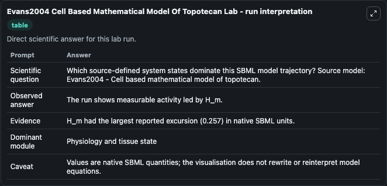
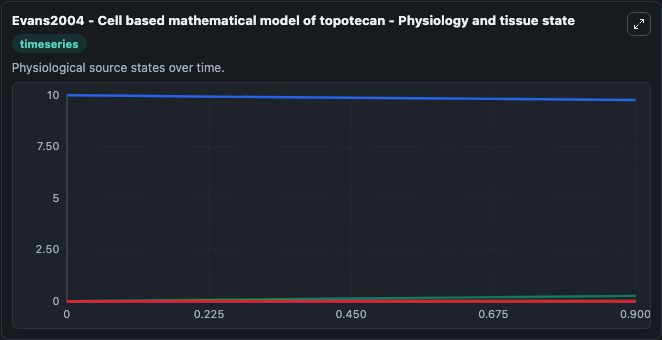
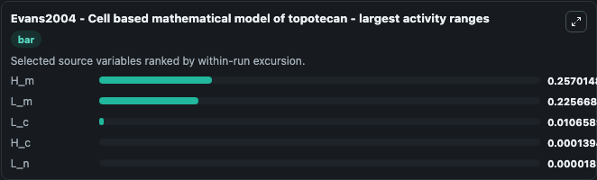
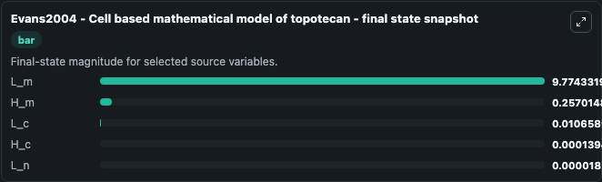
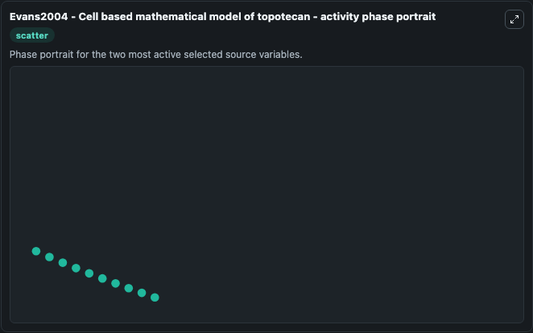

# Evans2004 Cell Based Mathematical Model Of Topotecan

This Biosimulant lab wraps `Evans2004 Cell Based Mathematical Model Of Topotecan` as a runnable systems biology model with a companion visualization module.
A two compartment mathematical model of the antineoplastic compound topotecan. It can be used to explore the configured dynamics and compare scenario outcomes across configurations.

## What You'll See

The lab asks: Which source-defined system states dominate this SBML model trajectory? Source model: Evans2004 - Cell based mathematical model of topotecan. It runs for 1.0 time units with a communication step of 0.1. The run uses the model defaults declared by the curated SBML wrapper. The generated visualizations focus on L_m, L_n, L_c, H_m, and H_c, combining trajectory, endpoint-comparison, and summary-table views from one completed dark-mode run.

In this captured run, **H_m** moved from 0 to 0.2570 across 1.0 simulation windows.


### Output Visualizations



*Summary table for Evans2004 Cell Based Mathematical Model Of Topotecan, reporting the scientific question, observed answer, dominant module, and caveat.*



*Trajectories of H_m, L_m, L_c, H_c, and L_n across the 1.0 simulation. In this run **H_m** climbed from 0 to 0.2570 and **L_m** fell from 10.000 to 9.774 — the largest movements among the focused observables.*



*Largest-excursion ranking of the focused observables — the absolute movement magnitude during the run. Top 3: **H_m** = 0.2570, **L_m** = 0.2257, **L_c** = 0.0107, with 2 more observables below.*



*Endpoint snapshot of the focused observables — final values from the captured run. Top 3 by value: **L_m** = 9.774, **H_m** = 0.2570, **L_c** = 0.0107, with 2 more observables below.*



*Visualization card from the Evans2004 Cell Based Mathematical Model Of Topotecan dark-mode run.*


## Model Context

- Core model: `models/core`
- Visualization model: `models/visualisation`
- Standard: `other`
- Upstream source: `biomodels_ebi:BIOMD0000000945`
- License: `CC0`

## Inputs

| Input | Maps To | Default | Notes |
|---|---|---|---|
| Initial Model State L M | `systemsbiology_sbml_evans2004_cell_based_mathematical_model_of_topot_biomd0000000945_model.initial_model_state_l_m` | | Source state initial condition exposed as a model-specific control because no explicit intervention parameter is identifiable. Maps to SBML symbol `L_m`. |
| Initial Model State L N | `systemsbiology_sbml_evans2004_cell_based_mathematical_model_of_topot_biomd0000000945_model.initial_model_state_l_n` | | Source state initial condition exposed as a model-specific control because no explicit intervention parameter is identifiable. Maps to SBML symbol `L_n`. |
| Initial Model State L C | `systemsbiology_sbml_evans2004_cell_based_mathematical_model_of_topot_biomd0000000945_model.initial_model_state_l_c` | | Source state initial condition exposed as a model-specific control because no explicit intervention parameter is identifiable. Maps to SBML symbol `L_c`. |
| Initial Model State H M | `systemsbiology_sbml_evans2004_cell_based_mathematical_model_of_topot_biomd0000000945_model.initial_model_state_h_m` | | Source state initial condition exposed as a model-specific control because no explicit intervention parameter is identifiable. Maps to SBML symbol `H_m`. |
| Initial Model State H C | `systemsbiology_sbml_evans2004_cell_based_mathematical_model_of_topot_biomd0000000945_model.initial_model_state_h_c` | | Source state initial condition exposed as a model-specific control because no explicit intervention parameter is identifiable. Maps to SBML symbol `H_c`. |

## Outputs

| Output | Maps To | Role |
|---|---|---|
| `state` | `systemsbiology_sbml_evans2004_cell_based_mathematical_model_of_topot_biomd0000000945_model.state` | Available to the visualization model and downstream workflows. |
| `summary` | `systemsbiology_sbml_evans2004_cell_based_mathematical_model_of_topot_biomd0000000945_model.summary` | Available to the visualization model and downstream workflows. |
| `species_labels` | `systemsbiology_sbml_evans2004_cell_based_mathematical_model_of_topot_biomd0000000945_model.species_labels` | Available to the visualization model and downstream workflows. |
| `l_m` | `systemsbiology_sbml_evans2004_cell_based_mathematical_model_of_topot_biomd0000000945_model.l_m` | Available to the visualization model and downstream workflows. |
| `l_n` | `systemsbiology_sbml_evans2004_cell_based_mathematical_model_of_topot_biomd0000000945_model.l_n` | Available to the visualization model and downstream workflows. |
| `l_c` | `systemsbiology_sbml_evans2004_cell_based_mathematical_model_of_topot_biomd0000000945_model.l_c` | Available to the visualization model and downstream workflows. |
| `h_m` | `systemsbiology_sbml_evans2004_cell_based_mathematical_model_of_topot_biomd0000000945_model.h_m` | Available to the visualization model and downstream workflows. |
| `h_c` | `systemsbiology_sbml_evans2004_cell_based_mathematical_model_of_topot_biomd0000000945_model.h_c` | Available to the visualization model and downstream workflows. |

## Runtime

- Duration: `1.0`
- Communication step: `0.1`

## Running Locally

```bash
biosimulant labs serve
```
