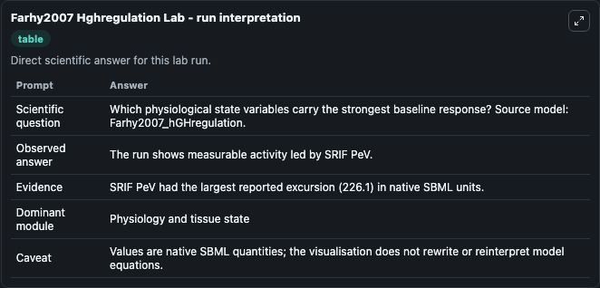
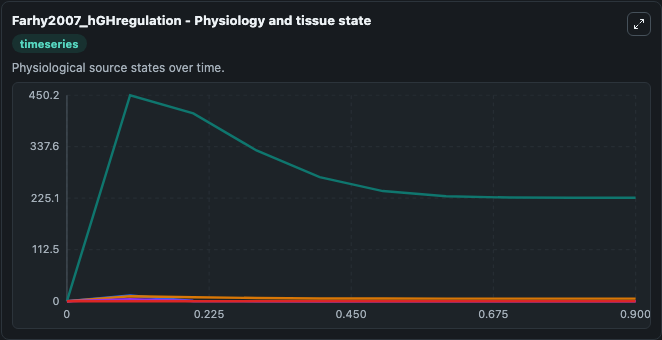
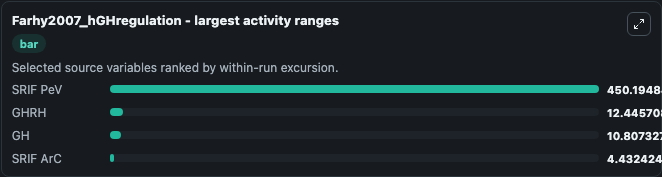
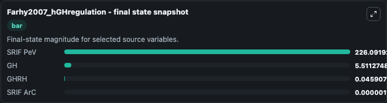
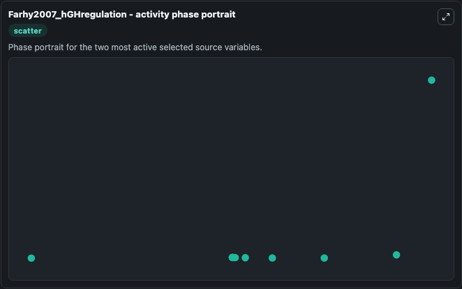

# Farhy2007 Hghregulation

This Biosimulant lab wraps `Farhy2007 Hghregulation` as a runnable systems biology model with a companion visualization module.
This a model from the article: Model-projected mechanistic bases for sex differences in growth hormoneregulation in humans. It can be used to explore the configured dynamics and compare scenario outcomes across configurations.

## What You'll See

The lab asks: Which physiological state variables carry the strongest baseline response? Source model: Farhy2007_hGHregulation. It runs for 1.0 time units with a communication step of 0.1. The run uses the model defaults declared by the curated SBML wrapper. The generated visualizations focus on SRIF PeV, SRIF ArC, Ghr GHRH, GHRH, and GH, combining trajectory, endpoint-comparison, and summary-table views from one completed dark-mode run.

In this captured run, **SRIF PeV** moved from 0 to 226.1 across 1.0 simulation windows.


### Output Visualizations



*Summary table for Farhy2007 Hghregulation, reporting the scientific question, observed answer, dominant module, and caveat.*



*Trajectories of SRIF PeV, GHRH, GH, SRIF ArC, and Ghr GHRH across the 1.0 simulation. In this run **SRIF PeV** climbed from 0 to 226.1 — the largest movements among the focused observables.*



*Largest-excursion ranking of the focused observables — the absolute movement magnitude during the run. Top 3: **SRIF PeV** = 450.2, **GHRH** = 12.446, **GH** = 10.807, with 1 more observable below.*



*Endpoint snapshot of the focused observables — final values from the captured run. Top 3 by value: **SRIF PeV** = 226.1, **GH** = 5.511, **GHRH** = 0.0459, with 1 more observable below.*



*Visualization card from the Farhy2007 Hghregulation dark-mode run.*


## Model Context

- Core model: `models/core`
- Visualization model: `models/visualisation`
- Standard: `other`
- Upstream source: `biomodels_ebi:MODEL0912096133`
- License: `CC0`

## Inputs

| Input | Maps To | Default | Notes |
|---|---|---|---|
| Initial Srif Pe V | `systemsbiology_sbml_farhy2007_hghregulation_model0912096133_model.initial_srif_pe_v` | | Source state initial condition exposed as a model-specific control because no explicit intervention parameter is identifiable. Maps to SBML symbol `SRIF_PeV`. |
| Initial Srif Ar C | `systemsbiology_sbml_farhy2007_hghregulation_model0912096133_model.initial_srif_ar_c` | | Source state initial condition exposed as a model-specific control because no explicit intervention parameter is identifiable. Maps to SBML symbol `SRIF_ArC`. |
| Initial Ghr Ghrh | `systemsbiology_sbml_farhy2007_hghregulation_model0912096133_model.initial_ghr_ghrh` | | Source state initial condition exposed as a model-specific control because no explicit intervention parameter is identifiable. Maps to SBML symbol `ghr_GHRH`. |
| Initial Ghrh | `systemsbiology_sbml_farhy2007_hghregulation_model0912096133_model.initial_ghrh` | | Source state initial condition exposed as a model-specific control because no explicit intervention parameter is identifiable. Maps to SBML symbol `GHRH`. |
| Initial Model State Gh | `systemsbiology_sbml_farhy2007_hghregulation_model0912096133_model.initial_model_state_gh` | | Source state initial condition exposed as a model-specific control because no explicit intervention parameter is identifiable. Maps to SBML symbol `GH`. |

## Outputs

| Output | Maps To | Role |
|---|---|---|
| `state` | `systemsbiology_sbml_farhy2007_hghregulation_model0912096133_model.state` | Available to the visualization model and downstream workflows. |
| `summary` | `systemsbiology_sbml_farhy2007_hghregulation_model0912096133_model.summary` | Available to the visualization model and downstream workflows. |
| `species_labels` | `systemsbiology_sbml_farhy2007_hghregulation_model0912096133_model.species_labels` | Available to the visualization model and downstream workflows. |
| `srif_pe_v` | `systemsbiology_sbml_farhy2007_hghregulation_model0912096133_model.srif_pe_v` | Available to the visualization model and downstream workflows. |
| `srif_ar_c` | `systemsbiology_sbml_farhy2007_hghregulation_model0912096133_model.srif_ar_c` | Available to the visualization model and downstream workflows. |
| `ghr_ghrh` | `systemsbiology_sbml_farhy2007_hghregulation_model0912096133_model.ghr_ghrh` | Available to the visualization model and downstream workflows. |
| `ghrh` | `systemsbiology_sbml_farhy2007_hghregulation_model0912096133_model.ghrh` | Available to the visualization model and downstream workflows. |
| `model_state_gh` | `systemsbiology_sbml_farhy2007_hghregulation_model0912096133_model.model_state_gh` | Available to the visualization model and downstream workflows. |

## Runtime

- Duration: `1.0`
- Communication step: `0.1`

## Running Locally

```bash
biosimulant labs serve
```
