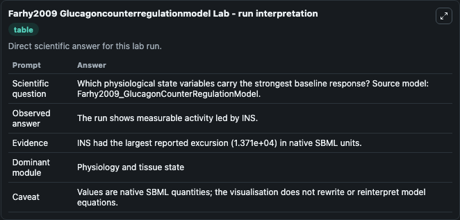
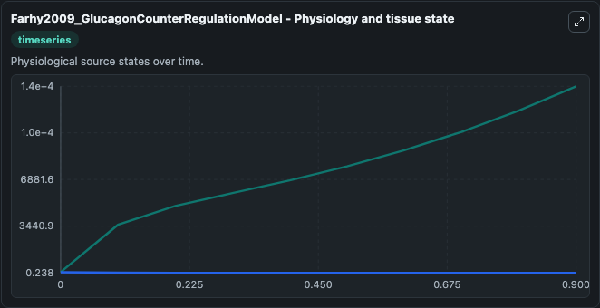
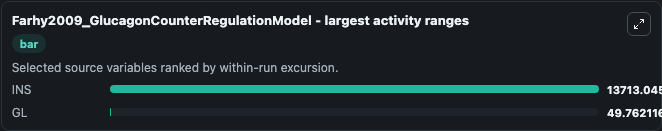
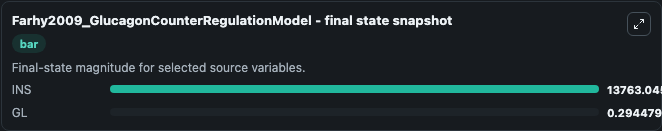
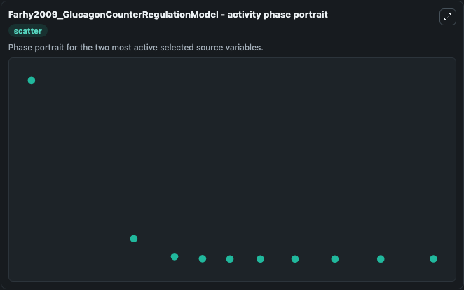

# Farhy2009 Glucagoncounterregulationmodel

This Biosimulant lab wraps `Farhy2009 Glucagoncounterregulationmodel` as a runnable systems biology model with a companion visualization module.
This a model from the article: Pancreatic network control of glucagon secretion and counterregulation. It can be used to explore the configured dynamics and compare scenario outcomes across configurations.

## What You'll See

The lab asks: Which physiological state variables carry the strongest baseline response? Source model: Farhy2009_GlucagonCounterRegulationModel. It runs for 1.0 time units with a communication step of 0.1. The run uses the model defaults declared by the curated SBML wrapper. The generated visualizations focus on INS, and GL, combining trajectory, endpoint-comparison, and summary-table views from one completed dark-mode run.

In this captured run, **INS** moved from 50.000 to 1.38e+04 across 1.0 simulation windows.


### Output Visualizations



*Summary table for Farhy2009 Glucagoncounterregulationmodel, reporting the scientific question, observed answer, dominant module, and caveat.*



*Trajectories of INS, and GL across the 1.0 simulation. In this run **INS** climbed from 50.000 to 1.38e+04 and **GL** fell from 50.000 to 0.2945 — the largest movements among the focused observables.*



*Largest-excursion ranking of the focused observables — the absolute movement magnitude during the run. Top 2: **INS** = 1.37e+04, **GL** = 49.762.*



*Endpoint snapshot of the focused observables — final values from the captured run. Top 2 by value: **INS** = 1.38e+04, **GL** = 0.2945.*



*Visualization card from the Farhy2009 Glucagoncounterregulationmodel dark-mode run.*


## Model Context

- Core model: `models/core`
- Visualization model: `models/visualisation`
- Standard: `other`
- Upstream source: `biomodels_ebi:MODEL1112110002`
- License: `CC0`

## Inputs

| Input | Maps To | Default | Notes |
|---|---|---|---|
| Initial Model State Ins | `systemsbiology_sbml_farhy2009_glucagoncounterregulationmodel_model1112110002_model.initial_model_state_ins` | | Source state initial condition exposed as a model-specific control because no explicit intervention parameter is identifiable. Maps to SBML symbol `INS`. |
| Initial Model State Gl | `systemsbiology_sbml_farhy2009_glucagoncounterregulationmodel_model1112110002_model.initial_model_state_gl` | | Source state initial condition exposed as a model-specific control because no explicit intervention parameter is identifiable. Maps to SBML symbol `GL`. |

## Outputs

| Output | Maps To | Role |
|---|---|---|
| `state` | `systemsbiology_sbml_farhy2009_glucagoncounterregulationmodel_model1112110002_model.state` | Available to the visualization model and downstream workflows. |
| `summary` | `systemsbiology_sbml_farhy2009_glucagoncounterregulationmodel_model1112110002_model.summary` | Available to the visualization model and downstream workflows. |
| `species_labels` | `systemsbiology_sbml_farhy2009_glucagoncounterregulationmodel_model1112110002_model.species_labels` | Available to the visualization model and downstream workflows. |
| `ins` | `systemsbiology_sbml_farhy2009_glucagoncounterregulationmodel_model1112110002_model.ins` | Available to the visualization model and downstream workflows. |
| `model_state_gl` | `systemsbiology_sbml_farhy2009_glucagoncounterregulationmodel_model1112110002_model.model_state_gl` | Available to the visualization model and downstream workflows. |

## Runtime

- Duration: `1.0`
- Communication step: `0.1`

## Running Locally

```bash
biosimulant labs serve
```
