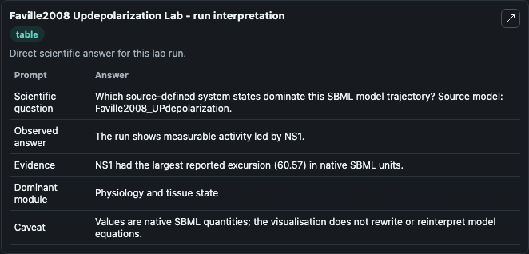
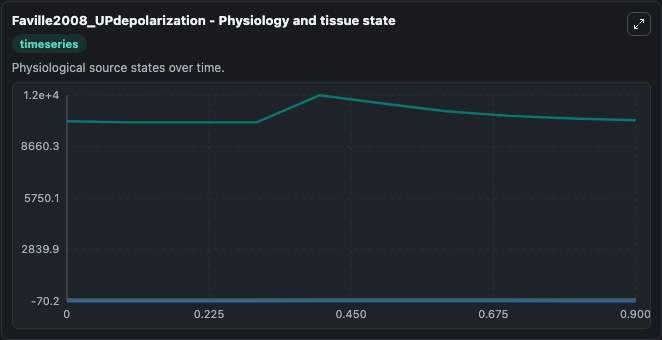
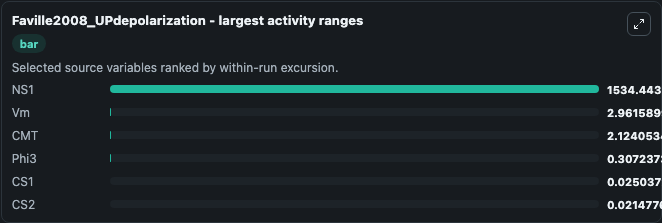
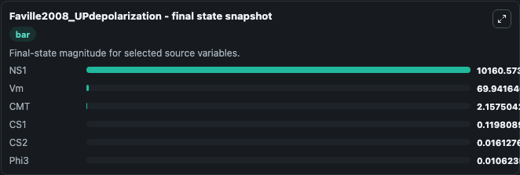
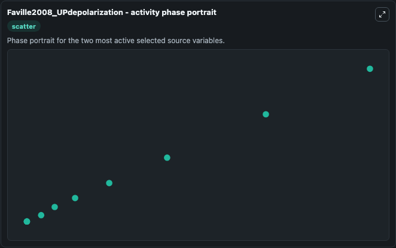

# Faville2008 Updepolarization

This Biosimulant lab wraps `Faville2008 Updepolarization` as a runnable systems biology model with a companion visualization module.
This a model from the article: A biophysically based mathematical model of unitary potential activity ininterstitial cells of Cajal. It can be used to explore the configured dynamics and compare scenario outcomes across configurations.

## What You'll See

The lab asks: Which source-defined system states dominate this SBML model trajectory? Source model: Faville2008_UPdepolarization. It runs for 1.0 time units with a communication step of 0.1. The run uses the model defaults declared by the curated SBML wrapper. The generated visualizations focus on Vm, Phi3, NS1, CS2, CS1, and CMT, combining trajectory, endpoint-comparison, and summary-table views from one completed dark-mode run.

In this captured run, **NS1** moved from 1.01e+04 to 1.02e+04 across 1.0 simulation windows.


### Output Visualizations



*Summary table for Faville2008 Updepolarization, reporting the scientific question, observed answer, dominant module, and caveat.*



*Trajectories of NS1, Vm, CMT, Phi3, CS1, and CS2 across the 1.0 simulation. In this run **NS1** climbed from 1.01e+04 to 1.02e+04 and **Phi3** fell from 0.3060 to 0.0106 — the largest movements among the focused observables.*



*Largest-excursion ranking of the focused observables — the absolute movement magnitude during the run. Top 3: **NS1** = 1534.4, **Vm** = 2.962, **CMT** = 2.124, with 3 more observables below.*



*Endpoint snapshot of the focused observables — final values from the captured run. Top 3 by value: **NS1** = 1.02e+04, **Vm** = 69.942, **CMT** = 2.158, with 3 more observables below.*



*Visualization card from the Faville2008 Updepolarization dark-mode run.*


## Model Context

- Core model: `models/core`
- Visualization model: `models/visualisation`
- Standard: `other`
- Upstream source: `biomodels_ebi:MODEL0912044015`
- License: `CC0`

## Inputs

| Input | Maps To | Default | Notes |
|---|---|---|---|
| Initial Model State Vm | `systemsbiology_sbml_faville2008_updepolarization_model0912044015_model.initial_model_state_vm` | | Source state initial condition exposed as a model-specific control because no explicit intervention parameter is identifiable. Maps to SBML symbol `Vm`. |
| Initial Phi3 | `systemsbiology_sbml_faville2008_updepolarization_model0912044015_model.initial_phi3` | | Source state initial condition exposed as a model-specific control because no explicit intervention parameter is identifiable. Maps to SBML symbol `phi3`. |
| Initial Model State NS1 | `systemsbiology_sbml_faville2008_updepolarization_model0912044015_model.initial_model_state_ns1` | | Source state initial condition exposed as a model-specific control because no explicit intervention parameter is identifiable. Maps to SBML symbol `NS1`. |
| Initial Model State CS2 | `systemsbiology_sbml_faville2008_updepolarization_model0912044015_model.initial_model_state_cs2` | | Source state initial condition exposed as a model-specific control because no explicit intervention parameter is identifiable. Maps to SBML symbol `CS2`. |
| Initial Model State CS1 | `systemsbiology_sbml_faville2008_updepolarization_model0912044015_model.initial_model_state_cs1` | | Source state initial condition exposed as a model-specific control because no explicit intervention parameter is identifiable. Maps to SBML symbol `CS1`. |
| Initial Model State Cmt | `systemsbiology_sbml_faville2008_updepolarization_model0912044015_model.initial_model_state_cmt` | | Source state initial condition exposed as a model-specific control because no explicit intervention parameter is identifiable. Maps to SBML symbol `CMT`. |

## Outputs

| Output | Maps To | Role |
|---|---|---|
| `state` | `systemsbiology_sbml_faville2008_updepolarization_model0912044015_model.state` | Available to the visualization model and downstream workflows. |
| `summary` | `systemsbiology_sbml_faville2008_updepolarization_model0912044015_model.summary` | Available to the visualization model and downstream workflows. |
| `species_labels` | `systemsbiology_sbml_faville2008_updepolarization_model0912044015_model.species_labels` | Available to the visualization model and downstream workflows. |
| `model_state_vm` | `systemsbiology_sbml_faville2008_updepolarization_model0912044015_model.model_state_vm` | Available to the visualization model and downstream workflows. |
| `phi3` | `systemsbiology_sbml_faville2008_updepolarization_model0912044015_model.phi3` | Available to the visualization model and downstream workflows. |
| `ns1` | `systemsbiology_sbml_faville2008_updepolarization_model0912044015_model.ns1` | Available to the visualization model and downstream workflows. |
| `cs2` | `systemsbiology_sbml_faville2008_updepolarization_model0912044015_model.cs2` | Available to the visualization model and downstream workflows. |
| `cs1` | `systemsbiology_sbml_faville2008_updepolarization_model0912044015_model.cs1` | Available to the visualization model and downstream workflows. |
| `cmt` | `systemsbiology_sbml_faville2008_updepolarization_model0912044015_model.cmt` | Available to the visualization model and downstream workflows. |

## Runtime

- Duration: `1.0`
- Communication step: `0.1`

## Running Locally

```bash
biosimulant labs serve
```
