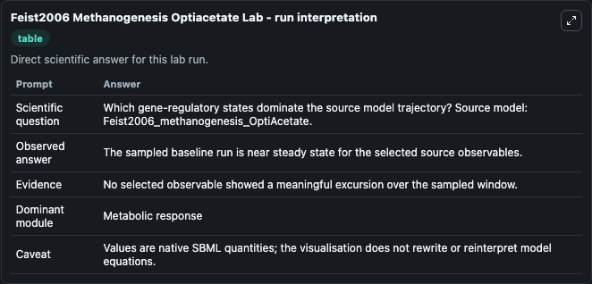
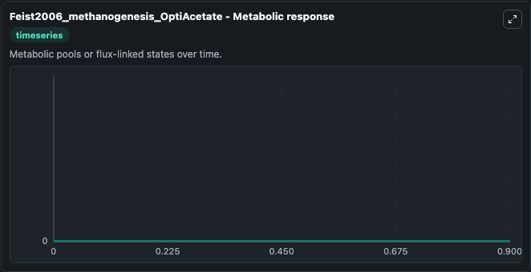

# Feist2006 Methanogenesis Optiacetate

This Biosimulant lab wraps `Feist2006 Methanogenesis Optiacetate` as a runnable systems biology model with a companion visualization module.
This model originates from BioModels Database: A Database of Annotated Published Models (http://www.ebi.ac.uk/biomodels/). It can be used to explore the configured dynamics and compare scenario outcomes across configurations.

## What You'll See

The lab asks: Which gene-regulatory states dominate the source model trajectory? Source model: Feist2006_methanogenesis_OptiAcetate. It runs for 1.0 time units with a communication step of 0.1. The run uses the model defaults declared by the curated SBML wrapper. The generated visualizations focus on _Glycolaldehyde, _dTDPglucose, _dTDP-4-dehydro-6-deoxy-D-glucose, _dATP, and _dADP, combining trajectory, endpoint-comparison, and summary-table views from one completed dark-mode run.

In this captured run, **_Glycolaldehyde** moved from 0 to 0 across 1.0 simulation windows.


### Output Visualizations



*Summary table for Feist2006 Methanogenesis Optiacetate, reporting the scientific question, observed answer, dominant module, and caveat.*



*Trajectories of _Glycolaldehyde, _Glycolaldehyde, _dTDPglucose, _dTDP-4-dehydro-6-deoxy-D-glucose, _dATP, and _dADP across the 1.0 simulation. In this run _Glycolaldehyde, _Glycolaldehyde, _dTDPglucose, _dTDP-4-dehydro-6-deoxy-D-glucose stayed near their initial values — no observable moved appreciably.*


## Model Context

- Core model: `models/core`
- Visualization model: `models/visualisation`
- Standard: `other`
- Upstream source: `biomodels_ebi:MODEL5662377562`
- License: `CC0`

## Inputs

| Input | Maps To | Default | Notes |
|---|---|---|---|
| Initial Glycolaldehyde | `systemsbiology_sbml_feist2006_methanogenesis_optiacetate_model5662377562_model.initial_glycolaldehyde` | | Source state initial condition exposed as a model-specific control because no explicit intervention parameter is identifiable. Maps to SBML symbol `M_gcald_c_`. |
| Initial Glycolaldehyde 2 | `systemsbiology_sbml_feist2006_methanogenesis_optiacetate_model5662377562_model.initial_glycolaldehyde_2` | | Source state initial condition exposed as a model-specific control because no explicit intervention parameter is identifiable. Maps to SBML symbol `M_gcald_e_`. |
| Initial D Td Pglucose | `systemsbiology_sbml_feist2006_methanogenesis_optiacetate_model5662377562_model.initial_d_td_pglucose` | | Source state initial condition exposed as a model-specific control because no explicit intervention parameter is identifiable. Maps to SBML symbol `M_dtdpglu_c_`. |
| Initial D Tdp 4 Dehydro 6 Deoxy D Glucose | `systemsbiology_sbml_feist2006_methanogenesis_optiacetate_model5662377562_model.initial_d_tdp_4_dehydro_6_deoxy_d_glucose` | | Source state initial condition exposed as a model-specific control because no explicit intervention parameter is identifiable. Maps to SBML symbol `M_dtdp4d6dg_c_`. |
| Initial D ATP | `systemsbiology_sbml_feist2006_methanogenesis_optiacetate_model5662377562_model.initial_d_atp` | | Source state initial condition exposed as a model-specific control because no explicit intervention parameter is identifiable. Maps to SBML symbol `M_datp_c_`. |
| Initial D ADP | `systemsbiology_sbml_feist2006_methanogenesis_optiacetate_model5662377562_model.initial_d_adp` | | Source state initial condition exposed as a model-specific control because no explicit intervention parameter is identifiable. Maps to SBML symbol `M_dadp_c_`. |

## Outputs

| Output | Maps To | Role |
|---|---|---|
| `state` | `systemsbiology_sbml_feist2006_methanogenesis_optiacetate_model5662377562_model.state` | Available to the visualization model and downstream workflows. |
| `summary` | `systemsbiology_sbml_feist2006_methanogenesis_optiacetate_model5662377562_model.summary` | Available to the visualization model and downstream workflows. |
| `species_labels` | `systemsbiology_sbml_feist2006_methanogenesis_optiacetate_model5662377562_model.species_labels` | Available to the visualization model and downstream workflows. |
| `glycolaldehyde` | `systemsbiology_sbml_feist2006_methanogenesis_optiacetate_model5662377562_model.glycolaldehyde` | Available to the visualization model and downstream workflows. |
| `glycolaldehyde_2` | `systemsbiology_sbml_feist2006_methanogenesis_optiacetate_model5662377562_model.glycolaldehyde_2` | Available to the visualization model and downstream workflows. |
| `d_td_pglucose` | `systemsbiology_sbml_feist2006_methanogenesis_optiacetate_model5662377562_model.d_td_pglucose` | Available to the visualization model and downstream workflows. |
| `d_tdp_4_dehydro_6_deoxy_d_glucose` | `systemsbiology_sbml_feist2006_methanogenesis_optiacetate_model5662377562_model.d_tdp_4_dehydro_6_deoxy_d_glucose` | Available to the visualization model and downstream workflows. |
| `d_atp` | `systemsbiology_sbml_feist2006_methanogenesis_optiacetate_model5662377562_model.d_atp` | Available to the visualization model and downstream workflows. |
| `d_adp` | `systemsbiology_sbml_feist2006_methanogenesis_optiacetate_model5662377562_model.d_adp` | Available to the visualization model and downstream workflows. |

## Runtime

- Duration: `1.0`
- Communication step: `0.1`

## Running Locally

```bash
biosimulant labs serve
```
