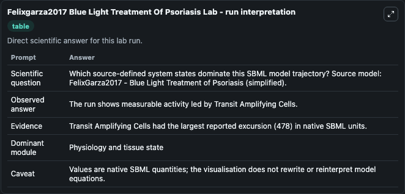
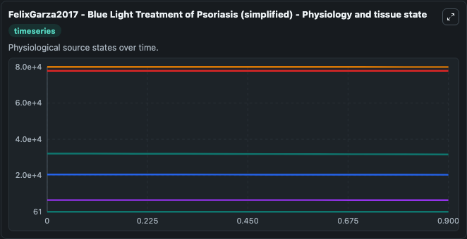
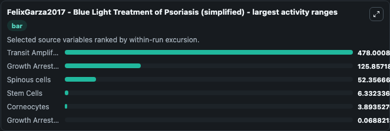
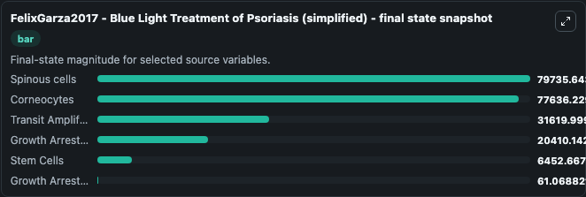
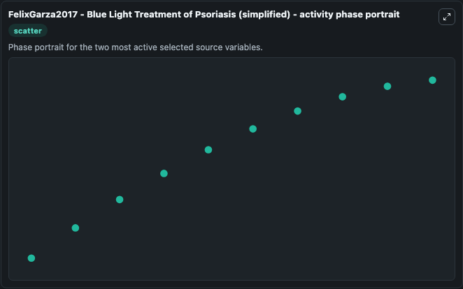

# Felixgarza2017 Blue Light Treatment Of Psoriasis

This Biosimulant lab wraps `Felixgarza2017 Blue Light Treatment Of Psoriasis` as a runnable systems biology model with a companion visualization module.
FelixGarza2017 - Blue Light Treatment ofPsoriasis (simplified) This model is described in the article: A Dynamic Model for Prediction of Psoriasis Management by Blue Light Irradiation. It can be used to explore the configured dynamics and compare scenario outcomes across configurations.

## What You'll See

The lab asks: Which source-defined system states dominate this SBML model trajectory? Source model: FelixGarza2017 - Blue Light Treatment of Psoriasis (simplified). It runs for 1.0 time units with a communication step of 0.1. The run uses the model defaults declared by the curated SBML wrapper. The generated visualizations focus on Growth Arrested Cells, Spinous cells, Corneocytes, Transit Amplifying Cells, and Stem Cells, combining trajectory, endpoint-comparison, and summary-table views from one completed dark-mode run.

In this captured run, **Transit Amplifying Cells** moved from 3.21e+04 to 3.16e+04 across 1.0 simulation windows.


### Output Visualizations



*Summary table for Felixgarza2017 Blue Light Treatment Of Psoriasis, reporting the scientific question, observed answer, dominant module, and caveat.*



*Trajectories of Transit Amplifying Cells, Growth Arrested Cells, Spinous cells, Stem Cells, Corneocytes, and Growth Arrested Cells across the 1.0 simulation. In this run **Corneocytes** climbed from 7.76e+04 to 7.76e+04 and **Transit Amplifying Cells** fell from 3.21e+04 to 3.16e+04 — the largest movements among the focused observables.*



*Largest-excursion ranking of the focused observables — the absolute movement magnitude during the run. Top 3: **Transit Amplifying Cells** = 478.0, **Growth Arrested Cells** = 125.9, **Spinous cells** = 52.357, with 3 more observables below.*



*Endpoint snapshot of the focused observables — final values from the captured run. Top 3 by value: **Spinous cells** = 7.97e+04, **Corneocytes** = 7.76e+04, **Transit Amplifying Cells** = 3.16e+04, with 3 more observables below.*



*Visualization card from the Felixgarza2017 Blue Light Treatment Of Psoriasis dark-mode run.*


## Model Context

- Core model: `models/core`
- Visualization model: `models/visualisation`
- Standard: `other`
- Upstream source: `biomodels_ebi:BIOMD0000000695`
- License: `CC0`

## Inputs

| Input | Maps To | Default | Notes |
|---|---|---|---|
| Treatment Duration | `systemsbiology_sbml_felixgarza2017_blue_light_treatment_of_psoriasis_biomd0000000695_model.treatment_duration` | | Source parameter exposed because its SBML label indicates a boundary, stimulus, dose, ligand, protocol, substrate, or environmental control. Maps to SBML symbol `Treatment_Duration`. |

## Outputs

| Output | Maps To | Role |
|---|---|---|
| `state` | `systemsbiology_sbml_felixgarza2017_blue_light_treatment_of_psoriasis_biomd0000000695_model.state` | Available to the visualization model and downstream workflows. |
| `summary` | `systemsbiology_sbml_felixgarza2017_blue_light_treatment_of_psoriasis_biomd0000000695_model.summary` | Available to the visualization model and downstream workflows. |
| `species_labels` | `systemsbiology_sbml_felixgarza2017_blue_light_treatment_of_psoriasis_biomd0000000695_model.species_labels` | Available to the visualization model and downstream workflows. |
| `growth_arrested_cells` | `systemsbiology_sbml_felixgarza2017_blue_light_treatment_of_psoriasis_biomd0000000695_model.growth_arrested_cells` | Available to the visualization model and downstream workflows. |
| `growth_arrested_cells_2` | `systemsbiology_sbml_felixgarza2017_blue_light_treatment_of_psoriasis_biomd0000000695_model.growth_arrested_cells_2` | Available to the visualization model and downstream workflows. |
| `spinous_cells` | `systemsbiology_sbml_felixgarza2017_blue_light_treatment_of_psoriasis_biomd0000000695_model.spinous_cells` | Available to the visualization model and downstream workflows. |
| `corneocytes` | `systemsbiology_sbml_felixgarza2017_blue_light_treatment_of_psoriasis_biomd0000000695_model.corneocytes` | Available to the visualization model and downstream workflows. |
| `transit_amplifying_cells` | `systemsbiology_sbml_felixgarza2017_blue_light_treatment_of_psoriasis_biomd0000000695_model.transit_amplifying_cells` | Available to the visualization model and downstream workflows. |
| `stem_cells` | `systemsbiology_sbml_felixgarza2017_blue_light_treatment_of_psoriasis_biomd0000000695_model.stem_cells` | Available to the visualization model and downstream workflows. |

## Runtime

- Duration: `1.0`
- Communication step: `0.1`

## Running Locally

```bash
biosimulant labs serve
```
