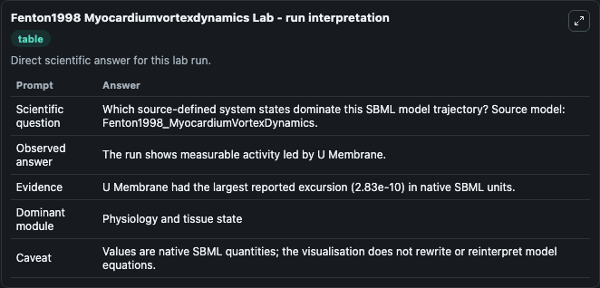
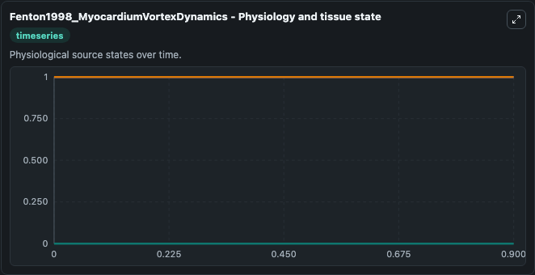
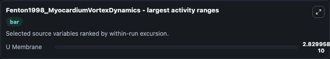
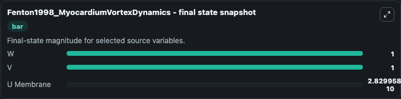

# Fenton1998 Myocardiumvortexdynamics

This Biosimulant lab wraps `Fenton1998 Myocardiumvortexdynamics` as a runnable systems biology model with a companion visualization module.
This a model from the article: Vortex dynamics in three-dimensional continuous myocardium with fiber rotation:Filament instability and fibrillation. It can be used to explore the configured dynamics and compare scenario outcomes across configurations.

## What You'll See

The lab asks: Which source-defined system states dominate this SBML model trajectory? Source model: Fenton1998_MyocardiumVortexDynamics. It runs for 1.0 time units with a communication step of 0.1. The run uses the model defaults declared by the curated SBML wrapper. The generated visualizations focus on U Membrane, W, and V, combining trajectory, endpoint-comparison, and summary-table views from one completed dark-mode run.

In this captured run, **U Membrane** moved from 0 to 2.83e-10 across 1.0 simulation windows.


### Output Visualizations



*Summary table for Fenton1998 Myocardiumvortexdynamics, reporting the scientific question, observed answer, dominant module, and caveat.*



*Trajectories of U Membrane, W, and V across the 1.0 simulation. In this run **U Membrane** climbed from 0 to 2.83e-10 — the largest movements among the focused observables.*



*Largest-excursion ranking of the focused observables — the absolute movement magnitude during the run. Top 1: **U Membrane** = 2.83e-10.*



*Endpoint snapshot of the focused observables — final values from the captured run. Top 3 by value: **W** = 1.000, **V** = 1.000, **U Membrane** = 2.83e-10.*


## Model Context

- Core model: `models/core`
- Visualization model: `models/visualisation`
- Standard: `other`
- Upstream source: `biomodels_ebi:MODEL0911989198`
- License: `CC0`

## Inputs

| Input | Maps To | Default | Notes |
|---|---|---|---|
| Initial U Membrane | `systemsbiology_sbml_fenton1998_myocardiumvortexdynamics_model0911989198_model.initial_u_membrane` | | Source state initial condition exposed as a model-specific control because no explicit intervention parameter is identifiable. Maps to SBML symbol `u_membrane`. |
| Initial Model State W | `systemsbiology_sbml_fenton1998_myocardiumvortexdynamics_model0911989198_model.initial_model_state_w` | | Source state initial condition exposed as a model-specific control because no explicit intervention parameter is identifiable. Maps to SBML symbol `w`. |
| Initial Model State V | `systemsbiology_sbml_fenton1998_myocardiumvortexdynamics_model0911989198_model.initial_model_state_v` | | Source state initial condition exposed as a model-specific control because no explicit intervention parameter is identifiable. Maps to SBML symbol `v`. |

## Outputs

| Output | Maps To | Role |
|---|---|---|
| `state` | `systemsbiology_sbml_fenton1998_myocardiumvortexdynamics_model0911989198_model.state` | Available to the visualization model and downstream workflows. |
| `summary` | `systemsbiology_sbml_fenton1998_myocardiumvortexdynamics_model0911989198_model.summary` | Available to the visualization model and downstream workflows. |
| `species_labels` | `systemsbiology_sbml_fenton1998_myocardiumvortexdynamics_model0911989198_model.species_labels` | Available to the visualization model and downstream workflows. |
| `u_membrane` | `systemsbiology_sbml_fenton1998_myocardiumvortexdynamics_model0911989198_model.u_membrane` | Available to the visualization model and downstream workflows. |
| `model_state_w` | `systemsbiology_sbml_fenton1998_myocardiumvortexdynamics_model0911989198_model.model_state_w` | Available to the visualization model and downstream workflows. |
| `model_state_v` | `systemsbiology_sbml_fenton1998_myocardiumvortexdynamics_model0911989198_model.model_state_v` | Available to the visualization model and downstream workflows. |

## Runtime

- Duration: `1.0`
- Communication step: `0.1`

## Running Locally

```bash
biosimulant labs serve
```
