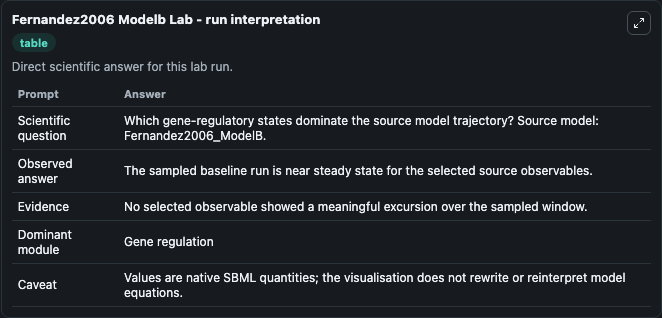
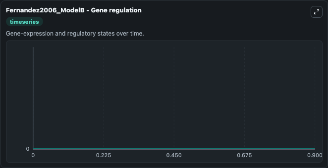

# Fernandez2006 Modelb

This Biosimulant lab wraps `Fernandez2006 Modelb` as a runnable systems biology model with a companion visualization module.
To the extent possible under law, all copyright and related or neighbouring rights to this encoded model have been dedicated to the public domain worldwide. It can be used to explore the configured dynamics and compare scenario outcomes across configurations.

## What You'll See

The lab asks: Which gene-regulatory states dominate the source model trajectory? Source model: Fernandez2006_ModelB. It runs for 1.0 time units with a communication step of 0.1. The run uses the model defaults declared by the curated SBML wrapper. The generated visualizations focus on cAMP_R2C2, cAMP_PDEP, cAMP_PDE, cAMP4_R2C2, cAMP4_R2C, and cAMP4_R2, combining trajectory, endpoint-comparison, and summary-table views from one completed dark-mode run.

In this captured run, **cAMP_R2C2** moved from 0 to 0 across 1.0 simulation windows.


### Output Visualizations



*Summary table for Fernandez2006 Modelb, reporting the scientific question, observed answer, dominant module, and caveat.*



*Trajectories of cAMP_R2C2, cAMP_PDEP, cAMP_PDE, cAMP4_R2C2, cAMP4_R2C, and cAMP4_R2 across the 1.0 simulation. In this run cAMP_R2C2, cAMP_PDEP, cAMP_PDE, cAMP4_R2C2 stayed near their initial values — no observable moved appreciably.*


## Model Context

- Core model: `models/core`
- Visualization model: `models/visualisation`
- Standard: `other`
- Upstream source: `biomodels_ebi:BIOMD0000000153`
- License: `CC0`

## Inputs

| Input | Maps To | Default | Notes |
|---|---|---|---|
| Initial CAMP R2 C2 | `systemsbiology_sbml_fernandez2006_modelb_biomd0000000153_model.initial_camp_r2_c2` | | Source state initial condition exposed as a model-specific control because no explicit intervention parameter is identifiable. Maps to SBML symbol `cAMP_R2C2`. |
| Initial CAMP Pdep | `systemsbiology_sbml_fernandez2006_modelb_biomd0000000153_model.initial_camp_pdep` | | Source state initial condition exposed as a model-specific control because no explicit intervention parameter is identifiable. Maps to SBML symbol `cAMP_PDEP`. |
| Initial CAMP Pde | `systemsbiology_sbml_fernandez2006_modelb_biomd0000000153_model.initial_camp_pde` | | Source state initial condition exposed as a model-specific control because no explicit intervention parameter is identifiable. Maps to SBML symbol `cAMP_PDE`. |
| Initial Camp4 R2 C2 | `systemsbiology_sbml_fernandez2006_modelb_biomd0000000153_model.initial_camp4_r2_c2` | | Source state initial condition exposed as a model-specific control because no explicit intervention parameter is identifiable. Maps to SBML symbol `cAMP4_R2C2`. |
| Initial Camp4 R2 C | `systemsbiology_sbml_fernandez2006_modelb_biomd0000000153_model.initial_camp4_r2_c` | | Source state initial condition exposed as a model-specific control because no explicit intervention parameter is identifiable. Maps to SBML symbol `cAMP4_R2C`. |
| Initial Camp4 R2 | `systemsbiology_sbml_fernandez2006_modelb_biomd0000000153_model.initial_camp4_r2` | | Source state initial condition exposed as a model-specific control because no explicit intervention parameter is identifiable. Maps to SBML symbol `cAMP4_R2`. |

## Outputs

| Output | Maps To | Role |
|---|---|---|
| `state` | `systemsbiology_sbml_fernandez2006_modelb_biomd0000000153_model.state` | Available to the visualization model and downstream workflows. |
| `summary` | `systemsbiology_sbml_fernandez2006_modelb_biomd0000000153_model.summary` | Available to the visualization model and downstream workflows. |
| `species_labels` | `systemsbiology_sbml_fernandez2006_modelb_biomd0000000153_model.species_labels` | Available to the visualization model and downstream workflows. |
| `camp_r2_c2` | `systemsbiology_sbml_fernandez2006_modelb_biomd0000000153_model.camp_r2_c2` | Available to the visualization model and downstream workflows. |
| `camp_pdep` | `systemsbiology_sbml_fernandez2006_modelb_biomd0000000153_model.camp_pdep` | Available to the visualization model and downstream workflows. |
| `camp_pde` | `systemsbiology_sbml_fernandez2006_modelb_biomd0000000153_model.camp_pde` | Available to the visualization model and downstream workflows. |
| `camp4_r2_c2` | `systemsbiology_sbml_fernandez2006_modelb_biomd0000000153_model.camp4_r2_c2` | Available to the visualization model and downstream workflows. |
| `camp4_r2_c` | `systemsbiology_sbml_fernandez2006_modelb_biomd0000000153_model.camp4_r2_c` | Available to the visualization model and downstream workflows. |
| `camp4_r2` | `systemsbiology_sbml_fernandez2006_modelb_biomd0000000153_model.camp4_r2` | Available to the visualization model and downstream workflows. |

## Runtime

- Duration: `1.0`
- Communication step: `0.1`

## Running Locally

```bash
biosimulant labs serve
```
