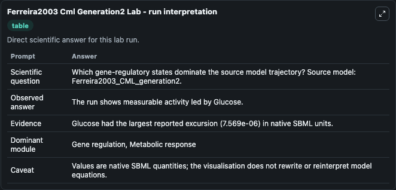
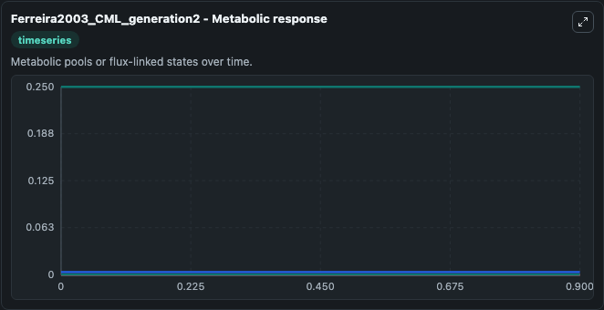
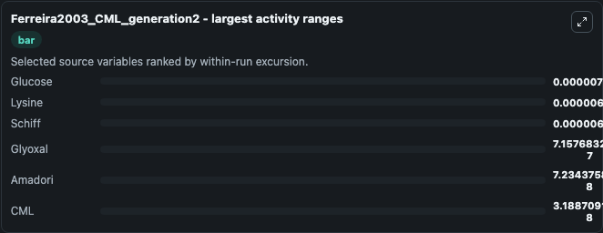
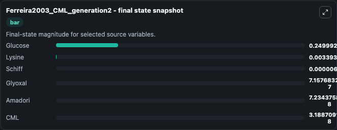
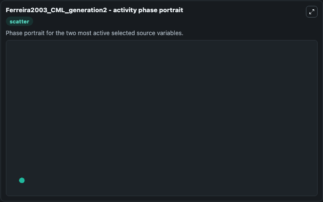

# Ferreira2003 Cml Generation2

This Biosimulant lab wraps `Ferreira2003 Cml Generation2` as a runnable systems biology model with a companion visualization module.
The model should reproduce the figure 2F of the article. It can be used to explore the configured dynamics and compare scenario outcomes across configurations.

## What You'll See

The lab asks: Which gene-regulatory states dominate the source model trajectory? Source model: Ferreira2003_CML_generation2. It runs for 1.0 time units with a communication step of 0.1. The run uses the model defaults declared by the curated SBML wrapper. The generated visualizations focus on Glucose, Lysine, Schiff, Glyoxal, CML, and Amadori, combining trajectory, endpoint-comparison, and summary-table views from one completed dark-mode run.

In this captured run, **Glucose** moved from 0.2500 to 0.2500 across 1.0 simulation windows.


### Output Visualizations



*Summary table for Ferreira2003 Cml Generation2, reporting the scientific question, observed answer, dominant module, and caveat.*



*Trajectories of Glucose, Lysine, Schiff, Glyoxal, Amadori, and CML across the 1.0 simulation. In this run **Schiff** climbed from 0 to 6.04e-06 and **Glucose** fell from 0.2500 to 0.2500 — the largest movements among the focused observables.*



*Largest-excursion ranking of the focused observables — the absolute movement magnitude during the run. Top 3: **Glucose** = 7.57e-06, **Lysine** = 6.82e-06, **Schiff** = 6.04e-06, with 3 more observables below.*



*Endpoint snapshot of the focused observables — final values from the captured run. Top 3 by value: **Glucose** = 0.2500, **Lysine** = 0.00339, **Schiff** = 6.04e-06, with 3 more observables below.*



*Visualization card from the Ferreira2003 Cml Generation2 dark-mode run.*


## Model Context

- Core model: `models/core`
- Visualization model: `models/visualisation`
- Standard: `other`
- Upstream source: `biomodels_ebi:BIOMD0000000053`
- License: `CC0`

## Inputs

| Input | Maps To | Default | Notes |
|---|---|---|---|
| Initial Glucose | `systemsbiology_sbml_ferreira2003_cml_generation2_biomd0000000053_model.initial_glucose` | | Source state initial condition exposed as a model-specific control because no explicit intervention parameter is identifiable. Maps to SBML symbol `Glucose`. |
| Initial Lysine | `systemsbiology_sbml_ferreira2003_cml_generation2_biomd0000000053_model.initial_lysine` | | Source state initial condition exposed as a model-specific control because no explicit intervention parameter is identifiable. Maps to SBML symbol `Lysine`. |
| Initial Schiff | `systemsbiology_sbml_ferreira2003_cml_generation2_biomd0000000053_model.initial_schiff` | | Source state initial condition exposed as a model-specific control because no explicit intervention parameter is identifiable. Maps to SBML symbol `Schiff`. |
| Initial Glyoxal | `systemsbiology_sbml_ferreira2003_cml_generation2_biomd0000000053_model.initial_glyoxal` | | Source state initial condition exposed as a model-specific control because no explicit intervention parameter is identifiable. Maps to SBML symbol `Glyoxal`. |
| Initial Model State Cml | `systemsbiology_sbml_ferreira2003_cml_generation2_biomd0000000053_model.initial_model_state_cml` | | Source state initial condition exposed as a model-specific control because no explicit intervention parameter is identifiable. Maps to SBML symbol `CML`. |
| Initial Amadori | `systemsbiology_sbml_ferreira2003_cml_generation2_biomd0000000053_model.initial_amadori` | | Source state initial condition exposed as a model-specific control because no explicit intervention parameter is identifiable. Maps to SBML symbol `Amadori`. |

## Outputs

| Output | Maps To | Role |
|---|---|---|
| `state` | `systemsbiology_sbml_ferreira2003_cml_generation2_biomd0000000053_model.state` | Available to the visualization model and downstream workflows. |
| `summary` | `systemsbiology_sbml_ferreira2003_cml_generation2_biomd0000000053_model.summary` | Available to the visualization model and downstream workflows. |
| `species_labels` | `systemsbiology_sbml_ferreira2003_cml_generation2_biomd0000000053_model.species_labels` | Available to the visualization model and downstream workflows. |
| `glucose` | `systemsbiology_sbml_ferreira2003_cml_generation2_biomd0000000053_model.glucose` | Available to the visualization model and downstream workflows. |
| `lysine` | `systemsbiology_sbml_ferreira2003_cml_generation2_biomd0000000053_model.lysine` | Available to the visualization model and downstream workflows. |
| `schiff` | `systemsbiology_sbml_ferreira2003_cml_generation2_biomd0000000053_model.schiff` | Available to the visualization model and downstream workflows. |
| `glyoxal` | `systemsbiology_sbml_ferreira2003_cml_generation2_biomd0000000053_model.glyoxal` | Available to the visualization model and downstream workflows. |
| `cml` | `systemsbiology_sbml_ferreira2003_cml_generation2_biomd0000000053_model.cml` | Available to the visualization model and downstream workflows. |
| `amadori` | `systemsbiology_sbml_ferreira2003_cml_generation2_biomd0000000053_model.amadori` | Available to the visualization model and downstream workflows. |

## Runtime

- Duration: `1.0`
- Communication step: `0.1`

## Running Locally

```bash
biosimulant labs serve
```
