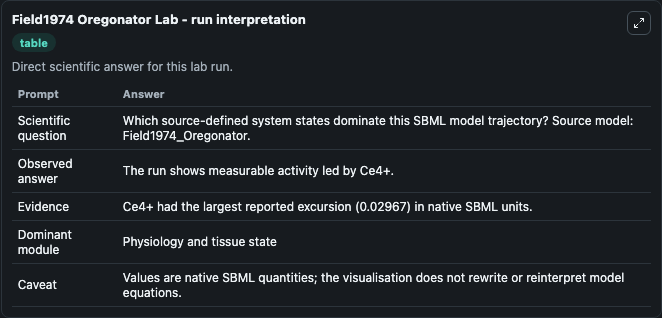
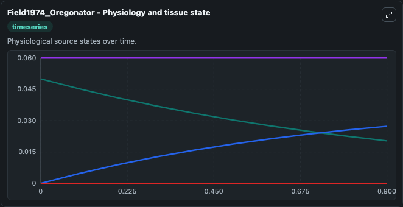
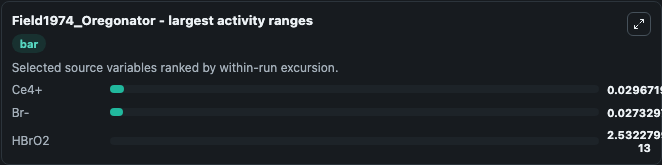
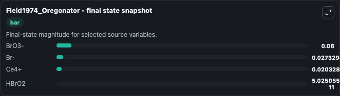
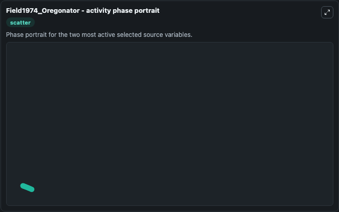

# Field1974 Oregonator

This Biosimulant lab wraps `Field1974 Oregonator` as a runnable systems biology model with a companion visualization module.
Field-Noyes Model of BZ Reaction Citation R.J.Field and R.M.Noyes,J.Chem.Phys.60,1877 (1974) Description Field Noyes Version of Belousov-Zhabotinsky Reaction. It can be used to explore the configured dynamics and compare scenario outcomes across configurations.

## What You'll See

The lab asks: Which source-defined system states dominate this SBML model trajectory? Source model: Field1974_Oregonator. It runs for 1.0 time units with a communication step of 0.1. The run uses the model defaults declared by the curated SBML wrapper. The generated visualizations focus on BrO3-, Ce4+, Br-, HBrO2, and HOBr, combining trajectory, endpoint-comparison, and summary-table views from one completed dark-mode run.

In this captured run, **Ce4+** moved from 0.0500 to 0.0203 across 1.0 simulation windows.


### Output Visualizations



*Summary table for Field1974 Oregonator, reporting the scientific question, observed answer, dominant module, and caveat.*



*Trajectories of Ce4+, Br-, HBrO2, BrO3-, and HOBr across the 1.0 simulation. In this run **Br-** climbed from 1e-07 to 0.0273 and **Ce4+** fell from 0.0500 to 0.0203 — the largest movements among the focused observables.*



*Largest-excursion ranking of the focused observables — the absolute movement magnitude during the run. Top 3: **Ce4+** = 0.0297, **Br-** = 0.0273, **HBrO2** = 2.53e-13.*



*Endpoint snapshot of the focused observables — final values from the captured run. Top 3 by value: **BrO3-** = 0.0600, **Br-** = 0.0273, **Ce4+** = 0.0203, with 1 more observable below.*



*Visualization card from the Field1974 Oregonator dark-mode run.*


## Model Context

- Core model: `models/core`
- Visualization model: `models/visualisation`
- Standard: `other`
- Upstream source: `biomodels_ebi:BIOMD0000000040`
- License: `CC0`

## Inputs

| Input | Maps To | Default | Notes |
|---|---|---|---|
| Initial Br O3 | `systemsbiology_sbml_field1974_oregonator_biomd0000000040_model.initial_br_o3` | | Source state initial condition exposed as a model-specific control because no explicit intervention parameter is identifiable. Maps to SBML symbol `BrO3`. |
| Initial Model State CE4 | `systemsbiology_sbml_field1974_oregonator_biomd0000000040_model.initial_model_state_ce4` | | Source state initial condition exposed as a model-specific control because no explicit intervention parameter is identifiable. Maps to SBML symbol `Ce`. |
| Initial Model State Br | `systemsbiology_sbml_field1974_oregonator_biomd0000000040_model.initial_model_state_br` | | Source state initial condition exposed as a model-specific control because no explicit intervention parameter is identifiable. Maps to SBML symbol `Br`. |
| Initial H Br O2 | `systemsbiology_sbml_field1974_oregonator_biomd0000000040_model.initial_h_br_o2` | | Source state initial condition exposed as a model-specific control because no explicit intervention parameter is identifiable. Maps to SBML symbol `HBrO2`. |
| Initial Ho Br | `systemsbiology_sbml_field1974_oregonator_biomd0000000040_model.initial_ho_br` | | Source state initial condition exposed as a model-specific control because no explicit intervention parameter is identifiable. Maps to SBML symbol `HOBr`. |

## Outputs

| Output | Maps To | Role |
|---|---|---|
| `state` | `systemsbiology_sbml_field1974_oregonator_biomd0000000040_model.state` | Available to the visualization model and downstream workflows. |
| `summary` | `systemsbiology_sbml_field1974_oregonator_biomd0000000040_model.summary` | Available to the visualization model and downstream workflows. |
| `species_labels` | `systemsbiology_sbml_field1974_oregonator_biomd0000000040_model.species_labels` | Available to the visualization model and downstream workflows. |
| `br_o3` | `systemsbiology_sbml_field1974_oregonator_biomd0000000040_model.br_o3` | Available to the visualization model and downstream workflows. |
| `ce4` | `systemsbiology_sbml_field1974_oregonator_biomd0000000040_model.ce4` | Available to the visualization model and downstream workflows. |
| `model_state_br` | `systemsbiology_sbml_field1974_oregonator_biomd0000000040_model.model_state_br` | Available to the visualization model and downstream workflows. |
| `h_br_o2` | `systemsbiology_sbml_field1974_oregonator_biomd0000000040_model.h_br_o2` | Available to the visualization model and downstream workflows. |
| `ho_br` | `systemsbiology_sbml_field1974_oregonator_biomd0000000040_model.ho_br` | Available to the visualization model and downstream workflows. |

## Runtime

- Duration: `1.0`
- Communication step: `0.1`

## Running Locally

```bash
biosimulant labs serve
```
