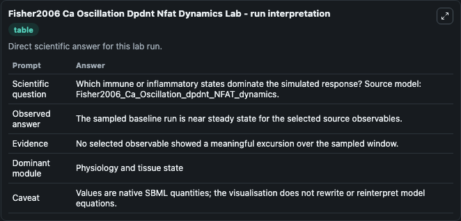
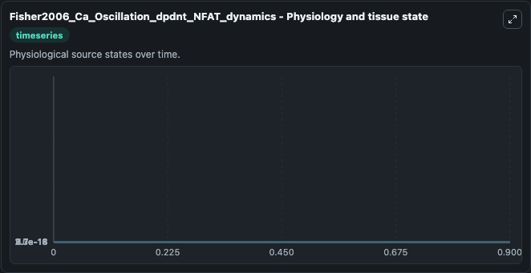
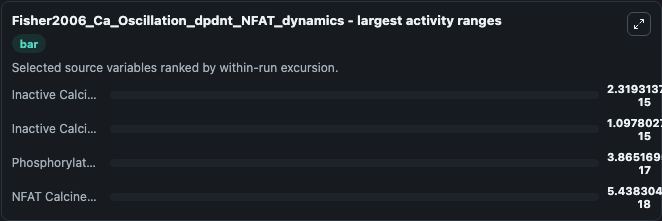
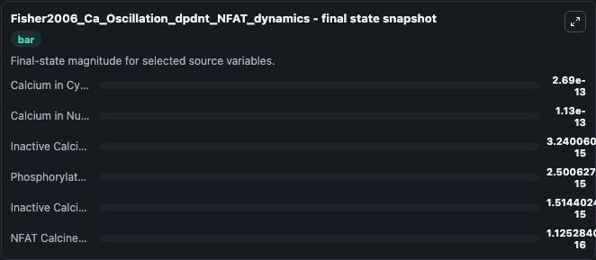
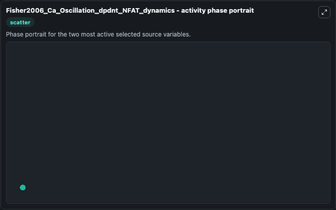

# Fisher2006 Ca Oscillation Dpdnt Nfat Dynamics

This Biosimulant lab wraps `Fisher2006 Ca Oscillation Dpdnt Nfat Dynamics` as a runnable systems biology model with a companion visualization module.
The model reproduces the calcium oscillation dependent activation-deactivation kinetics of nuclear factor of activated T cells (NFAT) as depicted in Fig 4a of the paper. It can be used to explore the configured dynamics and compare scenario outcomes across configurations.

## What You'll See

The lab asks: Which immune or inflammatory states dominate the simulated response? Source model: Fisher2006_Ca_Oscillation_dpdnt_NFAT_dynamics. It runs for 1.0 time units with a communication step of 0.1. The run uses the model defaults declared by the curated SBML wrapper. The generated visualizations focus on Calcium in Nucleus, Calcium in Cytosol, Inactive Calcineurin in nucleus, Inactive Calcineurin in cytosol, Phosphorylated NFAT in cytosol, and NFAT Calcineurin complex in nucleus, combining trajectory, endpoint-comparison, and summary-table views from one completed dark-mode run.

In this captured run, **Inactive Calcineurin in nucleus** moved from 5.56e-15 to 3.24e-15 across 1.0 simulation windows.


### Output Visualizations



*Summary table for Fisher2006 Ca Oscillation Dpdnt Nfat Dynamics, reporting the scientific question, observed answer, dominant module, and caveat.*



*Trajectories of Inactive Calcineurin in nucleus, Inactive Calcineurin in cytosol, Phosphorylated NFAT in cytosol, NFAT Calcineurin complex in nucleus, Calcium in Nucleus, and Calcium in Cytosol across the 1.0 simulation. In this run **NFAT Calcineurin complex in nucleus** climbed from 1.07e-16 to 1.13e-16 and **Inactive Calcineurin in nucleus** fell from 5.56e-15 to 3.24e-15 — the largest movements among the focused observables.*



*Largest-excursion ranking of the focused observables — the absolute movement magnitude during the run. Top 3: **Inactive Calcineurin in nucleus** = 2.32e-15, **Inactive Calcineurin in cytosol** = 1.1e-15, **Phosphorylated NFAT in cytosol** = 3.87e-17, with 1 more observable below.*



*Endpoint snapshot of the focused observables — final values from the captured run. Top 3 by value: **Calcium in Cytosol** = 2.69e-13, **Calcium in Nucleus** = 1.13e-13, **Inactive Calcineurin in nucleus** = 3.24e-15, with 3 more observables below.*



*Visualization card from the Fisher2006 Ca Oscillation Dpdnt Nfat Dynamics dark-mode run.*


## Model Context

- Core model: `models/core`
- Visualization model: `models/visualisation`
- Standard: `other`
- Upstream source: `biomodels_ebi:BIOMD0000000122`
- License: `CC0`

## Inputs

| Input | Maps To | Default | Notes |
|---|---|---|---|
| Initial Calcium In Nucleus | `systemsbiology_sbml_fisher2006_ca_oscillation_dpdnt_nfat_dynamics_biomd0000000122_model.initial_calcium_in_nucleus` | | Source state initial condition exposed as a model-specific control because no explicit intervention parameter is identifiable. Maps to SBML symbol `Ca_Nuc`. |
| Initial Calcium In Cytosol | `systemsbiology_sbml_fisher2006_ca_oscillation_dpdnt_nfat_dynamics_biomd0000000122_model.initial_calcium_in_cytosol` | | Source state initial condition exposed as a model-specific control because no explicit intervention parameter is identifiable. Maps to SBML symbol `Ca_Cyt`. |
| Initial Inactive Calcineurin In Nucleus | `systemsbiology_sbml_fisher2006_ca_oscillation_dpdnt_nfat_dynamics_biomd0000000122_model.initial_inactive_calcineurin_in_nucleus` | | Source state initial condition exposed as a model-specific control because no explicit intervention parameter is identifiable. Maps to SBML symbol `Inact_C_Nuc`. |
| Initial Inactive Calcineurin In Cytosol | `systemsbiology_sbml_fisher2006_ca_oscillation_dpdnt_nfat_dynamics_biomd0000000122_model.initial_inactive_calcineurin_in_cytosol` | | Source state initial condition exposed as a model-specific control because no explicit intervention parameter is identifiable. Maps to SBML symbol `Inact_C_Cyt`. |
| Initial Phosphorylated Nfat In Cytosol | `systemsbiology_sbml_fisher2006_ca_oscillation_dpdnt_nfat_dynamics_biomd0000000122_model.initial_phosphorylated_nfat_in_cytosol` | | Source state initial condition exposed as a model-specific control because no explicit intervention parameter is identifiable. Maps to SBML symbol `NFAT_Pi_Cyt`. |
| Initial Nfat Calcineurin Complex In Nucleus | `systemsbiology_sbml_fisher2006_ca_oscillation_dpdnt_nfat_dynamics_biomd0000000122_model.initial_nfat_calcineurin_complex_in_nucleus` | | Source state initial condition exposed as a model-specific control because no explicit intervention parameter is identifiable. Maps to SBML symbol `NFAT_Act_C_Nuc`. |

## Outputs

| Output | Maps To | Role |
|---|---|---|
| `state` | `systemsbiology_sbml_fisher2006_ca_oscillation_dpdnt_nfat_dynamics_biomd0000000122_model.state` | Available to the visualization model and downstream workflows. |
| `summary` | `systemsbiology_sbml_fisher2006_ca_oscillation_dpdnt_nfat_dynamics_biomd0000000122_model.summary` | Available to the visualization model and downstream workflows. |
| `species_labels` | `systemsbiology_sbml_fisher2006_ca_oscillation_dpdnt_nfat_dynamics_biomd0000000122_model.species_labels` | Available to the visualization model and downstream workflows. |
| `calcium_in_nucleus` | `systemsbiology_sbml_fisher2006_ca_oscillation_dpdnt_nfat_dynamics_biomd0000000122_model.calcium_in_nucleus` | Available to the visualization model and downstream workflows. |
| `calcium_in_cytosol` | `systemsbiology_sbml_fisher2006_ca_oscillation_dpdnt_nfat_dynamics_biomd0000000122_model.calcium_in_cytosol` | Available to the visualization model and downstream workflows. |
| `inactive_calcineurin_in_nucleus` | `systemsbiology_sbml_fisher2006_ca_oscillation_dpdnt_nfat_dynamics_biomd0000000122_model.inactive_calcineurin_in_nucleus` | Available to the visualization model and downstream workflows. |
| `inactive_calcineurin_in_cytosol` | `systemsbiology_sbml_fisher2006_ca_oscillation_dpdnt_nfat_dynamics_biomd0000000122_model.inactive_calcineurin_in_cytosol` | Available to the visualization model and downstream workflows. |
| `phosphorylated_nfat_in_cytosol` | `systemsbiology_sbml_fisher2006_ca_oscillation_dpdnt_nfat_dynamics_biomd0000000122_model.phosphorylated_nfat_in_cytosol` | Available to the visualization model and downstream workflows. |
| `nfat_calcineurin_complex_in_nucleus` | `systemsbiology_sbml_fisher2006_ca_oscillation_dpdnt_nfat_dynamics_biomd0000000122_model.nfat_calcineurin_complex_in_nucleus` | Available to the visualization model and downstream workflows. |

## Runtime

- Duration: `1.0`
- Communication step: `0.1`

## Running Locally

```bash
biosimulant labs serve
```
