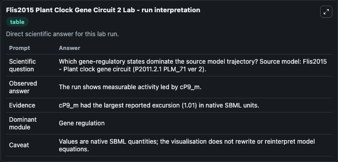
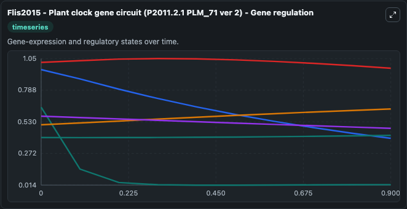
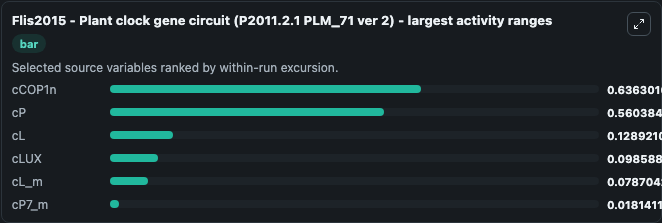
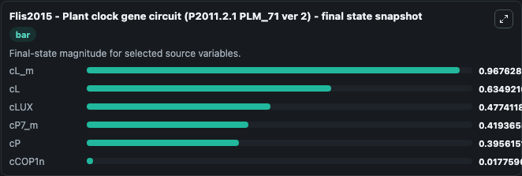
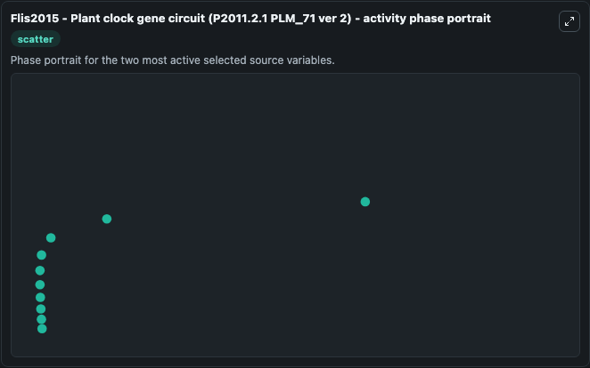

# Flis2015 Plant Clock Gene Circuit 2

This Biosimulant lab wraps `Flis2015 Plant Clock Gene Circuit 2` as a runnable systems biology model with a companion visualization module.
cL_m_degr, param m1, modified to ensure light rate > dark rate. It can be used to explore the configured dynamics and compare scenario outcomes across configurations.

## What You'll See

The lab asks: Which gene-regulatory states dominate the source model trajectory? Source model: Flis2015 - Plant clock gene circuit (P2011.2.1 PLM_71 ver 2). It runs for 1.0 time units with a communication step of 0.1. The run uses the model defaults declared by the curated SBML wrapper. The generated visualizations focus on cL_m, cP, cCOP1n, cLUX, cL, and cP7_m, combining trajectory, endpoint-comparison, and summary-table views from one completed dark-mode run.

In this captured run, **cCOP1n** moved from 0.6500 to 0.0178 across 1.0 simulation windows.


### Output Visualizations



*Summary table for Flis2015 Plant Clock Gene Circuit 2, reporting the scientific question, observed answer, dominant module, and caveat.*



*Trajectories of cCOP1n, cP, cL, cLUX, cL_m, and cP7_m across the 1.0 simulation. In this run **cL** climbed from 0.5060 to 0.6349 and **cCOP1n** fell from 0.6500 to 0.0178 — the largest movements among the focused observables.*



*Largest-excursion ranking of the focused observables — the absolute movement magnitude during the run. Top 3: **cCOP1n** = 0.6363, **cP** = 0.5604, **cL** = 0.1289, with 3 more observables below.*



*Endpoint snapshot of the focused observables — final values from the captured run. Top 3 by value: **cL_m** = 0.9676, **cL** = 0.6349, **cLUX** = 0.4774, with 3 more observables below.*



*Visualization card from the Flis2015 Plant Clock Gene Circuit 2 dark-mode run.*


## Model Context

- Core model: `models/core`
- Visualization model: `models/visualisation`
- Standard: `other`
- Upstream source: `biomodels_ebi:BIOMD0000000598`
- License: `CC0`

## Inputs

| Input | Maps To | Default | Notes |
|---|---|---|---|
| Initial C L M | `systemsbiology_sbml_flis2015_plant_clock_gene_circuit_p2011_2_1_plm_biomd0000000598_model.initial_c_l_m` | | Source state initial condition exposed as a model-specific control because no explicit intervention parameter is identifiable. Maps to SBML symbol `cL_m`. |
| Initial Model State C P | `systemsbiology_sbml_flis2015_plant_clock_gene_circuit_p2011_2_1_plm_biomd0000000598_model.initial_model_state_c_p` | | Source state initial condition exposed as a model-specific control because no explicit intervention parameter is identifiable. Maps to SBML symbol `cP`. |
| Initial C Cop1n | `systemsbiology_sbml_flis2015_plant_clock_gene_circuit_p2011_2_1_plm_biomd0000000598_model.initial_c_cop1n` | | Source state initial condition exposed as a model-specific control because no explicit intervention parameter is identifiable. Maps to SBML symbol `cCOP1n`. |
| Initial C Lux | `systemsbiology_sbml_flis2015_plant_clock_gene_circuit_p2011_2_1_plm_biomd0000000598_model.initial_c_lux` | | Source state initial condition exposed as a model-specific control because no explicit intervention parameter is identifiable. Maps to SBML symbol `cLUX`. |
| Initial Model State C L | `systemsbiology_sbml_flis2015_plant_clock_gene_circuit_p2011_2_1_plm_biomd0000000598_model.initial_model_state_c_l` | | Source state initial condition exposed as a model-specific control because no explicit intervention parameter is identifiable. Maps to SBML symbol `cL`. |
| Initial C P7 M | `systemsbiology_sbml_flis2015_plant_clock_gene_circuit_p2011_2_1_plm_biomd0000000598_model.initial_c_p7_m` | | Source state initial condition exposed as a model-specific control because no explicit intervention parameter is identifiable. Maps to SBML symbol `cP7_m`. |

## Outputs

| Output | Maps To | Role |
|---|---|---|
| `state` | `systemsbiology_sbml_flis2015_plant_clock_gene_circuit_p2011_2_1_plm_biomd0000000598_model.state` | Available to the visualization model and downstream workflows. |
| `summary` | `systemsbiology_sbml_flis2015_plant_clock_gene_circuit_p2011_2_1_plm_biomd0000000598_model.summary` | Available to the visualization model and downstream workflows. |
| `species_labels` | `systemsbiology_sbml_flis2015_plant_clock_gene_circuit_p2011_2_1_plm_biomd0000000598_model.species_labels` | Available to the visualization model and downstream workflows. |
| `c_l_m` | `systemsbiology_sbml_flis2015_plant_clock_gene_circuit_p2011_2_1_plm_biomd0000000598_model.c_l_m` | Available to the visualization model and downstream workflows. |
| `c_p` | `systemsbiology_sbml_flis2015_plant_clock_gene_circuit_p2011_2_1_plm_biomd0000000598_model.c_p` | Available to the visualization model and downstream workflows. |
| `c_cop1n` | `systemsbiology_sbml_flis2015_plant_clock_gene_circuit_p2011_2_1_plm_biomd0000000598_model.c_cop1n` | Available to the visualization model and downstream workflows. |
| `c_lux` | `systemsbiology_sbml_flis2015_plant_clock_gene_circuit_p2011_2_1_plm_biomd0000000598_model.c_lux` | Available to the visualization model and downstream workflows. |
| `c_l` | `systemsbiology_sbml_flis2015_plant_clock_gene_circuit_p2011_2_1_plm_biomd0000000598_model.c_l` | Available to the visualization model and downstream workflows. |
| `c_p7_m` | `systemsbiology_sbml_flis2015_plant_clock_gene_circuit_p2011_2_1_plm_biomd0000000598_model.c_p7_m` | Available to the visualization model and downstream workflows. |

## Runtime

- Duration: `1.0`
- Communication step: `0.1`

## Running Locally

```bash
biosimulant labs serve
```
