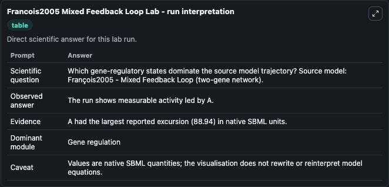
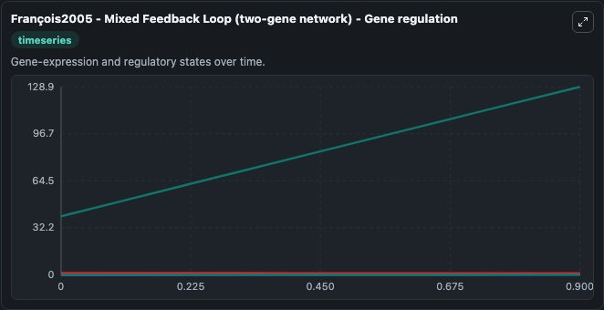
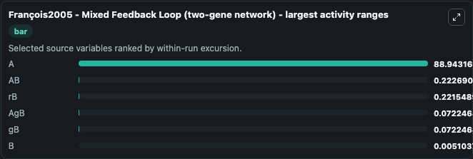
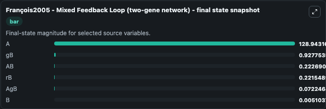
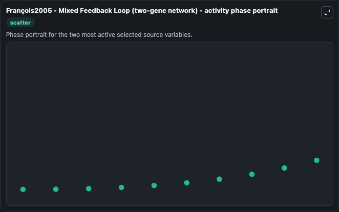

# Francois2005 Mixed Feedback Loop

This Biosimulant lab wraps `Francois2005 Mixed Feedback Loop` as a runnable systems biology model with a companion visualization module.
Paul François & Vincent Hakim. It can be used to explore the configured dynamics and compare scenario outcomes across configurations.

## What You'll See

The lab asks: Which gene-regulatory states dominate the source model trajectory? Source model: François2005 - Mixed Feedback Loop (two-gene network). It runs for 1.0 time units with a communication step of 0.1. The run uses the model defaults declared by the curated SBML wrapper. The generated visualizations focus on gB, rB, AgB, AB, A, and B, combining trajectory, endpoint-comparison, and summary-table views from one completed dark-mode run.

In this captured run, **A** moved from 40.000 to 128.9 across 1.0 simulation windows.


### Output Visualizations



*Summary table for Francois2005 Mixed Feedback Loop, reporting the scientific question, observed answer, dominant module, and caveat.*



*Trajectories of A, AB, rB, AgB, gB, and B across the 1.0 simulation. In this run **A** climbed from 40.000 to 128.9 and **gB** fell from 1.000 to 0.9278 — the largest movements among the focused observables.*



*Largest-excursion ranking of the focused observables — the absolute movement magnitude during the run. Top 3: **A** = 88.943, **AB** = 0.2227, **rB** = 0.2215, with 3 more observables below.*



*Endpoint snapshot of the focused observables — final values from the captured run. Top 3 by value: **A** = 128.9, **gB** = 0.9278, **AB** = 0.2227, with 3 more observables below.*



*Visualization card from the Francois2005 Mixed Feedback Loop dark-mode run.*


## Model Context

- Core model: `models/core`
- Visualization model: `models/visualisation`
- Standard: `other`
- Upstream source: `biomodels_ebi:BIOMD0000000539`
- License: `CC0`

## Inputs

| Input | Maps To | Default | Notes |
|---|---|---|---|
| Initial Model State G B | `systemsbiology_sbml_fran_ois2005_mixed_feedback_loop_two_gene_networ_biomd0000000539_model.initial_model_state_g_b` | | Source state initial condition exposed as a model-specific control because no explicit intervention parameter is identifiable. Maps to SBML symbol `gB`. |
| Initial Model State R B | `systemsbiology_sbml_fran_ois2005_mixed_feedback_loop_two_gene_networ_biomd0000000539_model.initial_model_state_r_b` | | Source state initial condition exposed as a model-specific control because no explicit intervention parameter is identifiable. Maps to SBML symbol `rB`. |
| Initial Ag B | `systemsbiology_sbml_fran_ois2005_mixed_feedback_loop_two_gene_networ_biomd0000000539_model.initial_ag_b` | | Source state initial condition exposed as a model-specific control because no explicit intervention parameter is identifiable. Maps to SBML symbol `AgB`. |
| Initial Model State Ab | `systemsbiology_sbml_fran_ois2005_mixed_feedback_loop_two_gene_networ_biomd0000000539_model.initial_model_state_ab` | | Source state initial condition exposed as a model-specific control because no explicit intervention parameter is identifiable. Maps to SBML symbol `AB`. |
| Initial Model State A | `systemsbiology_sbml_fran_ois2005_mixed_feedback_loop_two_gene_networ_biomd0000000539_model.initial_model_state_a` | | Source state initial condition exposed as a model-specific control because no explicit intervention parameter is identifiable. Maps to SBML symbol `A`. |
| Initial Model State B | `systemsbiology_sbml_fran_ois2005_mixed_feedback_loop_two_gene_networ_biomd0000000539_model.initial_model_state_b` | | Source state initial condition exposed as a model-specific control because no explicit intervention parameter is identifiable. Maps to SBML symbol `B`. |

## Outputs

| Output | Maps To | Role |
|---|---|---|
| `state` | `systemsbiology_sbml_fran_ois2005_mixed_feedback_loop_two_gene_networ_biomd0000000539_model.state` | Available to the visualization model and downstream workflows. |
| `summary` | `systemsbiology_sbml_fran_ois2005_mixed_feedback_loop_two_gene_networ_biomd0000000539_model.summary` | Available to the visualization model and downstream workflows. |
| `species_labels` | `systemsbiology_sbml_fran_ois2005_mixed_feedback_loop_two_gene_networ_biomd0000000539_model.species_labels` | Available to the visualization model and downstream workflows. |
| `g_b` | `systemsbiology_sbml_fran_ois2005_mixed_feedback_loop_two_gene_networ_biomd0000000539_model.g_b` | Available to the visualization model and downstream workflows. |
| `r_b` | `systemsbiology_sbml_fran_ois2005_mixed_feedback_loop_two_gene_networ_biomd0000000539_model.r_b` | Available to the visualization model and downstream workflows. |
| `ag_b` | `systemsbiology_sbml_fran_ois2005_mixed_feedback_loop_two_gene_networ_biomd0000000539_model.ag_b` | Available to the visualization model and downstream workflows. |
| `model_state_ab` | `systemsbiology_sbml_fran_ois2005_mixed_feedback_loop_two_gene_networ_biomd0000000539_model.model_state_ab` | Available to the visualization model and downstream workflows. |
| `model_state_a` | `systemsbiology_sbml_fran_ois2005_mixed_feedback_loop_two_gene_networ_biomd0000000539_model.model_state_a` | Available to the visualization model and downstream workflows. |
| `model_state_b` | `systemsbiology_sbml_fran_ois2005_mixed_feedback_loop_two_gene_networ_biomd0000000539_model.model_state_b` | Available to the visualization model and downstream workflows. |

## Runtime

- Duration: `1.0`
- Communication step: `0.1`

## Running Locally

```bash
biosimulant labs serve
```
