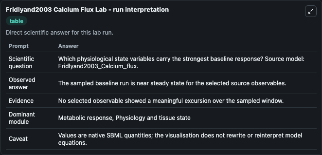
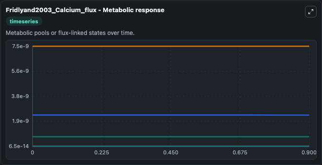
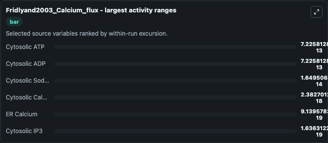
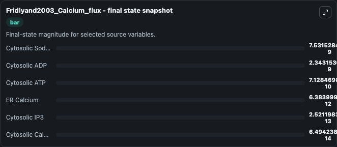
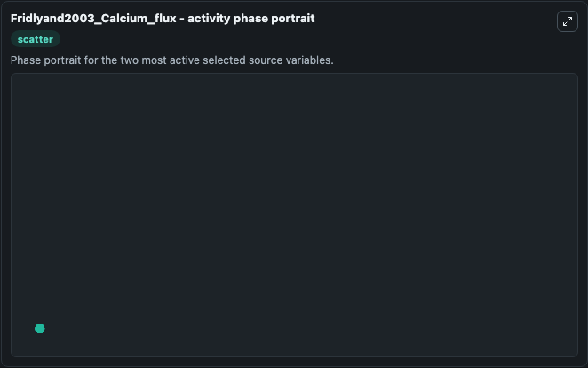

# Fridlyand2003 Calcium Flux

This Biosimulant lab wraps `Fridlyand2003 Calcium Flux` as a runnable systems biology model with a companion visualization module.
The model reproduces block A of Fig 5 and also Fig 3 (without the inclusion of Tg action). It can be used to explore the configured dynamics and compare scenario outcomes across configurations.

## What You'll See

The lab asks: Which physiological state variables carry the strongest baseline response? Source model: Fridlyand2003_Calcium_flux. It runs for 1.0 time units with a communication step of 0.1. The run uses the model defaults declared by the curated SBML wrapper. The generated visualizations focus on Cytosolic ADP, Cytosolic ATP, Cytosolic Sodium, ER Calcium, Cytosolic IP3, and Cytosolic Calcium, combining trajectory, endpoint-comparison, and summary-table views from one completed dark-mode run.

In this captured run, **Cytosolic ATP** moved from 7.12e-10 to 7.13e-10 across 1.0 simulation windows.


### Output Visualizations



*Summary table for Fridlyand2003 Calcium Flux, reporting the scientific question, observed answer, dominant module, and caveat.*



*Trajectories of Cytosolic ATP, Cytosolic ADP, Cytosolic Sodium, Cytosolic Calcium, ER Calcium, and Cytosolic IP3 across the 1.0 simulation. In this run **Cytosolic ATP** climbed from 7.12e-10 to 7.13e-10 and **Cytosolic ADP** fell from 2.34e-09 to 2.34e-09 — the largest movements among the focused observables.*



*Largest-excursion ranking of the focused observables — the absolute movement magnitude during the run. Top 3: **Cytosolic ATP** = 7.23e-13, **Cytosolic ADP** = 7.23e-13, **Cytosolic Sodium** = 1.65e-14, with 3 more observables below.*



*Endpoint snapshot of the focused observables — final values from the captured run. Top 3 by value: **Cytosolic Sodium** = 7.53e-09, **Cytosolic ADP** = 2.34e-09, **Cytosolic ATP** = 7.13e-10, with 3 more observables below.*



*Visualization card from the Fridlyand2003 Calcium Flux dark-mode run.*


## Model Context

- Core model: `models/core`
- Visualization model: `models/visualisation`
- Standard: `other`
- Upstream source: `biomodels_ebi:BIOMD0000000059`
- License: `CC0`

## Inputs

| Input | Maps To | Default | Notes |
|---|---|---|---|
| Initial Cytosolic ADP | `systemsbiology_sbml_fridlyand2003_calcium_flux_biomd0000000059_model.initial_cytosolic_adp` | | Source state initial condition exposed as a model-specific control because no explicit intervention parameter is identifiable. Maps to SBML symbol `ADP_cyt`. |
| Initial Cytosolic ATP | `systemsbiology_sbml_fridlyand2003_calcium_flux_biomd0000000059_model.initial_cytosolic_atp` | | Source state initial condition exposed as a model-specific control because no explicit intervention parameter is identifiable. Maps to SBML symbol `ATP_cyt`. |
| Initial Cytosolic Sodium | `systemsbiology_sbml_fridlyand2003_calcium_flux_biomd0000000059_model.initial_cytosolic_sodium` | | Source state initial condition exposed as a model-specific control because no explicit intervention parameter is identifiable. Maps to SBML symbol `Na_cyt`. |
| Initial Er Calcium | `systemsbiology_sbml_fridlyand2003_calcium_flux_biomd0000000059_model.initial_er_calcium` | | Source state initial condition exposed as a model-specific control because no explicit intervention parameter is identifiable. Maps to SBML symbol `Ca_er`. |
| Initial Cytosolic IP3 | `systemsbiology_sbml_fridlyand2003_calcium_flux_biomd0000000059_model.initial_cytosolic_ip3` | | Source state initial condition exposed as a model-specific control because no explicit intervention parameter is identifiable. Maps to SBML symbol `IP3_cyt`. |
| Initial Cytosolic Calcium | `systemsbiology_sbml_fridlyand2003_calcium_flux_biomd0000000059_model.initial_cytosolic_calcium` | | Source state initial condition exposed as a model-specific control because no explicit intervention parameter is identifiable. Maps to SBML symbol `Ca_cyt`. |

## Outputs

| Output | Maps To | Role |
|---|---|---|
| `state` | `systemsbiology_sbml_fridlyand2003_calcium_flux_biomd0000000059_model.state` | Available to the visualization model and downstream workflows. |
| `summary` | `systemsbiology_sbml_fridlyand2003_calcium_flux_biomd0000000059_model.summary` | Available to the visualization model and downstream workflows. |
| `species_labels` | `systemsbiology_sbml_fridlyand2003_calcium_flux_biomd0000000059_model.species_labels` | Available to the visualization model and downstream workflows. |
| `cytosolic_adp` | `systemsbiology_sbml_fridlyand2003_calcium_flux_biomd0000000059_model.cytosolic_adp` | Available to the visualization model and downstream workflows. |
| `cytosolic_atp` | `systemsbiology_sbml_fridlyand2003_calcium_flux_biomd0000000059_model.cytosolic_atp` | Available to the visualization model and downstream workflows. |
| `cytosolic_sodium` | `systemsbiology_sbml_fridlyand2003_calcium_flux_biomd0000000059_model.cytosolic_sodium` | Available to the visualization model and downstream workflows. |
| `er_calcium` | `systemsbiology_sbml_fridlyand2003_calcium_flux_biomd0000000059_model.er_calcium` | Available to the visualization model and downstream workflows. |
| `cytosolic_ip3` | `systemsbiology_sbml_fridlyand2003_calcium_flux_biomd0000000059_model.cytosolic_ip3` | Available to the visualization model and downstream workflows. |
| `cytosolic_calcium` | `systemsbiology_sbml_fridlyand2003_calcium_flux_biomd0000000059_model.cytosolic_calcium` | Available to the visualization model and downstream workflows. |

## Runtime

- Duration: `1.0`
- Communication step: `0.1`

## Running Locally

```bash
biosimulant labs serve
```
