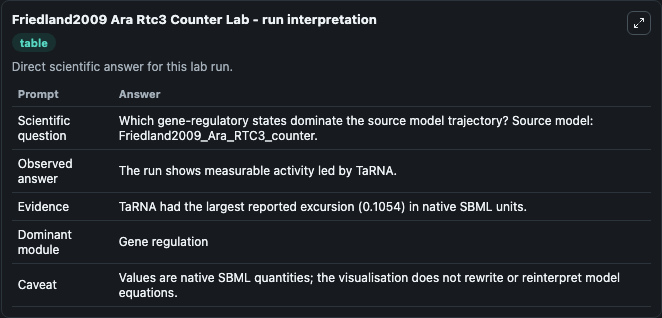
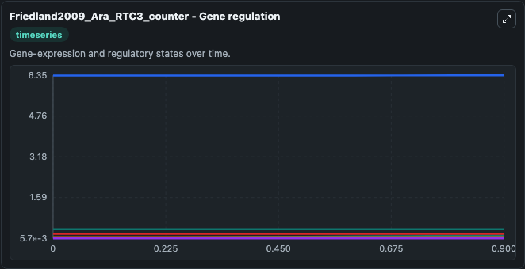
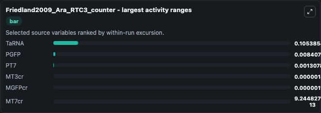
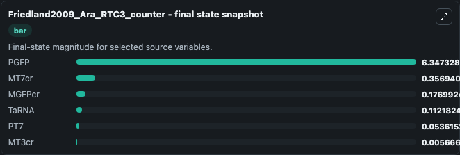
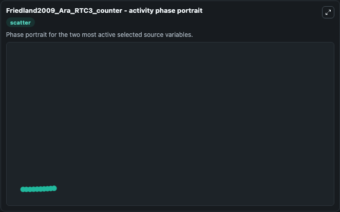

# Friedland2009 Ara Rtc3 Counter

This Biosimulant lab wraps `Friedland2009 Ara Rtc3 Counter` as a runnable systems biology model with a companion visualization module.
This is the model of the RTC3 counter described in the article: Synthetic gene networks that count. It can be used to explore the configured dynamics and compare scenario outcomes across configurations.

## What You'll See

The lab asks: Which gene-regulatory states dominate the source model trajectory? Source model: Friedland2009_Ara_RTC3_counter. It runs for 1.0 time units with a communication step of 0.1. The run uses the model defaults declared by the curated SBML wrapper. The generated visualizations focus on PGFP, MT7cr, MGFPcr, PT7, TaRNA, and MT3cr, combining trajectory, endpoint-comparison, and summary-table views from one completed dark-mode run.

In this captured run, **TaRNA** moved from 0.0068 to 0.1122 across 1.0 simulation windows.


### Output Visualizations



*Summary table for Friedland2009 Ara Rtc3 Counter, reporting the scientific question, observed answer, dominant module, and caveat.*



*Trajectories of TaRNA, PGFP, PT7, MT3cr, MGFPcr, and MT7cr across the 1.0 simulation. In this run **TaRNA** climbed from 0.0068 to 0.1122 — the largest movements among the focused observables.*



*Largest-excursion ranking of the focused observables — the absolute movement magnitude during the run. Top 3: **TaRNA** = 0.1054, **PGFP** = 0.00841, **PT7** = 0.00131, with 3 more observables below.*



*Endpoint snapshot of the focused observables — final values from the captured run. Top 3 by value: **PGFP** = 6.347, **MT7cr** = 0.3569, **MGFPcr** = 0.1770, with 3 more observables below.*



*Visualization card from the Friedland2009 Ara Rtc3 Counter dark-mode run.*


## Model Context

- Core model: `models/core`
- Visualization model: `models/visualisation`
- Standard: `other`
- Upstream source: `biomodels_ebi:BIOMD0000000301`
- License: `CC0`

## Inputs

| Input | Maps To | Default | Notes |
|---|---|---|---|
| Initial Pgfp | `systemsbiology_sbml_friedland2009_ara_rtc3_counter_biomd0000000301_model.initial_pgfp` | | Source state initial condition exposed as a model-specific control because no explicit intervention parameter is identifiable. Maps to SBML symbol `pGFP`. |
| Initial Mt7cr | `systemsbiology_sbml_friedland2009_ara_rtc3_counter_biomd0000000301_model.initial_mt7cr` | | Source state initial condition exposed as a model-specific control because no explicit intervention parameter is identifiable. Maps to SBML symbol `mT7cr`. |
| Initial Mgf Pcr | `systemsbiology_sbml_friedland2009_ara_rtc3_counter_biomd0000000301_model.initial_mgf_pcr` | | Source state initial condition exposed as a model-specific control because no explicit intervention parameter is identifiable. Maps to SBML symbol `mGFPcr`. |
| Initial Model State PT7 | `systemsbiology_sbml_friedland2009_ara_rtc3_counter_biomd0000000301_model.initial_model_state_pt7` | | Source state initial condition exposed as a model-specific control because no explicit intervention parameter is identifiable. Maps to SBML symbol `pT7`. |
| Initial Ta RNA | `systemsbiology_sbml_friedland2009_ara_rtc3_counter_biomd0000000301_model.initial_ta_rna` | | Source state initial condition exposed as a model-specific control because no explicit intervention parameter is identifiable. Maps to SBML symbol `taRNA`. |
| Initial Mt3cr | `systemsbiology_sbml_friedland2009_ara_rtc3_counter_biomd0000000301_model.initial_mt3cr` | | Source state initial condition exposed as a model-specific control because no explicit intervention parameter is identifiable. Maps to SBML symbol `mT3cr`. |

## Outputs

| Output | Maps To | Role |
|---|---|---|
| `state` | `systemsbiology_sbml_friedland2009_ara_rtc3_counter_biomd0000000301_model.state` | Available to the visualization model and downstream workflows. |
| `summary` | `systemsbiology_sbml_friedland2009_ara_rtc3_counter_biomd0000000301_model.summary` | Available to the visualization model and downstream workflows. |
| `species_labels` | `systemsbiology_sbml_friedland2009_ara_rtc3_counter_biomd0000000301_model.species_labels` | Available to the visualization model and downstream workflows. |
| `pgfp` | `systemsbiology_sbml_friedland2009_ara_rtc3_counter_biomd0000000301_model.pgfp` | Available to the visualization model and downstream workflows. |
| `mt7cr` | `systemsbiology_sbml_friedland2009_ara_rtc3_counter_biomd0000000301_model.mt7cr` | Available to the visualization model and downstream workflows. |
| `mgf_pcr` | `systemsbiology_sbml_friedland2009_ara_rtc3_counter_biomd0000000301_model.mgf_pcr` | Available to the visualization model and downstream workflows. |
| `pt7` | `systemsbiology_sbml_friedland2009_ara_rtc3_counter_biomd0000000301_model.pt7` | Available to the visualization model and downstream workflows. |
| `ta_rna` | `systemsbiology_sbml_friedland2009_ara_rtc3_counter_biomd0000000301_model.ta_rna` | Available to the visualization model and downstream workflows. |
| `mt3cr` | `systemsbiology_sbml_friedland2009_ara_rtc3_counter_biomd0000000301_model.mt3cr` | Available to the visualization model and downstream workflows. |

## Runtime

- Duration: `1.0`
- Communication step: `0.1`

## Running Locally

```bash
biosimulant labs serve
```
