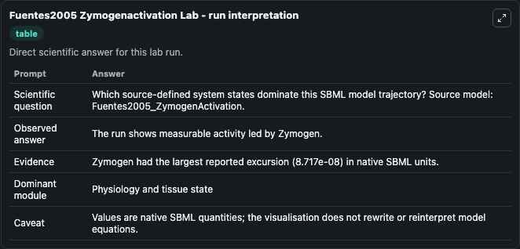
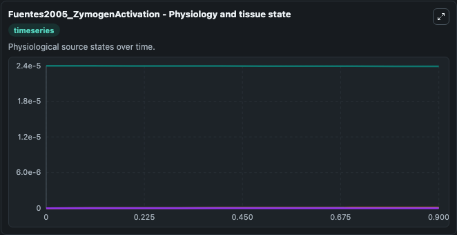
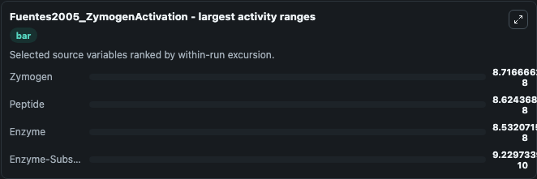
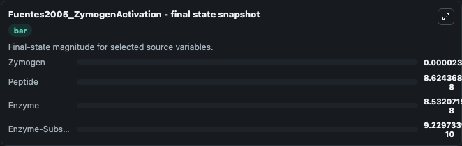
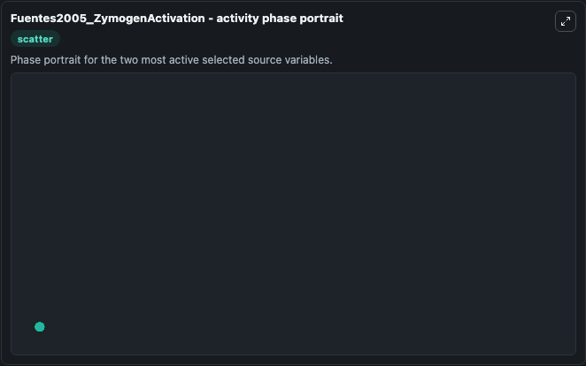

# Fuentes2005 Zymogenactivation

This Biosimulant lab wraps `Fuentes2005 Zymogenactivation` as a runnable systems biology model with a companion visualization module.
. It can be used to explore the configured dynamics and compare scenario outcomes across configurations.

## What You'll See

The lab asks: Which source-defined system states dominate this SBML model trajectory? Source model: Fuentes2005_ZymogenActivation. It runs for 1.0 time units with a communication step of 0.1. The run uses the model defaults declared by the curated SBML wrapper. The generated visualizations focus on Enzyme-Substrate complex, Zymogen, Peptide, and Enzyme, combining trajectory, endpoint-comparison, and summary-table views from one completed dark-mode run.

In this captured run, **Zymogen** moved from 2.4e-05 to 2.39e-05 across 1.0 simulation windows.


### Output Visualizations



*Summary table for Fuentes2005 Zymogenactivation, reporting the scientific question, observed answer, dominant module, and caveat.*



*Trajectories of Zymogen, Peptide, Enzyme, and Enzyme-Substrate complex across the 1.0 simulation. In this run **Peptide** climbed from 0 to 8.62e-08 and **Zymogen** fell from 2.4e-05 to 2.39e-05 — the largest movements among the focused observables.*



*Largest-excursion ranking of the focused observables — the absolute movement magnitude during the run. Top 3: **Zymogen** = 8.72e-08, **Peptide** = 8.62e-08, **Enzyme** = 8.53e-08, with 1 more observable below.*



*Endpoint snapshot of the focused observables — final values from the captured run. Top 3 by value: **Zymogen** = 2.39e-05, **Peptide** = 8.62e-08, **Enzyme** = 8.53e-08, with 1 more observable below.*



*Visualization card from the Fuentes2005 Zymogenactivation dark-mode run.*


## Model Context

- Core model: `models/core`
- Visualization model: `models/visualisation`
- Standard: `other`
- Upstream source: `biomodels_ebi:BIOMD0000000092`
- License: `CC0`

## Inputs

| Input | Maps To | Default | Notes |
|---|---|---|---|
| Initial Enzyme Substrate Complex | `systemsbiology_sbml_fuentes2005_zymogenactivation_biomd0000000092_model.initial_enzyme_substrate_complex` | | Source state initial condition exposed as a model-specific control because no explicit intervention parameter is identifiable. Maps to SBML symbol `ez`. |
| Initial Zymogen | `systemsbiology_sbml_fuentes2005_zymogenactivation_biomd0000000092_model.initial_zymogen` | | Source state initial condition exposed as a model-specific control because no explicit intervention parameter is identifiable. Maps to SBML symbol `z`. |
| Initial Peptide | `systemsbiology_sbml_fuentes2005_zymogenactivation_biomd0000000092_model.initial_peptide` | | Source state initial condition exposed as a model-specific control because no explicit intervention parameter is identifiable. Maps to SBML symbol `w`. |
| Initial Enzyme | `systemsbiology_sbml_fuentes2005_zymogenactivation_biomd0000000092_model.initial_enzyme` | | Source state initial condition exposed as a model-specific control because no explicit intervention parameter is identifiable. Maps to SBML symbol `e`. |

## Outputs

| Output | Maps To | Role |
|---|---|---|
| `state` | `systemsbiology_sbml_fuentes2005_zymogenactivation_biomd0000000092_model.state` | Available to the visualization model and downstream workflows. |
| `summary` | `systemsbiology_sbml_fuentes2005_zymogenactivation_biomd0000000092_model.summary` | Available to the visualization model and downstream workflows. |
| `species_labels` | `systemsbiology_sbml_fuentes2005_zymogenactivation_biomd0000000092_model.species_labels` | Available to the visualization model and downstream workflows. |
| `enzyme_substrate_complex` | `systemsbiology_sbml_fuentes2005_zymogenactivation_biomd0000000092_model.enzyme_substrate_complex` | Available to the visualization model and downstream workflows. |
| `zymogen` | `systemsbiology_sbml_fuentes2005_zymogenactivation_biomd0000000092_model.zymogen` | Available to the visualization model and downstream workflows. |
| `peptide` | `systemsbiology_sbml_fuentes2005_zymogenactivation_biomd0000000092_model.peptide` | Available to the visualization model and downstream workflows. |
| `enzyme` | `systemsbiology_sbml_fuentes2005_zymogenactivation_biomd0000000092_model.enzyme` | Available to the visualization model and downstream workflows. |

## Runtime

- Duration: `1.0`
- Communication step: `0.1`

## Running Locally

```bash
biosimulant labs serve
```
