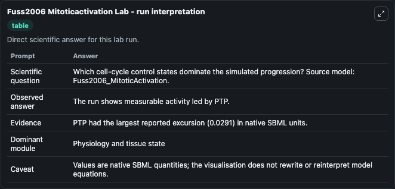
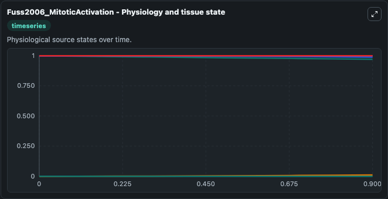
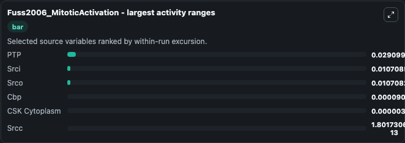
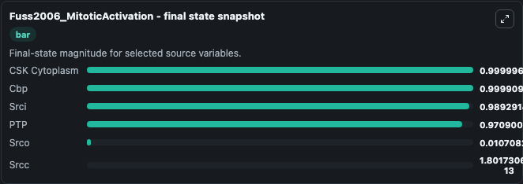
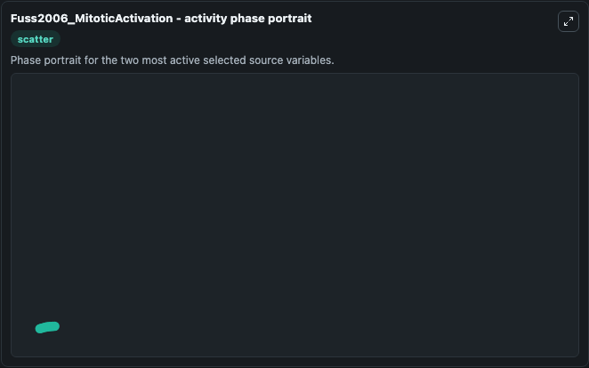

# Fuss2006 Mitoticactivation

This Biosimulant lab wraps `Fuss2006 Mitoticactivation` as a runnable systems biology model with a companion visualization module.
The model was curated with XPP. It can be used to explore the configured dynamics and compare scenario outcomes across configurations.

## What You'll See

The lab asks: Which cell-cycle control states dominate the simulated progression? Source model: Fuss2006_MitoticActivation. It runs for 1.0 time units with a communication step of 0.1. The run uses the model defaults declared by the curated SBML wrapper. The generated visualizations focus on Srci, PTP, Cbp, CSK Cytoplasm, Srco, and Srcc, combining trajectory, endpoint-comparison, and summary-table views from one completed dark-mode run.

In this captured run, **PTP** moved from 1.000 to 0.9709 across 1.0 simulation windows.


### Output Visualizations



*Summary table for Fuss2006 Mitoticactivation, reporting the scientific question, observed answer, dominant module, and caveat.*



*Trajectories of PTP, Srci, Srco, Cbp, CSK Cytoplasm, and Srcc across the 1.0 simulation. In this run **Srco** climbed from 0 to 0.0107 and **PTP** fell from 1.000 to 0.9709 — the largest movements among the focused observables.*



*Largest-excursion ranking of the focused observables — the absolute movement magnitude during the run. Top 3: **PTP** = 0.0291, **Srci** = 0.0107, **Srco** = 0.0107, with 3 more observables below.*



*Endpoint snapshot of the focused observables — final values from the captured run. Top 3 by value: **CSK Cytoplasm** = 1.0000, **Cbp** = 0.9999, **Srci** = 0.9893, with 3 more observables below.*



*Visualization card from the Fuss2006 Mitoticactivation dark-mode run.*


## Model Context

- Core model: `models/core`
- Visualization model: `models/visualisation`
- Standard: `other`
- Upstream source: `biomodels_ebi:BIOMD0000000069`
- License: `CC0`

## Inputs

| Input | Maps To | Default | Notes |
|---|---|---|---|
| Initial Srci | `systemsbiology_sbml_fuss2006_mitoticactivation_biomd0000000069_model.initial_srci` | | Source state initial condition exposed as a model-specific control because no explicit intervention parameter is identifiable. Maps to SBML symbol `srci`. |
| Initial Model State Ptp | `systemsbiology_sbml_fuss2006_mitoticactivation_biomd0000000069_model.initial_model_state_ptp` | | Source state initial condition exposed as a model-specific control because no explicit intervention parameter is identifiable. Maps to SBML symbol `PTP`. |
| Initial Model State Cbp | `systemsbiology_sbml_fuss2006_mitoticactivation_biomd0000000069_model.initial_model_state_cbp` | | Source state initial condition exposed as a model-specific control because no explicit intervention parameter is identifiable. Maps to SBML symbol `Cbp`. |
| Initial Csk Cytoplasm | `systemsbiology_sbml_fuss2006_mitoticactivation_biomd0000000069_model.initial_csk_cytoplasm` | | Source state initial condition exposed as a model-specific control because no explicit intervention parameter is identifiable. Maps to SBML symbol `CSK_cytoplasm`. |
| Initial Srco | `systemsbiology_sbml_fuss2006_mitoticactivation_biomd0000000069_model.initial_srco` | | Source state initial condition exposed as a model-specific control because no explicit intervention parameter is identifiable. Maps to SBML symbol `srco`. |
| Initial Srcc | `systemsbiology_sbml_fuss2006_mitoticactivation_biomd0000000069_model.initial_srcc` | | Source state initial condition exposed as a model-specific control because no explicit intervention parameter is identifiable. Maps to SBML symbol `srcc`. |

## Outputs

| Output | Maps To | Role |
|---|---|---|
| `state` | `systemsbiology_sbml_fuss2006_mitoticactivation_biomd0000000069_model.state` | Available to the visualization model and downstream workflows. |
| `summary` | `systemsbiology_sbml_fuss2006_mitoticactivation_biomd0000000069_model.summary` | Available to the visualization model and downstream workflows. |
| `species_labels` | `systemsbiology_sbml_fuss2006_mitoticactivation_biomd0000000069_model.species_labels` | Available to the visualization model and downstream workflows. |
| `srci` | `systemsbiology_sbml_fuss2006_mitoticactivation_biomd0000000069_model.srci` | Available to the visualization model and downstream workflows. |
| `ptp` | `systemsbiology_sbml_fuss2006_mitoticactivation_biomd0000000069_model.ptp` | Available to the visualization model and downstream workflows. |
| `cbp` | `systemsbiology_sbml_fuss2006_mitoticactivation_biomd0000000069_model.cbp` | Available to the visualization model and downstream workflows. |
| `csk_cytoplasm` | `systemsbiology_sbml_fuss2006_mitoticactivation_biomd0000000069_model.csk_cytoplasm` | Available to the visualization model and downstream workflows. |
| `srco` | `systemsbiology_sbml_fuss2006_mitoticactivation_biomd0000000069_model.srco` | Available to the visualization model and downstream workflows. |
| `srcc` | `systemsbiology_sbml_fuss2006_mitoticactivation_biomd0000000069_model.srcc` | Available to the visualization model and downstream workflows. |

## Runtime

- Duration: `1.0`
- Communication step: `0.1`

## Running Locally

```bash
biosimulant labs serve
```
