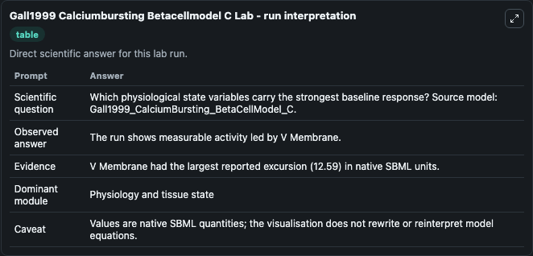
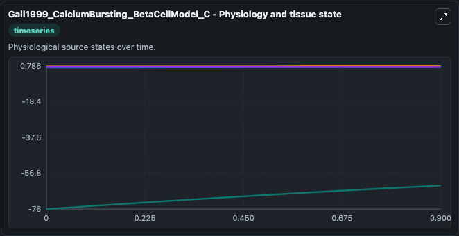
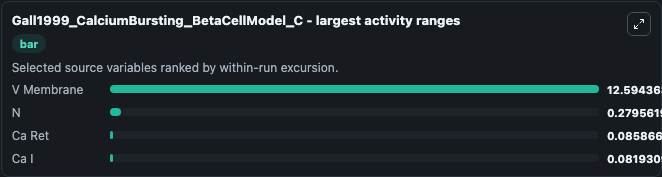
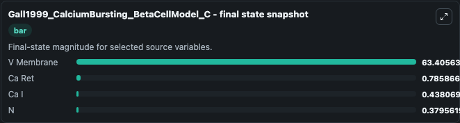
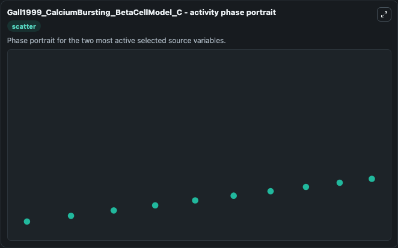

# Gall1999 Calciumbursting Betacellmodel C

This Biosimulant lab wraps `Gall1999 Calciumbursting Betacellmodel C` as a runnable systems biology model with a companion visualization module.
This a model from the article: Effect of Na/Ca exchange on plateau fraction and [Ca]i in models for bursting in pancreatic beta-cells. It can be used to explore the configured dynamics and compare scenario outcomes across configurations.

## What You'll See

The lab asks: Which physiological state variables carry the strongest baseline response? Source model: Gall1999_CalciumBursting_BetaCellModel_C. It runs for 1.0 time units with a communication step of 0.1. The run uses the model defaults declared by the curated SBML wrapper. The generated visualizations focus on V Membrane, Ca Ret, Ca I, and N, combining trajectory, endpoint-comparison, and summary-table views from one completed dark-mode run.

In this captured run, **V Membrane** moved from -76.000 to -63.406 across 1.0 simulation windows.


### Output Visualizations



*Summary table for Gall1999 Calciumbursting Betacellmodel C, reporting the scientific question, observed answer, dominant module, and caveat.*



*Trajectories of V Membrane, N, Ca Ret, and Ca I across the 1.0 simulation. In this run **V Membrane** climbed from -76.000 to -63.406 and **Ca I** fell from 0.5200 to 0.4381 — the largest movements among the focused observables.*



*Largest-excursion ranking of the focused observables — the absolute movement magnitude during the run. Top 3: **V Membrane** = 12.594, **N** = 0.2796, **Ca Ret** = 0.0859, with 1 more observable below.*



*Endpoint snapshot of the focused observables — final values from the captured run. Top 3 by value: **V Membrane** = 63.406, **Ca Ret** = 0.7859, **Ca I** = 0.4381, with 1 more observable below.*



*Visualization card from the Gall1999 Calciumbursting Betacellmodel C dark-mode run.*


## Model Context

- Core model: `models/core`
- Visualization model: `models/visualisation`
- Standard: `other`
- Upstream source: `biomodels_ebi:MODEL1201140000`
- License: `CC0`

## Inputs

| Input | Maps To | Default | Notes |
|---|---|---|---|
| Initial V Membrane | `systemsbiology_sbml_gall1999_calciumbursting_betacellmodel_c_model1201140000_model.initial_v_membrane` | | Source state initial condition exposed as a model-specific control because no explicit intervention parameter is identifiable. Maps to SBML symbol `V_membrane`. |
| Initial Ca Ret | `systemsbiology_sbml_gall1999_calciumbursting_betacellmodel_c_model1201140000_model.initial_ca_ret` | | Source state initial condition exposed as a model-specific control because no explicit intervention parameter is identifiable. Maps to SBML symbol `Ca_ret`. |
| Initial Ca I | `systemsbiology_sbml_gall1999_calciumbursting_betacellmodel_c_model1201140000_model.initial_ca_i` | | Source state initial condition exposed as a model-specific control because no explicit intervention parameter is identifiable. Maps to SBML symbol `Ca_i`. |
| Initial Model State N | `systemsbiology_sbml_gall1999_calciumbursting_betacellmodel_c_model1201140000_model.initial_model_state_n` | | Source state initial condition exposed as a model-specific control because no explicit intervention parameter is identifiable. Maps to SBML symbol `n`. |

## Outputs

| Output | Maps To | Role |
|---|---|---|
| `state` | `systemsbiology_sbml_gall1999_calciumbursting_betacellmodel_c_model1201140000_model.state` | Available to the visualization model and downstream workflows. |
| `summary` | `systemsbiology_sbml_gall1999_calciumbursting_betacellmodel_c_model1201140000_model.summary` | Available to the visualization model and downstream workflows. |
| `species_labels` | `systemsbiology_sbml_gall1999_calciumbursting_betacellmodel_c_model1201140000_model.species_labels` | Available to the visualization model and downstream workflows. |
| `v_membrane` | `systemsbiology_sbml_gall1999_calciumbursting_betacellmodel_c_model1201140000_model.v_membrane` | Available to the visualization model and downstream workflows. |
| `ca_ret` | `systemsbiology_sbml_gall1999_calciumbursting_betacellmodel_c_model1201140000_model.ca_ret` | Available to the visualization model and downstream workflows. |
| `ca_i` | `systemsbiology_sbml_gall1999_calciumbursting_betacellmodel_c_model1201140000_model.ca_i` | Available to the visualization model and downstream workflows. |
| `model_state_n` | `systemsbiology_sbml_gall1999_calciumbursting_betacellmodel_c_model1201140000_model.model_state_n` | Available to the visualization model and downstream workflows. |

## Runtime

- Duration: `1.0`
- Communication step: `0.1`

## Running Locally

```bash
biosimulant labs serve
```
