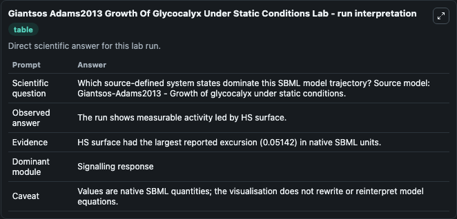
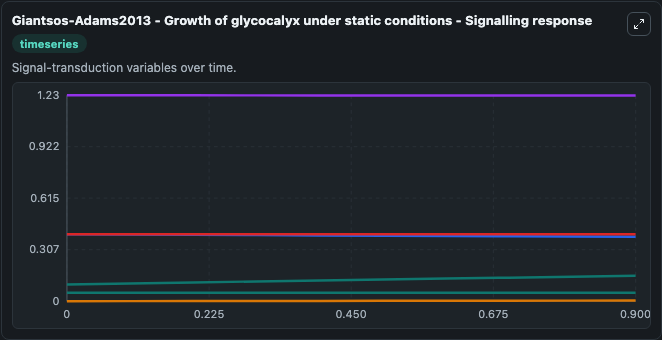
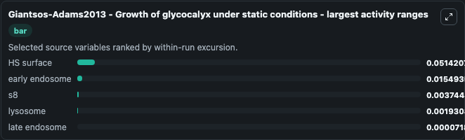
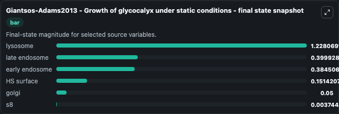
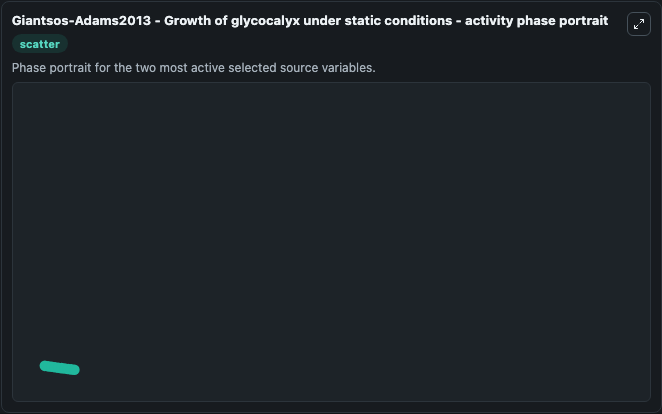

# Giantsos Adams2013 Growth Of Glycocalyx Under Static Conditions

This Biosimulant lab wraps `Giantsos Adams2013 Growth Of Glycocalyx Under Static Conditions` as a runnable systems biology model with a companion visualization module.
Giantsos-Adams2013 - Growth of glycocalyxunder static conditions This model is described in the article: Heparan Sulfate Regrowth Profiles Under Laminar Shear Flow Following Enzymatic Degradation. It can be used to explore the configured dynamics and compare scenario outcomes across configurations.

## What You'll See

The lab asks: Which source-defined system states dominate this SBML model trajectory? Source model: Giantsos-Adams2013 - Growth of glycocalyx under static conditions. It runs for 1.0 time units with a communication step of 0.1. The run uses the model defaults declared by the curated SBML wrapper. The generated visualizations focus on lysosome, late endosome, early endosome, HS surface, golgi, and s8, combining trajectory, endpoint-comparison, and summary-table views from one completed dark-mode run.

In this captured run, **HS surface** moved from 0.1000 to 0.1514 across 1.0 simulation windows.


### Output Visualizations



*Summary table for Giantsos Adams2013 Growth Of Glycocalyx Under Static Conditions, reporting the scientific question, observed answer, dominant module, and caveat.*



*Trajectories of HS surface, early endosome, s8, lysosome, late endosome, and golgi across the 1.0 simulation. In this run **HS surface** climbed from 0.1000 to 0.1514 and **early endosome** fell from 0.4000 to 0.3845 — the largest movements among the focused observables.*



*Largest-excursion ranking of the focused observables — the absolute movement magnitude during the run. Top 3: **HS surface** = 0.0514, **early endosome** = 0.0155, **s8** = 0.00374, with 2 more observables below.*



*Trajectories of HS surface, early endosome, s8, lysosome, late endosome, and golgi across the 1.0 simulation. In this run **HS surface** climbed from 0.1000 to 0.1514 and **early endosome** fell from 0.4000 to 0.3845 — the largest movements among the focused observables.*



*Visualization card from the Giantsos Adams2013 Growth Of Glycocalyx Under Static Conditions dark-mode run.*


## Model Context

- Core model: `models/core`
- Visualization model: `models/visualisation`
- Standard: `other`
- Upstream source: `biomodels_ebi:MODEL1609100001`
- License: `CC0`

## Inputs

| Input | Maps To | Default | Notes |
|---|---|---|---|
| Initial Lysosome | `systemsbiology_sbml_giantsos_adams2013_growth_of_glycocalyx_under_st_model1609100001_model.initial_lysosome` | | Source state initial condition exposed as a model-specific control because no explicit intervention parameter is identifiable. Maps to SBML symbol `s4`. |
| Initial Late Endosome | `systemsbiology_sbml_giantsos_adams2013_growth_of_glycocalyx_under_st_model1609100001_model.initial_late_endosome` | | Source state initial condition exposed as a model-specific control because no explicit intervention parameter is identifiable. Maps to SBML symbol `s3`. |
| Initial Early Endosome | `systemsbiology_sbml_giantsos_adams2013_growth_of_glycocalyx_under_st_model1609100001_model.initial_early_endosome` | | Source state initial condition exposed as a model-specific control because no explicit intervention parameter is identifiable. Maps to SBML symbol `s2`. |
| Initial Hs Surface | `systemsbiology_sbml_giantsos_adams2013_growth_of_glycocalyx_under_st_model1609100001_model.initial_hs_surface` | | Source state initial condition exposed as a model-specific control because no explicit intervention parameter is identifiable. Maps to SBML symbol `s1`. |
| Initial Golgi | `systemsbiology_sbml_giantsos_adams2013_growth_of_glycocalyx_under_st_model1609100001_model.initial_golgi` | | Source state initial condition exposed as a model-specific control because no explicit intervention parameter is identifiable. Maps to SBML symbol `s6`. |
| Initial Model State S8 | `systemsbiology_sbml_giantsos_adams2013_growth_of_glycocalyx_under_st_model1609100001_model.initial_model_state_s8` | | Source state initial condition exposed as a model-specific control because no explicit intervention parameter is identifiable. Maps to SBML symbol `s8`. |

## Outputs

| Output | Maps To | Role |
|---|---|---|
| `state` | `systemsbiology_sbml_giantsos_adams2013_growth_of_glycocalyx_under_st_model1609100001_model.state` | Available to the visualization model and downstream workflows. |
| `summary` | `systemsbiology_sbml_giantsos_adams2013_growth_of_glycocalyx_under_st_model1609100001_model.summary` | Available to the visualization model and downstream workflows. |
| `species_labels` | `systemsbiology_sbml_giantsos_adams2013_growth_of_glycocalyx_under_st_model1609100001_model.species_labels` | Available to the visualization model and downstream workflows. |
| `lysosome` | `systemsbiology_sbml_giantsos_adams2013_growth_of_glycocalyx_under_st_model1609100001_model.lysosome` | Available to the visualization model and downstream workflows. |
| `late_endosome` | `systemsbiology_sbml_giantsos_adams2013_growth_of_glycocalyx_under_st_model1609100001_model.late_endosome` | Available to the visualization model and downstream workflows. |
| `early_endosome` | `systemsbiology_sbml_giantsos_adams2013_growth_of_glycocalyx_under_st_model1609100001_model.early_endosome` | Available to the visualization model and downstream workflows. |
| `hs_surface` | `systemsbiology_sbml_giantsos_adams2013_growth_of_glycocalyx_under_st_model1609100001_model.hs_surface` | Available to the visualization model and downstream workflows. |
| `golgi` | `systemsbiology_sbml_giantsos_adams2013_growth_of_glycocalyx_under_st_model1609100001_model.golgi` | Available to the visualization model and downstream workflows. |
| `model_state_s8` | `systemsbiology_sbml_giantsos_adams2013_growth_of_glycocalyx_under_st_model1609100001_model.model_state_s8` | Available to the visualization model and downstream workflows. |

## Runtime

- Duration: `1.0`
- Communication step: `0.1`

## Running Locally

```bash
biosimulant labs serve
```
