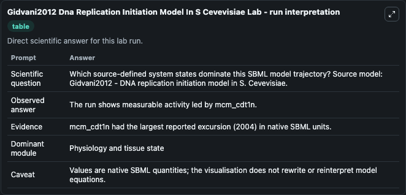
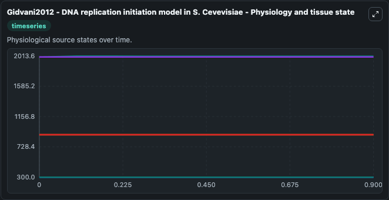
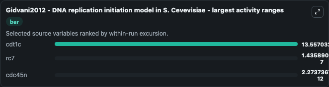
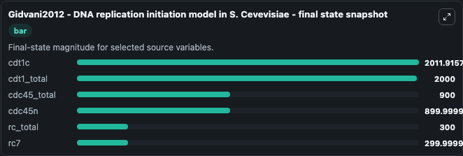
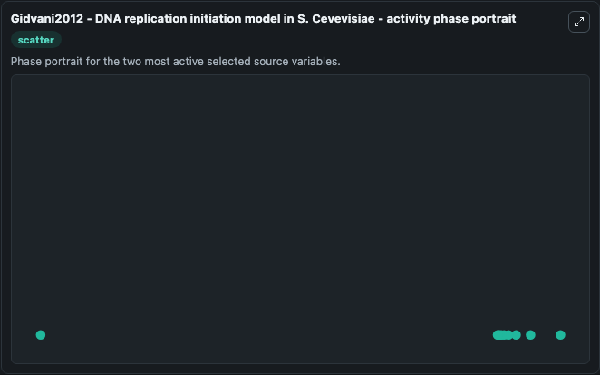

# Gidvani2012 Dna Replication Initiation Model In S Cevevisiae

This Biosimulant lab wraps `Gidvani2012 Dna Replication Initiation Model In S Cevevisiae` as a runnable systems biology model with a companion visualization module.
A quantitative model of the initiation of DNA replication in Saccharomyces cerevisiae predicts the effects of system perturbations. It can be used to explore the configured dynamics and compare scenario outcomes across configurations.

## What You'll See

The lab asks: Which source-defined system states dominate this SBML model trajectory? Source model: Gidvani2012 - DNA replication initiation model in S. Cevevisiae. It runs for 1.0 time units with a communication step of 0.1. The run uses the model defaults declared by the curated SBML wrapper. The generated visualizations focus on cdt1c, cdt1_total, cdc45n, cdc45_total, rc_total, and rc7, combining trajectory, endpoint-comparison, and summary-table views from one completed dark-mode run.

In this captured run, **cdt1c** moved from 2000.0 to 2011.9 across 1.0 simulation windows.


### Output Visualizations



*Summary table for Gidvani2012 Dna Replication Initiation Model In S Cevevisiae, reporting the scientific question, observed answer, dominant module, and caveat.*



*Trajectories of cdt1c, rc7, cdc45n, cdt1_total, cdc45_total, and rc_total across the 1.0 simulation. In this run **cdt1c** climbed from 2000.0 to 2011.9 and **rc7** fell from 300.0 to 300.0 — the largest movements among the focused observables.*



*Largest-excursion ranking of the focused observables — the absolute movement magnitude during the run. Top 3: **cdt1c** = 13.557, **rc7** = 1.44e-07, **cdc45n** = 2.27e-12.*



*Trajectories of cdt1c, rc7, cdc45n, cdt1_total, cdc45_total, and rc_total across the 1.0 simulation. In this run **cdt1c** climbed from 2000.0 to 2011.9 and **rc7** fell from 300.0 to 300.0 — the largest movements among the focused observables.*



*Visualization card from the Gidvani2012 Dna Replication Initiation Model In S Cevevisiae dark-mode run.*


## Model Context

- Core model: `models/core`
- Visualization model: `models/visualisation`
- Standard: `other`
- Upstream source: `biomodels_ebi:MODEL2003180001`
- License: `CC0`

## Inputs

| Input | Maps To | Default | Notes |
|---|---|---|---|
| Initial Cdt1c | `systemsbiology_sbml_gidvani2012_dna_replication_initiation_model_in_model2003180001_model.initial_cdt1c` | | Source state initial condition exposed as a model-specific control because no explicit intervention parameter is identifiable. Maps to SBML symbol `cdt1c`. |
| Initial Cdt1 Total | `systemsbiology_sbml_gidvani2012_dna_replication_initiation_model_in_model2003180001_model.initial_cdt1_total` | | Source state initial condition exposed as a model-specific control because no explicit intervention parameter is identifiable. Maps to SBML symbol `cdt1_total`. |
| Initial Cdc45n | `systemsbiology_sbml_gidvani2012_dna_replication_initiation_model_in_model2003180001_model.initial_cdc45n` | | Source state initial condition exposed as a model-specific control because no explicit intervention parameter is identifiable. Maps to SBML symbol `cdc45n`. |
| Initial Cdc45 Total | `systemsbiology_sbml_gidvani2012_dna_replication_initiation_model_in_model2003180001_model.initial_cdc45_total` | | Source state initial condition exposed as a model-specific control because no explicit intervention parameter is identifiable. Maps to SBML symbol `cdc45_total`. |
| Initial Rc Total | `systemsbiology_sbml_gidvani2012_dna_replication_initiation_model_in_model2003180001_model.initial_rc_total` | | Source state initial condition exposed as a model-specific control because no explicit intervention parameter is identifiable. Maps to SBML symbol `rc_total`. |
| Initial Model State RC7 | `systemsbiology_sbml_gidvani2012_dna_replication_initiation_model_in_model2003180001_model.initial_model_state_rc7` | | Source state initial condition exposed as a model-specific control because no explicit intervention parameter is identifiable. Maps to SBML symbol `rc7`. |

## Outputs

| Output | Maps To | Role |
|---|---|---|
| `state` | `systemsbiology_sbml_gidvani2012_dna_replication_initiation_model_in_model2003180001_model.state` | Available to the visualization model and downstream workflows. |
| `summary` | `systemsbiology_sbml_gidvani2012_dna_replication_initiation_model_in_model2003180001_model.summary` | Available to the visualization model and downstream workflows. |
| `species_labels` | `systemsbiology_sbml_gidvani2012_dna_replication_initiation_model_in_model2003180001_model.species_labels` | Available to the visualization model and downstream workflows. |
| `cdt1c` | `systemsbiology_sbml_gidvani2012_dna_replication_initiation_model_in_model2003180001_model.cdt1c` | Available to the visualization model and downstream workflows. |
| `cdt1_total` | `systemsbiology_sbml_gidvani2012_dna_replication_initiation_model_in_model2003180001_model.cdt1_total` | Available to the visualization model and downstream workflows. |
| `cdc45n` | `systemsbiology_sbml_gidvani2012_dna_replication_initiation_model_in_model2003180001_model.cdc45n` | Available to the visualization model and downstream workflows. |
| `cdc45_total` | `systemsbiology_sbml_gidvani2012_dna_replication_initiation_model_in_model2003180001_model.cdc45_total` | Available to the visualization model and downstream workflows. |
| `rc_total` | `systemsbiology_sbml_gidvani2012_dna_replication_initiation_model_in_model2003180001_model.rc_total` | Available to the visualization model and downstream workflows. |
| `rc7` | `systemsbiology_sbml_gidvani2012_dna_replication_initiation_model_in_model2003180001_model.rc7` | Available to the visualization model and downstream workflows. |

## Runtime

- Duration: `1.0`
- Communication step: `0.1`

## Running Locally

```bash
biosimulant labs serve
```
