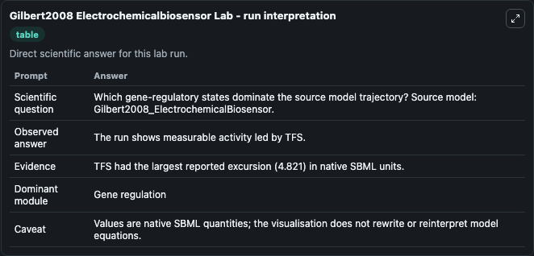
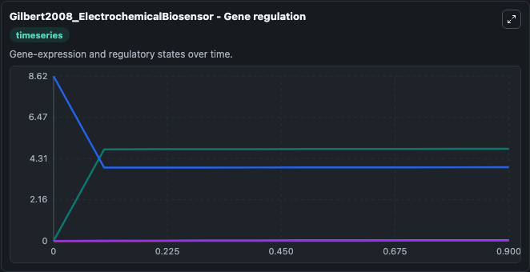
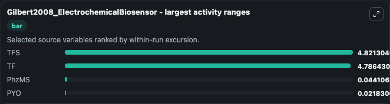
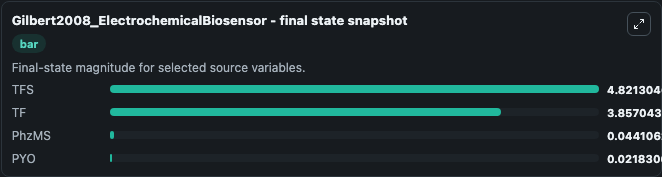
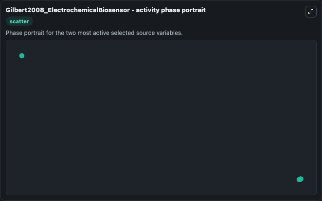

# Gilbert2008 Electrochemicalbiosensor

This Biosimulant lab wraps `Gilbert2008 Electrochemicalbiosensor` as a runnable systems biology model with a companion visualization module.
This a model from the article: A Case Study in Model-driven Synthetic Biology David Gilbert, Monika Heiner, Susan Rosser, Rachael Fulton, Xu Gu and Maciej Trybilo IFIP International Federation for Inf. It can be used to explore the configured dynamics and compare scenario outcomes across configurations.

## What You'll See

The lab asks: Which gene-regulatory states dominate the source model trajectory? Source model: Gilbert2008_ElectrochemicalBiosensor. It runs for 1.0 time units with a communication step of 0.1. The run uses the model defaults declared by the curated SBML wrapper. The generated visualizations focus on TFS, TF, PhzMS, and PYO, combining trajectory, endpoint-comparison, and summary-table views from one completed dark-mode run.

In this captured run, **TFS** moved from 0 to 4.821 across 1.0 simulation windows.


### Output Visualizations



*Summary table for Gilbert2008 Electrochemicalbiosensor, reporting the scientific question, observed answer, dominant module, and caveat.*



*Trajectories of TFS, TF, PhzMS, and PYO across the 1.0 simulation. In this run **TFS** climbed from 0 to 4.821 and **TF** fell from 8.621 to 3.857 — the largest movements among the focused observables.*



*Largest-excursion ranking of the focused observables — the absolute movement magnitude during the run. Top 3: **TFS** = 4.821, **TF** = 4.786, **PhzMS** = 0.0441, with 1 more observable below.*



*Endpoint snapshot of the focused observables — final values from the captured run. Top 3 by value: **TFS** = 4.821, **TF** = 3.857, **PhzMS** = 0.0441, with 1 more observable below.*



*Visualization card from the Gilbert2008 Electrochemicalbiosensor dark-mode run.*


## Model Context

- Core model: `models/core`
- Visualization model: `models/visualisation`
- Standard: `other`
- Upstream source: `biomodels_ebi:MODEL1173105855`
- License: `CC0`

## Inputs

| Input | Maps To | Default | Notes |
|---|---|---|---|
| Feedback On | `systemsbiology_sbml_gilbert2008_electrochemicalbiosensor_model1173105855_model.feedback_on` | | Source parameter exposed because its SBML label indicates a boundary, stimulus, dose, ligand, protocol, substrate, or environmental control. Maps to SBML symbol `feedbackOn`. |

## Outputs

| Output | Maps To | Role |
|---|---|---|
| `state` | `systemsbiology_sbml_gilbert2008_electrochemicalbiosensor_model1173105855_model.state` | Available to the visualization model and downstream workflows. |
| `summary` | `systemsbiology_sbml_gilbert2008_electrochemicalbiosensor_model1173105855_model.summary` | Available to the visualization model and downstream workflows. |
| `species_labels` | `systemsbiology_sbml_gilbert2008_electrochemicalbiosensor_model1173105855_model.species_labels` | Available to the visualization model and downstream workflows. |
| `tfs` | `systemsbiology_sbml_gilbert2008_electrochemicalbiosensor_model1173105855_model.tfs` | Available to the visualization model and downstream workflows. |
| `model_state_tf` | `systemsbiology_sbml_gilbert2008_electrochemicalbiosensor_model1173105855_model.model_state_tf` | Available to the visualization model and downstream workflows. |
| `phz_ms` | `systemsbiology_sbml_gilbert2008_electrochemicalbiosensor_model1173105855_model.phz_ms` | Available to the visualization model and downstream workflows. |
| `pyo` | `systemsbiology_sbml_gilbert2008_electrochemicalbiosensor_model1173105855_model.pyo` | Available to the visualization model and downstream workflows. |

## Runtime

- Duration: `1.0`
- Communication step: `0.1`

## Running Locally

```bash
biosimulant labs serve
```
