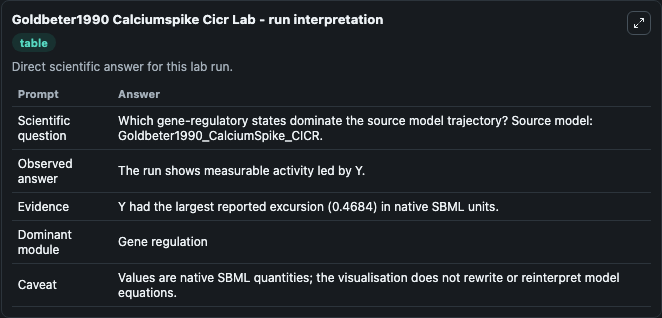
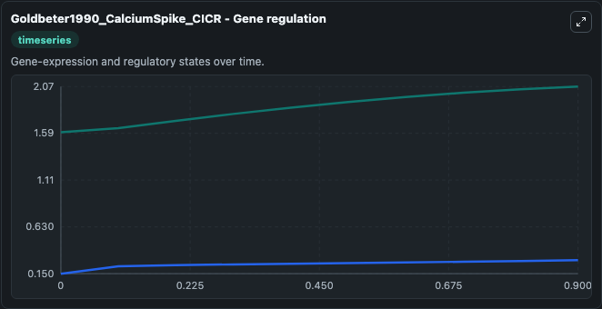
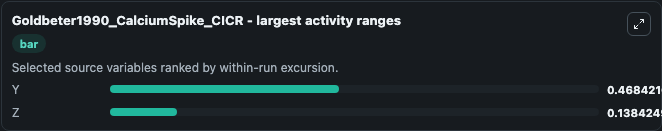
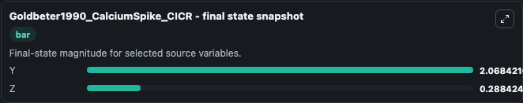
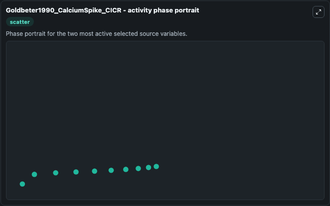

# Goldbeter1990 Calciumspike Cicr

This Biosimulant lab wraps `Goldbeter1990 Calciumspike Cicr` as a runnable systems biology model with a companion visualization module.
The model reproduces the time profile of cytosolic and intracellular calcium as depicted in the upper panel of Fig 2 in the paper. It can be used to explore the configured dynamics and compare scenario outcomes across configurations.

## What You'll See

The lab asks: Which gene-regulatory states dominate the source model trajectory? Source model: Goldbeter1990_CalciumSpike_CICR. It runs for 1.0 time units with a communication step of 0.1. The run uses the model defaults declared by the curated SBML wrapper. The generated visualizations focus on Y, and Z, combining trajectory, endpoint-comparison, and summary-table views from one completed dark-mode run.

In this captured run, **Y** moved from 1.600 to 2.068 across 1.0 simulation windows.


### Output Visualizations



*Summary table for Goldbeter1990 Calciumspike Cicr, reporting the scientific question, observed answer, dominant module, and caveat.*



*Trajectories of Y, and Z across the 1.0 simulation. In this run **Y** climbed from 1.600 to 2.068 — the largest movements among the focused observables.*



*Largest-excursion ranking of the focused observables — the absolute movement magnitude during the run. Top 2: **Y** = 0.4684, **Z** = 0.1384.*



*Endpoint snapshot of the focused observables — final values from the captured run. Top 2 by value: **Y** = 2.068, **Z** = 0.2884.*



*Visualization card from the Goldbeter1990 Calciumspike Cicr dark-mode run.*


## Model Context

- Core model: `models/core`
- Visualization model: `models/visualisation`
- Standard: `other`
- Upstream source: `biomodels_ebi:BIOMD0000000098`
- License: `CC0`

## Inputs

| Input | Maps To | Default | Notes |
|---|---|---|---|
| Initial Model State Y | `systemsbiology_sbml_goldbeter1990_calciumspike_cicr_biomd0000000098_model.initial_model_state_y` | | Source state initial condition exposed as a model-specific control because no explicit intervention parameter is identifiable. Maps to SBML symbol `Y`. |
| Initial Model State Z | `systemsbiology_sbml_goldbeter1990_calciumspike_cicr_biomd0000000098_model.initial_model_state_z` | | Source state initial condition exposed as a model-specific control because no explicit intervention parameter is identifiable. Maps to SBML symbol `Z`. |

## Outputs

| Output | Maps To | Role |
|---|---|---|
| `state` | `systemsbiology_sbml_goldbeter1990_calciumspike_cicr_biomd0000000098_model.state` | Available to the visualization model and downstream workflows. |
| `summary` | `systemsbiology_sbml_goldbeter1990_calciumspike_cicr_biomd0000000098_model.summary` | Available to the visualization model and downstream workflows. |
| `species_labels` | `systemsbiology_sbml_goldbeter1990_calciumspike_cicr_biomd0000000098_model.species_labels` | Available to the visualization model and downstream workflows. |
| `model_state_y` | `systemsbiology_sbml_goldbeter1990_calciumspike_cicr_biomd0000000098_model.model_state_y` | Available to the visualization model and downstream workflows. |
| `model_state_z` | `systemsbiology_sbml_goldbeter1990_calciumspike_cicr_biomd0000000098_model.model_state_z` | Available to the visualization model and downstream workflows. |

## Runtime

- Duration: `1.0`
- Communication step: `0.1`

## Running Locally

```bash
biosimulant labs serve
```
