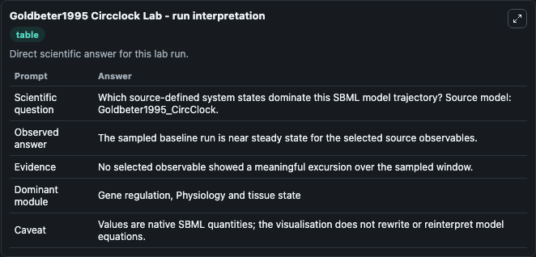
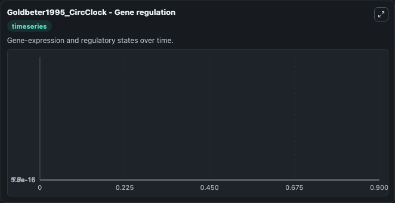
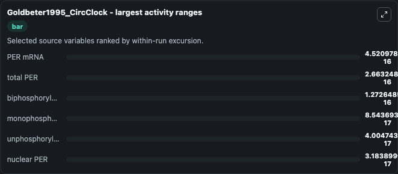
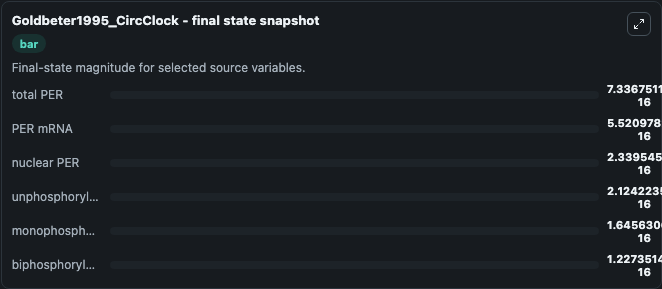
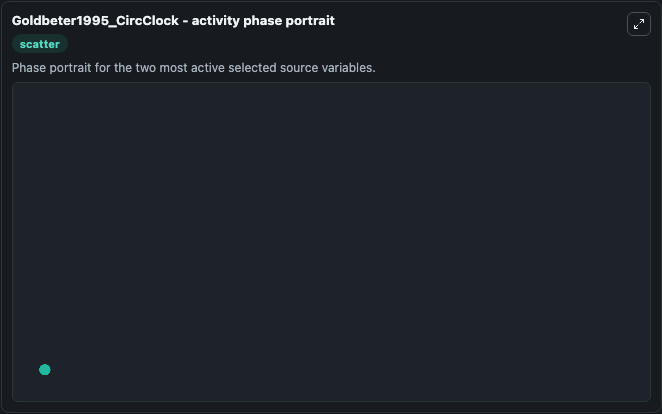

# Goldbeter1995 Circclock

This Biosimulant lab wraps `Goldbeter1995 Circclock` as a runnable systems biology model with a companion visualization module.
To the extent possible under law, all copyright and related or neighbouring rights to this encoded model have been dedicated to the public domain worldwide. It can be used to explore the configured dynamics and compare scenario outcomes across configurations.

## What You'll See

The lab asks: Which source-defined system states dominate this SBML model trajectory? Source model: Goldbeter1995_CircClock. It runs for 1.0 time units with a communication step of 0.1. The run uses the model defaults declared by the curated SBML wrapper. The generated visualizations focus on PER mRNA, total PER, unphosphorylated PER, nuclear PER, monophosphorylated PER, and biphosphorylated PER, combining trajectory, endpoint-comparison, and summary-table views from one completed dark-mode run.

In this captured run, **PER mRNA** moved from 1e-16 to 5.52e-16 across 1.0 simulation windows.


### Output Visualizations



*Summary table for Goldbeter1995 Circclock, reporting the scientific question, observed answer, dominant module, and caveat.*



*Trajectories of PER mRNA, total PER, biphosphorylated PER, monophosphorylated PER, unphosphorylated PER, and nuclear PER across the 1.0 simulation. In this run **PER mRNA** climbed from 1e-16 to 5.52e-16 and **total PER** fell from 1e-15 to 7.34e-16 — the largest movements among the focused observables.*



*Largest-excursion ranking of the focused observables — the absolute movement magnitude during the run. Top 3: **PER mRNA** = 4.52e-16, **total PER** = 2.66e-16, **biphosphorylated PER** = 1.27e-16, with 3 more observables below.*



*Endpoint snapshot of the focused observables — final values from the captured run. Top 3 by value: **total PER** = 7.34e-16, **PER mRNA** = 5.52e-16, **nuclear PER** = 2.34e-16, with 3 more observables below.*



*Visualization card from the Goldbeter1995 Circclock dark-mode run.*


## Model Context

- Core model: `models/core`
- Visualization model: `models/visualisation`
- Standard: `other`
- Upstream source: `biomodels_ebi:BIOMD0000000016`
- License: `CC0`

## Inputs

| Input | Maps To | Default | Notes |
|---|---|---|---|
| Initial Per MRNA | `systemsbiology_sbml_goldbeter1995_circclock_biomd0000000016_model.initial_per_mrna` | | Source state initial condition exposed as a model-specific control because no explicit intervention parameter is identifiable. Maps to SBML symbol `M`. |
| Initial Total Per | `systemsbiology_sbml_goldbeter1995_circclock_biomd0000000016_model.initial_total_per` | | Source state initial condition exposed as a model-specific control because no explicit intervention parameter is identifiable. Maps to SBML symbol `Pt`. |
| Initial Unphosphorylated Per | `systemsbiology_sbml_goldbeter1995_circclock_biomd0000000016_model.initial_unphosphorylated_per` | | Source state initial condition exposed as a model-specific control because no explicit intervention parameter is identifiable. Maps to SBML symbol `P0`. |
| Initial Nuclear Per | `systemsbiology_sbml_goldbeter1995_circclock_biomd0000000016_model.initial_nuclear_per` | | Source state initial condition exposed as a model-specific control because no explicit intervention parameter is identifiable. Maps to SBML symbol `Pn`. |
| Initial Monophosphorylated Per | `systemsbiology_sbml_goldbeter1995_circclock_biomd0000000016_model.initial_monophosphorylated_per` | | Source state initial condition exposed as a model-specific control because no explicit intervention parameter is identifiable. Maps to SBML symbol `P1`. |
| Initial Biphosphorylated Per | `systemsbiology_sbml_goldbeter1995_circclock_biomd0000000016_model.initial_biphosphorylated_per` | | Source state initial condition exposed as a model-specific control because no explicit intervention parameter is identifiable. Maps to SBML symbol `P2`. |

## Outputs

| Output | Maps To | Role |
|---|---|---|
| `state` | `systemsbiology_sbml_goldbeter1995_circclock_biomd0000000016_model.state` | Available to the visualization model and downstream workflows. |
| `summary` | `systemsbiology_sbml_goldbeter1995_circclock_biomd0000000016_model.summary` | Available to the visualization model and downstream workflows. |
| `species_labels` | `systemsbiology_sbml_goldbeter1995_circclock_biomd0000000016_model.species_labels` | Available to the visualization model and downstream workflows. |
| `per_mrna` | `systemsbiology_sbml_goldbeter1995_circclock_biomd0000000016_model.per_mrna` | Available to the visualization model and downstream workflows. |
| `total_per` | `systemsbiology_sbml_goldbeter1995_circclock_biomd0000000016_model.total_per` | Available to the visualization model and downstream workflows. |
| `unphosphorylated_per` | `systemsbiology_sbml_goldbeter1995_circclock_biomd0000000016_model.unphosphorylated_per` | Available to the visualization model and downstream workflows. |
| `nuclear_per` | `systemsbiology_sbml_goldbeter1995_circclock_biomd0000000016_model.nuclear_per` | Available to the visualization model and downstream workflows. |
| `monophosphorylated_per` | `systemsbiology_sbml_goldbeter1995_circclock_biomd0000000016_model.monophosphorylated_per` | Available to the visualization model and downstream workflows. |
| `biphosphorylated_per` | `systemsbiology_sbml_goldbeter1995_circclock_biomd0000000016_model.biphosphorylated_per` | Available to the visualization model and downstream workflows. |

## Runtime

- Duration: `1.0`
- Communication step: `0.1`

## Running Locally

```bash
biosimulant labs serve
```
