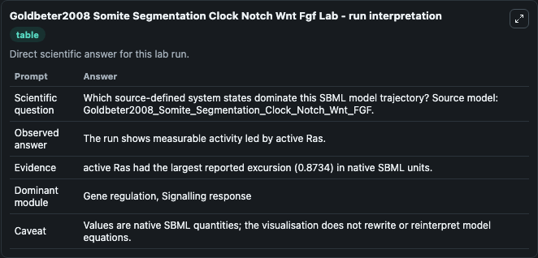
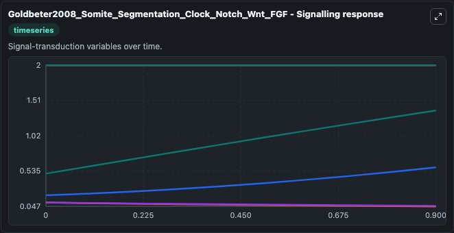
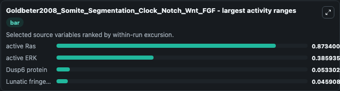
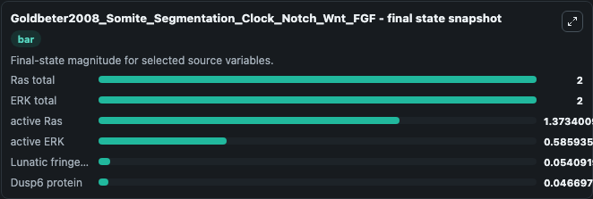
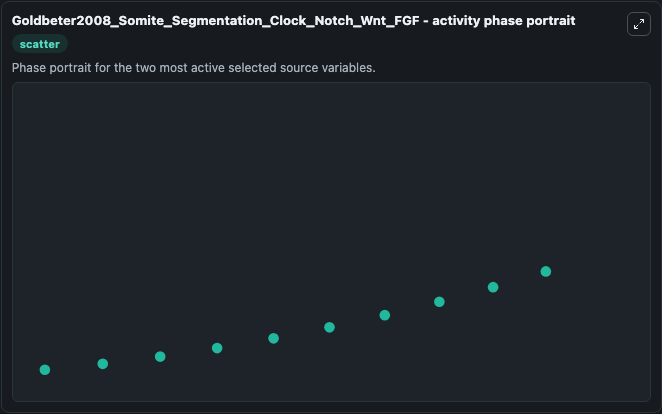

# Goldbeter2008 Somite Segmentation Clock Notch Wnt Fgf

This Biosimulant lab wraps `Goldbeter2008 Somite Segmentation Clock Notch Wnt Fgf` as a runnable systems biology model with a companion visualization module.
This is a model of the coupled Natch, Wnt and FGF modules as described in: A. It can be used to explore the configured dynamics and compare scenario outcomes across configurations.

## What You'll See

The lab asks: Which source-defined system states dominate this SBML model trajectory? Source model: Goldbeter2008_Somite_Segmentation_Clock_Notch_Wnt_FGF. It runs for 1.0 time units with a communication step of 0.1. The run uses the model defaults declared by the curated SBML wrapper. The generated visualizations focus on Ras total, ERK total, active Ras, active ERK, Lunatic fringe mRNA, and Dusp6 protein, combining trajectory, endpoint-comparison, and summary-table views from one completed dark-mode run.

In this captured run, **active Ras** moved from 0.5000 to 1.373 across 1.0 simulation windows.


### Output Visualizations



*Summary table for Goldbeter2008 Somite Segmentation Clock Notch Wnt Fgf, reporting the scientific question, observed answer, dominant module, and caveat.*



*Trajectories of active Ras, active ERK, Dusp6 protein, Lunatic fringe mRNA, Ras total, and ERK total across the 1.0 simulation. In this run **active Ras** climbed from 0.5000 to 1.373 and **Dusp6 protein** fell from 0.1000 to 0.0467 — the largest movements among the focused observables.*



*Largest-excursion ranking of the focused observables — the absolute movement magnitude during the run. Top 3: **active Ras** = 0.8734, **active ERK** = 0.3859, **Dusp6 protein** = 0.0533, with 1 more observable below.*



*Endpoint snapshot of the focused observables — final values from the captured run. Top 3 by value: **Ras total** = 2.000, **ERK total** = 2.000, **active Ras** = 1.373, with 3 more observables below.*



*Visualization card from the Goldbeter2008 Somite Segmentation Clock Notch Wnt Fgf dark-mode run.*


## Model Context

- Core model: `models/core`
- Visualization model: `models/visualisation`
- Standard: `other`
- Upstream source: `biomodels_ebi:BIOMD0000000201`
- License: `CC0`

## Inputs

| Input | Maps To | Default | Notes |
|---|---|---|---|
| Initial RAS Total | `systemsbiology_sbml_goldbeter2008_somite_segmentation_clock_notch_wn_biomd0000000201_model.initial_ras_total` | | Source state initial condition exposed as a model-specific control because no explicit intervention parameter is identifiable. Maps to SBML symbol `Rast`. |
| Initial ERK Total | `systemsbiology_sbml_goldbeter2008_somite_segmentation_clock_notch_wn_biomd0000000201_model.initial_erk_total` | | Source state initial condition exposed as a model-specific control because no explicit intervention parameter is identifiable. Maps to SBML symbol `ERKt`. |
| Initial Active RAS | `systemsbiology_sbml_goldbeter2008_somite_segmentation_clock_notch_wn_biomd0000000201_model.initial_active_ras` | | Source state initial condition exposed as a model-specific control because no explicit intervention parameter is identifiable. Maps to SBML symbol `Rasa`. |
| Initial Active ERK | `systemsbiology_sbml_goldbeter2008_somite_segmentation_clock_notch_wn_biomd0000000201_model.initial_active_erk` | | Source state initial condition exposed as a model-specific control because no explicit intervention parameter is identifiable. Maps to SBML symbol `ERKa`. |
| Initial Lunatic Fringe MRNA | `systemsbiology_sbml_goldbeter2008_somite_segmentation_clock_notch_wn_biomd0000000201_model.initial_lunatic_fringe_mrna` | | Source state initial condition exposed as a model-specific control because no explicit intervention parameter is identifiable. Maps to SBML symbol `MF`. |
| Initial Dusp6 Protein | `systemsbiology_sbml_goldbeter2008_somite_segmentation_clock_notch_wn_biomd0000000201_model.initial_dusp6_protein` | | Source state initial condition exposed as a model-specific control because no explicit intervention parameter is identifiable. Maps to SBML symbol `Dusp`. |

## Outputs

| Output | Maps To | Role |
|---|---|---|
| `state` | `systemsbiology_sbml_goldbeter2008_somite_segmentation_clock_notch_wn_biomd0000000201_model.state` | Available to the visualization model and downstream workflows. |
| `summary` | `systemsbiology_sbml_goldbeter2008_somite_segmentation_clock_notch_wn_biomd0000000201_model.summary` | Available to the visualization model and downstream workflows. |
| `species_labels` | `systemsbiology_sbml_goldbeter2008_somite_segmentation_clock_notch_wn_biomd0000000201_model.species_labels` | Available to the visualization model and downstream workflows. |
| `ras_total` | `systemsbiology_sbml_goldbeter2008_somite_segmentation_clock_notch_wn_biomd0000000201_model.ras_total` | Available to the visualization model and downstream workflows. |
| `erk_total` | `systemsbiology_sbml_goldbeter2008_somite_segmentation_clock_notch_wn_biomd0000000201_model.erk_total` | Available to the visualization model and downstream workflows. |
| `active_ras` | `systemsbiology_sbml_goldbeter2008_somite_segmentation_clock_notch_wn_biomd0000000201_model.active_ras` | Available to the visualization model and downstream workflows. |
| `active_erk` | `systemsbiology_sbml_goldbeter2008_somite_segmentation_clock_notch_wn_biomd0000000201_model.active_erk` | Available to the visualization model and downstream workflows. |
| `lunatic_fringe_mrna` | `systemsbiology_sbml_goldbeter2008_somite_segmentation_clock_notch_wn_biomd0000000201_model.lunatic_fringe_mrna` | Available to the visualization model and downstream workflows. |
| `dusp6_protein` | `systemsbiology_sbml_goldbeter2008_somite_segmentation_clock_notch_wn_biomd0000000201_model.dusp6_protein` | Available to the visualization model and downstream workflows. |

## Runtime

- Duration: `1.0`
- Communication step: `0.1`

## Running Locally

```bash
biosimulant labs serve
```
