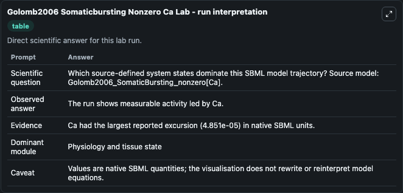
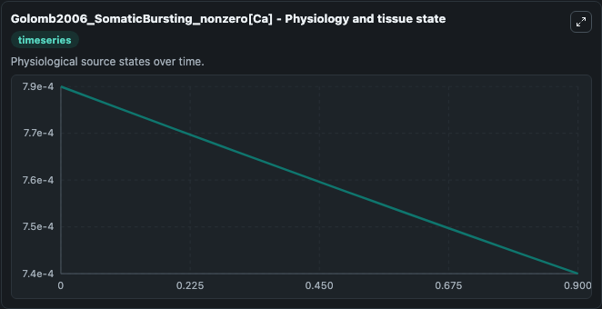
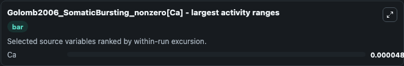
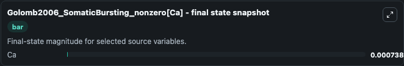

# Golomb2006 Somaticbursting Nonzero Ca

This Biosimulant lab wraps `Golomb2006 Somaticbursting Nonzero Ca` as a runnable systems biology model with a companion visualization module.
Model is according to the paper Contribution of Persistent Na+ Current and M-Type K+ Current to Somatic Bursting in CA1 Pyramidal Cell: Combined Experimental. It can be used to explore the configured dynamics and compare scenario outcomes across configurations.

## What You'll See

The lab asks: Which source-defined system states dominate this SBML model trajectory? Source model: Golomb2006_SomaticBursting_nonzero[Ca]. It runs for 1.0 time units with a communication step of 0.1. The run uses the model defaults declared by the curated SBML wrapper. The generated visualizations focus on Ca, combining trajectory, endpoint-comparison, and summary-table views from one completed dark-mode run.

In this captured run, **Ca** moved from 0.000787 to 0.000738 across 1.0 simulation windows.


### Output Visualizations



*Summary table for Golomb2006 Somaticbursting Nonzero Ca, reporting the scientific question, observed answer, dominant module, and caveat.*



*Trajectories of Ca across the 1.0 simulation. In this run **Ca** fell from 0.000787 to 0.000738 — the largest movements among the focused observables.*



*Largest-excursion ranking of the focused observables — the absolute movement magnitude during the run. Top 1: **Ca** = 4.85e-05.*



*Endpoint snapshot of the focused observables — final values from the captured run. Top 1 by value: **Ca** = 0.000738.*


## Model Context

- Core model: `models/core`
- Visualization model: `models/visualisation`
- Standard: `other`
- Upstream source: `biomodels_ebi:BIOMD0000000119`
- License: `CC0`

## Inputs

| Input | Maps To | Default | Notes |
|---|---|---|---|
| Initial Model State Ca | `systemsbiology_sbml_golomb2006_somaticbursting_nonzero_ca_biomd0000000119_model.initial_model_state_ca` | | Source state initial condition exposed as a model-specific control because no explicit intervention parameter is identifiable. Maps to SBML symbol `Ca`. |

## Outputs

| Output | Maps To | Role |
|---|---|---|
| `state` | `systemsbiology_sbml_golomb2006_somaticbursting_nonzero_ca_biomd0000000119_model.state` | Available to the visualization model and downstream workflows. |
| `summary` | `systemsbiology_sbml_golomb2006_somaticbursting_nonzero_ca_biomd0000000119_model.summary` | Available to the visualization model and downstream workflows. |
| `species_labels` | `systemsbiology_sbml_golomb2006_somaticbursting_nonzero_ca_biomd0000000119_model.species_labels` | Available to the visualization model and downstream workflows. |
| `model_state_ca` | `systemsbiology_sbml_golomb2006_somaticbursting_nonzero_ca_biomd0000000119_model.model_state_ca` | Available to the visualization model and downstream workflows. |

## Runtime

- Duration: `1.0`
- Communication step: `0.1`

## Running Locally

```bash
biosimulant labs serve
```
