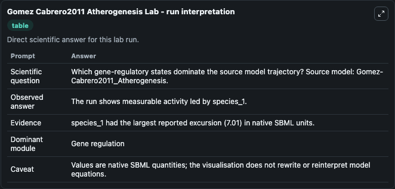
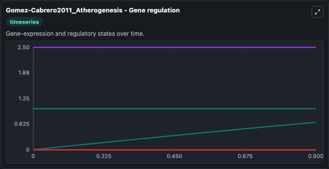
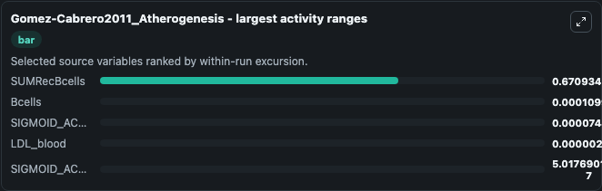
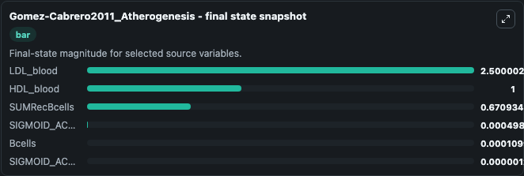
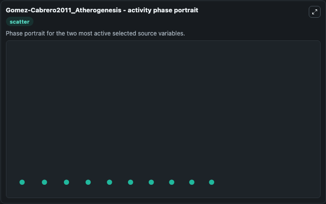

# Gomez Cabrero2011 Atherogenesis

This Biosimulant lab wraps `Gomez Cabrero2011 Atherogenesis` as a runnable systems biology model with a companion visualization module.
This model is from the article: Workflow for generating competing hypothesis from models with parameter uncertainty. It can be used to explore the configured dynamics and compare scenario outcomes across configurations.

## What You'll See

The lab asks: Which gene-regulatory states dominate the source model trajectory? Source model: Gomez-Cabrero2011_Atherogenesis. It runs for 1.0 time units with a communication step of 0.1. The run uses the model defaults declared by the curated SBML wrapper. The generated visualizations focus on SUMRecBcells, Bcells, LDL_blood, HDL_blood, SIGMOID_ACTENDinh, and SIGMOID_ACTENDstim, combining trajectory, endpoint-comparison, and summary-table views from one completed dark-mode run.

In this captured run, **SUMRecBcells** moved from 2.68e-07 to 0.6709 across 1.0 simulation windows.


### Output Visualizations



*Summary table for Gomez Cabrero2011 Atherogenesis, reporting the scientific question, observed answer, dominant module, and caveat.*



*Trajectories of SUMRecBcells, Bcells, SIGMOID_ACTENDinh, LDL_blood, SIGMOID_ACTENDstim, and HDL_blood across the 1.0 simulation. In this run **SUMRecBcells** climbed from 2.68e-07 to 0.6709 — the largest movements among the focused observables.*



*Largest-excursion ranking of the focused observables — the absolute movement magnitude during the run. Top 3: **SUMRecBcells** = 0.6709, **Bcells** = 0.00011, **SIGMOID_ACTENDinh** = 7.45e-05, with 2 more observables below.*



*Endpoint snapshot of the focused observables — final values from the captured run. Top 3 by value: **LDL_blood** = 2.500, **HDL_blood** = 1.000, **SUMRecBcells** = 0.6709, with 3 more observables below.*



*Visualization card from the Gomez Cabrero2011 Atherogenesis dark-mode run.*


## Model Context

- Core model: `models/core`
- Visualization model: `models/visualisation`
- Standard: `other`
- Upstream source: `biomodels_ebi:MODEL1002160000`
- License: `CC0`

## Inputs

| Input | Maps To | Default | Notes |
|---|---|---|---|
| Initial Sum Rec Bcells | `systemsbiology_sbml_gomez_cabrero2011_atherogenesis_model1002160000_model.initial_sum_rec_bcells` | | Source state initial condition exposed as a model-specific control because no explicit intervention parameter is identifiable. Maps to SBML symbol `species_14`. |
| Initial Bcells | `systemsbiology_sbml_gomez_cabrero2011_atherogenesis_model1002160000_model.initial_bcells` | | Source state initial condition exposed as a model-specific control because no explicit intervention parameter is identifiable. Maps to SBML symbol `species_8`. |
| Initial Ldl Blood | `systemsbiology_sbml_gomez_cabrero2011_atherogenesis_model1002160000_model.initial_ldl_blood` | | Source state initial condition exposed as a model-specific control because no explicit intervention parameter is identifiable. Maps to SBML symbol `species_16`. |
| Initial Hdl Blood | `systemsbiology_sbml_gomez_cabrero2011_atherogenesis_model1002160000_model.initial_hdl_blood` | | Source state initial condition exposed as a model-specific control because no explicit intervention parameter is identifiable. Maps to SBML symbol `species_15`. |
| Initial Sigmoid Acten Dinh | `systemsbiology_sbml_gomez_cabrero2011_atherogenesis_model1002160000_model.initial_sigmoid_acten_dinh` | | Source state initial condition exposed as a model-specific control because no explicit intervention parameter is identifiable. Maps to SBML symbol `species_19`. |
| Initial Sigmoid Acten Dstim | `systemsbiology_sbml_gomez_cabrero2011_atherogenesis_model1002160000_model.initial_sigmoid_acten_dstim` | | Source state initial condition exposed as a model-specific control because no explicit intervention parameter is identifiable. Maps to SBML symbol `species_18`. |

## Outputs

| Output | Maps To | Role |
|---|---|---|
| `state` | `systemsbiology_sbml_gomez_cabrero2011_atherogenesis_model1002160000_model.state` | Available to the visualization model and downstream workflows. |
| `summary` | `systemsbiology_sbml_gomez_cabrero2011_atherogenesis_model1002160000_model.summary` | Available to the visualization model and downstream workflows. |
| `species_labels` | `systemsbiology_sbml_gomez_cabrero2011_atherogenesis_model1002160000_model.species_labels` | Available to the visualization model and downstream workflows. |
| `sum_rec_bcells` | `systemsbiology_sbml_gomez_cabrero2011_atherogenesis_model1002160000_model.sum_rec_bcells` | Available to the visualization model and downstream workflows. |
| `bcells` | `systemsbiology_sbml_gomez_cabrero2011_atherogenesis_model1002160000_model.bcells` | Available to the visualization model and downstream workflows. |
| `ldl_blood` | `systemsbiology_sbml_gomez_cabrero2011_atherogenesis_model1002160000_model.ldl_blood` | Available to the visualization model and downstream workflows. |
| `hdl_blood` | `systemsbiology_sbml_gomez_cabrero2011_atherogenesis_model1002160000_model.hdl_blood` | Available to the visualization model and downstream workflows. |
| `sigmoid_acten_dinh` | `systemsbiology_sbml_gomez_cabrero2011_atherogenesis_model1002160000_model.sigmoid_acten_dinh` | Available to the visualization model and downstream workflows. |
| `sigmoid_acten_dstim` | `systemsbiology_sbml_gomez_cabrero2011_atherogenesis_model1002160000_model.sigmoid_acten_dstim` | Available to the visualization model and downstream workflows. |

## Runtime

- Duration: `1.0`
- Communication step: `0.1`

## Running Locally

```bash
biosimulant labs serve
```
