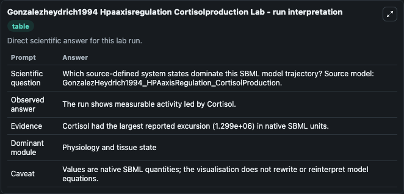
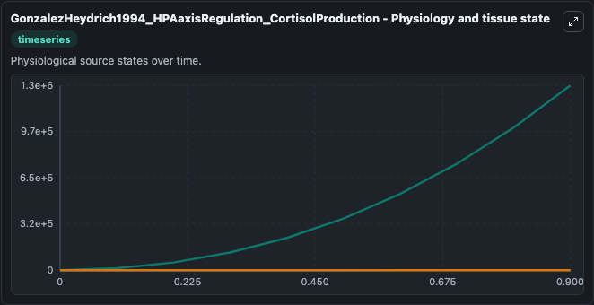
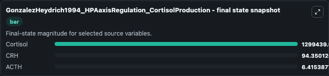
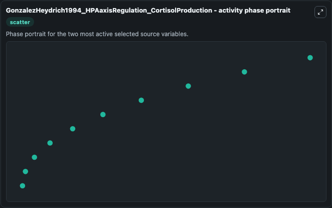

# Gonzalezheydrich1994 Hpaaxisregulation Cortisolproduction

This Biosimulant lab wraps `Gonzalezheydrich1994 Hpaaxisregulation Cortisolproduction` as a runnable systems biology model with a companion visualization module.
This a model from the article: A computer simulation of the hypothalamic-pituitary-adrenal axis. It can be used to explore the configured dynamics and compare scenario outcomes across configurations.

## What You'll See

The lab asks: Which source-defined system states dominate this SBML model trajectory? Source model: GonzalezHeydrich1994_HPAaxisRegulation_CortisolProduction. It runs for 1.0 time units with a communication step of 0.1. The run uses the model defaults declared by the curated SBML wrapper. The generated visualizations focus on Cortisol, CRH, and ACTH, combining trajectory, endpoint-comparison, and summary-table views from one completed dark-mode run.

In this captured run, **Cortisol** moved from 0 to 1.3e+06 across 1.0 simulation windows.


### Output Visualizations



*Summary table for Gonzalezheydrich1994 Hpaaxisregulation Cortisolproduction, reporting the scientific question, observed answer, dominant module, and caveat.*



*Trajectories of Cortisol, CRH, and ACTH across the 1.0 simulation. In this run **Cortisol** climbed from 0 to 1.3e+06 — the largest movements among the focused observables.*


*Largest-excursion ranking of the focused observables — the absolute movement magnitude during the run. Top 3: **Cortisol** = 1.3e+06, **CRH** = 44.350, **ACTH** = 6.415.*



*Endpoint snapshot of the focused observables — final values from the captured run. Top 3 by value: **Cortisol** = 1.3e+06, **CRH** = 94.350, **ACTH** = 6.415.*



*Visualization card from the Gonzalezheydrich1994 Hpaaxisregulation Cortisolproduction dark-mode run.*


## Model Context

- Core model: `models/core`
- Visualization model: `models/visualisation`
- Standard: `other`
- Upstream source: `biomodels_ebi:MODEL0911270004`
- License: `CC0`

## Inputs

| Input | Maps To | Default | Notes |
|---|---|---|---|
| Initial Cortisol | `systemsbiology_sbml_gonzalezheydrich1994_hpaaxisregulation_cortisolp_model0911270004_model.initial_cortisol` | | Source state initial condition exposed as a model-specific control because no explicit intervention parameter is identifiable. Maps to SBML symbol `cortisol`. |
| Initial Model State Crh | `systemsbiology_sbml_gonzalezheydrich1994_hpaaxisregulation_cortisolp_model0911270004_model.initial_model_state_crh` | | Source state initial condition exposed as a model-specific control because no explicit intervention parameter is identifiable. Maps to SBML symbol `CRH`. |
| Initial Acth | `systemsbiology_sbml_gonzalezheydrich1994_hpaaxisregulation_cortisolp_model0911270004_model.initial_acth` | | Source state initial condition exposed as a model-specific control because no explicit intervention parameter is identifiable. Maps to SBML symbol `ACTH`. |

## Outputs

| Output | Maps To | Role |
|---|---|---|
| `state` | `systemsbiology_sbml_gonzalezheydrich1994_hpaaxisregulation_cortisolp_model0911270004_model.state` | Available to the visualization model and downstream workflows. |
| `summary` | `systemsbiology_sbml_gonzalezheydrich1994_hpaaxisregulation_cortisolp_model0911270004_model.summary` | Available to the visualization model and downstream workflows. |
| `species_labels` | `systemsbiology_sbml_gonzalezheydrich1994_hpaaxisregulation_cortisolp_model0911270004_model.species_labels` | Available to the visualization model and downstream workflows. |
| `cortisol` | `systemsbiology_sbml_gonzalezheydrich1994_hpaaxisregulation_cortisolp_model0911270004_model.cortisol` | Available to the visualization model and downstream workflows. |
| `crh` | `systemsbiology_sbml_gonzalezheydrich1994_hpaaxisregulation_cortisolp_model0911270004_model.crh` | Available to the visualization model and downstream workflows. |
| `acth` | `systemsbiology_sbml_gonzalezheydrich1994_hpaaxisregulation_cortisolp_model0911270004_model.acth` | Available to the visualization model and downstream workflows. |

## Runtime

- Duration: `1.0`
- Communication step: `0.1`

## Running Locally

```bash
biosimulant labs serve
```
