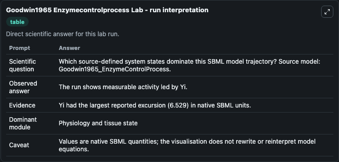
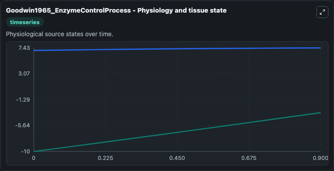
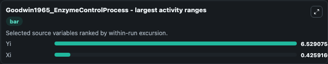
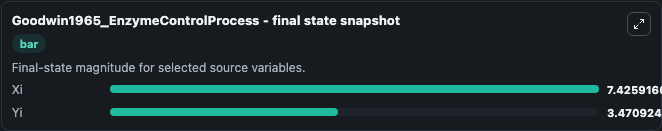
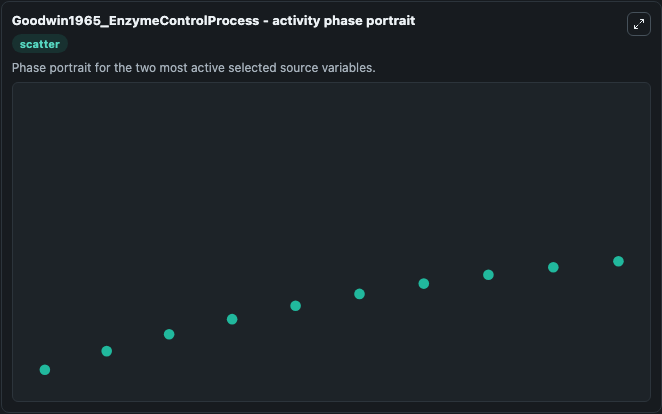

# Goodwin1965 Enzymecontrolprocess

This Biosimulant lab wraps `Goodwin1965 Enzymecontrolprocess` as a runnable systems biology model with a companion visualization module.
This a model from the article: Oscillatory behavior in enzymatic control processes. It can be used to explore the configured dynamics and compare scenario outcomes across configurations.

## What You'll See

The lab asks: Which source-defined system states dominate this SBML model trajectory? Source model: Goodwin1965_EnzymeControlProcess. It runs for 1.0 time units with a communication step of 0.1. The run uses the model defaults declared by the curated SBML wrapper. The generated visualizations focus on Yi, and Xi, combining trajectory, endpoint-comparison, and summary-table views from one completed dark-mode run.

In this captured run, **Yi** moved from -10.000 to -3.471 across 1.0 simulation windows.


### Output Visualizations



*Summary table for Goodwin1965 Enzymecontrolprocess, reporting the scientific question, observed answer, dominant module, and caveat.*



*Trajectories of Yi, and Xi across the 1.0 simulation. In this run **Yi** climbed from -10.000 to -3.471 — the largest movements among the focused observables.*



*Largest-excursion ranking of the focused observables — the absolute movement magnitude during the run. Top 2: **Yi** = 6.529, **Xi** = 0.4259.*



*Endpoint snapshot of the focused observables — final values from the captured run. Top 2 by value: **Xi** = 7.426, **Yi** = 3.471.*



*Visualization card from the Goodwin1965 Enzymecontrolprocess dark-mode run.*


## Model Context

- Core model: `models/core`
- Visualization model: `models/visualisation`
- Standard: `other`
- Upstream source: `biomodels_ebi:MODEL0911532520`
- License: `CC0`

## Inputs

| Input | Maps To | Default | Notes |
|---|---|---|---|
| Initial Model State Yi | `systemsbiology_sbml_goodwin1965_enzymecontrolprocess_model0911532520_model.initial_model_state_yi` | | Source state initial condition exposed as a model-specific control because no explicit intervention parameter is identifiable. Maps to SBML symbol `Yi`. |
| Initial Model State Xi | `systemsbiology_sbml_goodwin1965_enzymecontrolprocess_model0911532520_model.initial_model_state_xi` | | Source state initial condition exposed as a model-specific control because no explicit intervention parameter is identifiable. Maps to SBML symbol `Xi`. |

## Outputs

| Output | Maps To | Role |
|---|---|---|
| `state` | `systemsbiology_sbml_goodwin1965_enzymecontrolprocess_model0911532520_model.state` | Available to the visualization model and downstream workflows. |
| `summary` | `systemsbiology_sbml_goodwin1965_enzymecontrolprocess_model0911532520_model.summary` | Available to the visualization model and downstream workflows. |
| `species_labels` | `systemsbiology_sbml_goodwin1965_enzymecontrolprocess_model0911532520_model.species_labels` | Available to the visualization model and downstream workflows. |
| `model_state_yi` | `systemsbiology_sbml_goodwin1965_enzymecontrolprocess_model0911532520_model.model_state_yi` | Available to the visualization model and downstream workflows. |
| `model_state_xi` | `systemsbiology_sbml_goodwin1965_enzymecontrolprocess_model0911532520_model.model_state_xi` | Available to the visualization model and downstream workflows. |

## Runtime

- Duration: `1.0`
- Communication step: `0.1`

## Running Locally

```bash
biosimulant labs serve
```
