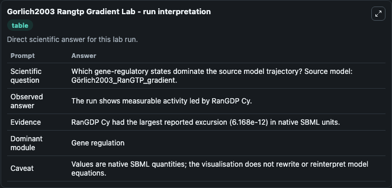
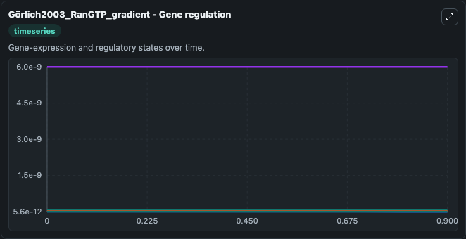
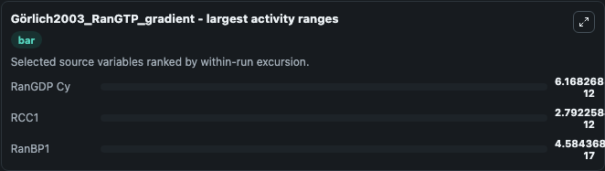
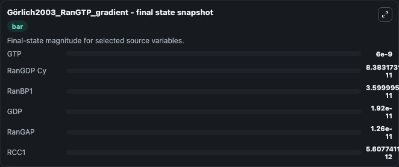
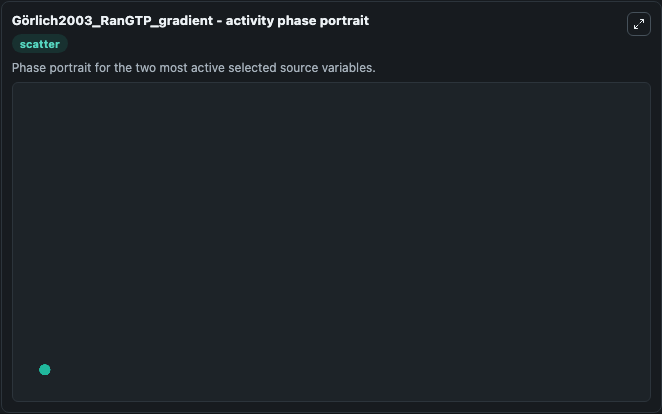

# Gorlich2003 Rangtp Gradient

This Biosimulant lab wraps `Gorlich2003 Rangtp Gradient` as a runnable systems biology model with a companion visualization module.
This model represents a concentration gradient of RanGTP across the nuclear envelope. It can be used to explore the configured dynamics and compare scenario outcomes across configurations.

## What You'll See

The lab asks: Which gene-regulatory states dominate the source model trajectory? Source model: Görlich2003_RanGTP_gradient. It runs for 1.0 time units with a communication step of 0.1. The run uses the model defaults declared by the curated SBML wrapper. The generated visualizations focus on GTP, RanGDP Cy, RanBP1, GDP, RanGAP, and RCC1, combining trajectory, endpoint-comparison, and summary-table views from one completed dark-mode run.

In this captured run, **RanGDP Cy** moved from 9e-11 to 8.38e-11 across 1.0 simulation windows.


### Output Visualizations



*Summary table for Gorlich2003 Rangtp Gradient, reporting the scientific question, observed answer, dominant module, and caveat.*



*Trajectories of RanGDP Cy, RCC1, RanBP1, GTP, GDP, and RanGAP across the 1.0 simulation. In this run **RanGDP Cy** fell from 9e-11 to 8.38e-11 — the largest movements among the focused observables.*



*Largest-excursion ranking of the focused observables — the absolute movement magnitude during the run. Top 3: **RanGDP Cy** = 6.17e-12, **RCC1** = 2.79e-12, **RanBP1** = 4.58e-17.*



*Endpoint snapshot of the focused observables — final values from the captured run. Top 3 by value: **GTP** = 6e-09, **RanGDP Cy** = 8.38e-11, **RanBP1** = 3.6e-11, with 3 more observables below.*



*Visualization card from the Gorlich2003 Rangtp Gradient dark-mode run.*


## Model Context

- Core model: `models/core`
- Visualization model: `models/visualisation`
- Standard: `other`
- Upstream source: `biomodels_ebi:BIOMD0000000192`
- License: `CC0`

## Inputs

| Input | Maps To | Default | Notes |
|---|---|---|---|
| Initial Model State Gtp | `systemsbiology_sbml_g_rlich2003_rangtp_gradient_biomd0000000192_model.initial_model_state_gtp` | | Source state initial condition exposed as a model-specific control because no explicit intervention parameter is identifiable. Maps to SBML symbol `GTP`. |
| Initial Ran Gdp Cy | `systemsbiology_sbml_g_rlich2003_rangtp_gradient_biomd0000000192_model.initial_ran_gdp_cy` | | Source state initial condition exposed as a model-specific control because no explicit intervention parameter is identifiable. Maps to SBML symbol `RanGDP_cy`. |
| Initial Ran BP1 | `systemsbiology_sbml_g_rlich2003_rangtp_gradient_biomd0000000192_model.initial_ran_bp1` | | Source state initial condition exposed as a model-specific control because no explicit intervention parameter is identifiable. Maps to SBML symbol `RanBP1`. |
| Initial Model State Gdp | `systemsbiology_sbml_g_rlich2003_rangtp_gradient_biomd0000000192_model.initial_model_state_gdp` | | Source state initial condition exposed as a model-specific control because no explicit intervention parameter is identifiable. Maps to SBML symbol `GDP`. |
| Initial Ran Gap | `systemsbiology_sbml_g_rlich2003_rangtp_gradient_biomd0000000192_model.initial_ran_gap` | | Source state initial condition exposed as a model-specific control because no explicit intervention parameter is identifiable. Maps to SBML symbol `RanGAP`. |
| Initial Rcc1 | `systemsbiology_sbml_g_rlich2003_rangtp_gradient_biomd0000000192_model.initial_rcc1` | | Source state initial condition exposed as a model-specific control because no explicit intervention parameter is identifiable. Maps to SBML symbol `RCC1`. |

## Outputs

| Output | Maps To | Role |
|---|---|---|
| `state` | `systemsbiology_sbml_g_rlich2003_rangtp_gradient_biomd0000000192_model.state` | Available to the visualization model and downstream workflows. |
| `summary` | `systemsbiology_sbml_g_rlich2003_rangtp_gradient_biomd0000000192_model.summary` | Available to the visualization model and downstream workflows. |
| `species_labels` | `systemsbiology_sbml_g_rlich2003_rangtp_gradient_biomd0000000192_model.species_labels` | Available to the visualization model and downstream workflows. |
| `gtp` | `systemsbiology_sbml_g_rlich2003_rangtp_gradient_biomd0000000192_model.gtp` | Available to the visualization model and downstream workflows. |
| `ran_gdp_cy` | `systemsbiology_sbml_g_rlich2003_rangtp_gradient_biomd0000000192_model.ran_gdp_cy` | Available to the visualization model and downstream workflows. |
| `ran_bp1` | `systemsbiology_sbml_g_rlich2003_rangtp_gradient_biomd0000000192_model.ran_bp1` | Available to the visualization model and downstream workflows. |
| `gdp` | `systemsbiology_sbml_g_rlich2003_rangtp_gradient_biomd0000000192_model.gdp` | Available to the visualization model and downstream workflows. |
| `ran_gap` | `systemsbiology_sbml_g_rlich2003_rangtp_gradient_biomd0000000192_model.ran_gap` | Available to the visualization model and downstream workflows. |
| `rcc1` | `systemsbiology_sbml_g_rlich2003_rangtp_gradient_biomd0000000192_model.rcc1` | Available to the visualization model and downstream workflows. |

## Runtime

- Duration: `1.0`
- Communication step: `0.1`

## Running Locally

```bash
biosimulant labs serve
```
