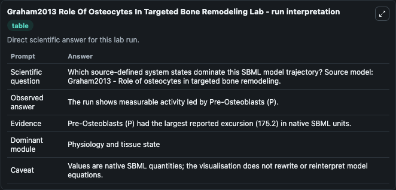
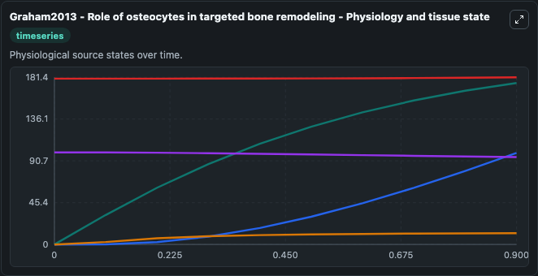
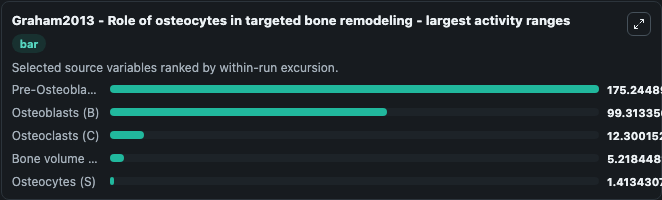
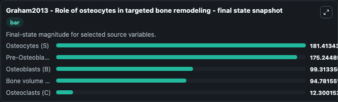
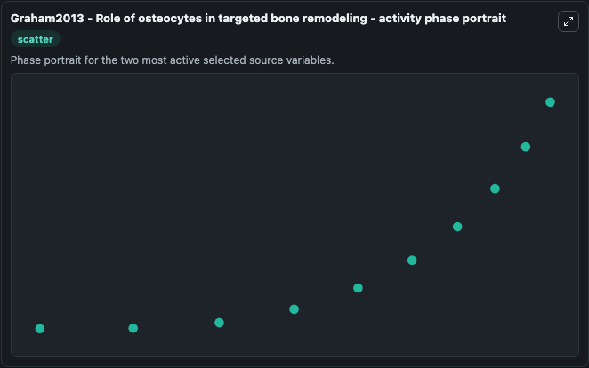

# Graham2013 Role Of Osteocytes In Targeted Bone Remodeling

This Biosimulant lab wraps `Graham2013 Role Of Osteocytes In Targeted Bone Remodeling` as a runnable systems biology model with a companion visualization module.
Jason M. It can be used to explore the configured dynamics and compare scenario outcomes across configurations.

## What You'll See

The lab asks: Which source-defined system states dominate this SBML model trajectory? Source model: Graham2013 - Role of osteocytes in targeted bone remodeling. It runs for 1.0 time units with a communication step of 0.1. The run uses the model defaults declared by the curated SBML wrapper. The generated visualizations focus on Osteocytes (S), Bone volume (z), Pre-Osteoblasts (P), Osteoclasts (C), and Osteoblasts (B), combining trajectory, endpoint-comparison, and summary-table views from one completed dark-mode run.

In this captured run, **Pre-Osteoblasts (P)** moved from 0 to 175.2 across 1.0 simulation windows.


### Output Visualizations



*Summary table for Graham2013 Role Of Osteocytes In Targeted Bone Remodeling, reporting the scientific question, observed answer, dominant module, and caveat.*



*Trajectories of Pre-Osteoblasts (P), Osteoblasts (B), Osteoclasts (C), Bone volume (z), and Osteocytes (S) across the 1.0 simulation. In this run **Pre-Osteoblasts (P)** climbed from 0 to 175.2 and **Bone volume (z)** fell from 100.0 to 94.782 — the largest movements among the focused observables.*



*Largest-excursion ranking of the focused observables — the absolute movement magnitude during the run. Top 3: **Pre-Osteoblasts (P)** = 175.2, **Osteoblasts (B)** = 99.313, **Osteoclasts (C)** = 12.300, with 2 more observables below.*



*Endpoint snapshot of the focused observables — final values from the captured run. Top 3 by value: **Osteocytes (S)** = 181.4, **Pre-Osteoblasts (P)** = 175.2, **Osteoblasts (B)** = 99.313, with 2 more observables below.*



*Visualization card from the Graham2013 Role Of Osteocytes In Targeted Bone Remodeling dark-mode run.*


## Model Context

- Core model: `models/core`
- Visualization model: `models/visualisation`
- Standard: `other`
- Upstream source: `biomodels_ebi:BIOMD0000000721`
- License: `CC0`

## Inputs

| Input | Maps To | Default | Notes |
|---|---|---|---|
| Initial Osteocytes S | `systemsbiology_sbml_graham2013_role_of_osteocytes_in_targeted_bone_r_biomd0000000721_model.initial_osteocytes_s` | | Source state initial condition exposed as a model-specific control because no explicit intervention parameter is identifiable. Maps to SBML symbol `Osteocytes__S`. |
| Initial Bone Volume Z | `systemsbiology_sbml_graham2013_role_of_osteocytes_in_targeted_bone_r_biomd0000000721_model.initial_bone_volume_z` | | Source state initial condition exposed as a model-specific control because no explicit intervention parameter is identifiable. Maps to SBML symbol `Bone_volume__z`. |
| Initial Pre Osteoblasts P | `systemsbiology_sbml_graham2013_role_of_osteocytes_in_targeted_bone_r_biomd0000000721_model.initial_pre_osteoblasts_p` | | Source state initial condition exposed as a model-specific control because no explicit intervention parameter is identifiable. Maps to SBML symbol `Pre_Osteoblasts__P`. |
| Initial Osteoclasts C | `systemsbiology_sbml_graham2013_role_of_osteocytes_in_targeted_bone_r_biomd0000000721_model.initial_osteoclasts_c` | | Source state initial condition exposed as a model-specific control because no explicit intervention parameter is identifiable. Maps to SBML symbol `Osteoclasts__C`. |
| Initial Osteoblasts B | `systemsbiology_sbml_graham2013_role_of_osteocytes_in_targeted_bone_r_biomd0000000721_model.initial_osteoblasts_b` | | Source state initial condition exposed as a model-specific control because no explicit intervention parameter is identifiable. Maps to SBML symbol `Osteoblasts__B`. |

## Outputs

| Output | Maps To | Role |
|---|---|---|
| `state` | `systemsbiology_sbml_graham2013_role_of_osteocytes_in_targeted_bone_r_biomd0000000721_model.state` | Available to the visualization model and downstream workflows. |
| `summary` | `systemsbiology_sbml_graham2013_role_of_osteocytes_in_targeted_bone_r_biomd0000000721_model.summary` | Available to the visualization model and downstream workflows. |
| `species_labels` | `systemsbiology_sbml_graham2013_role_of_osteocytes_in_targeted_bone_r_biomd0000000721_model.species_labels` | Available to the visualization model and downstream workflows. |
| `osteocytes_s` | `systemsbiology_sbml_graham2013_role_of_osteocytes_in_targeted_bone_r_biomd0000000721_model.osteocytes_s` | Available to the visualization model and downstream workflows. |
| `bone_volume_z` | `systemsbiology_sbml_graham2013_role_of_osteocytes_in_targeted_bone_r_biomd0000000721_model.bone_volume_z` | Available to the visualization model and downstream workflows. |
| `pre_osteoblasts_p` | `systemsbiology_sbml_graham2013_role_of_osteocytes_in_targeted_bone_r_biomd0000000721_model.pre_osteoblasts_p` | Available to the visualization model and downstream workflows. |
| `osteoclasts_c` | `systemsbiology_sbml_graham2013_role_of_osteocytes_in_targeted_bone_r_biomd0000000721_model.osteoclasts_c` | Available to the visualization model and downstream workflows. |
| `osteoblasts_b` | `systemsbiology_sbml_graham2013_role_of_osteocytes_in_targeted_bone_r_biomd0000000721_model.osteoblasts_b` | Available to the visualization model and downstream workflows. |

## Runtime

- Duration: `1.0`
- Communication step: `0.1`

## Running Locally

```bash
biosimulant labs serve
```
