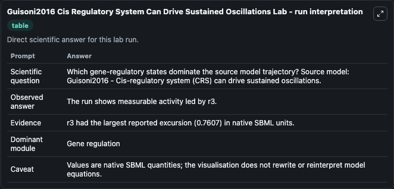
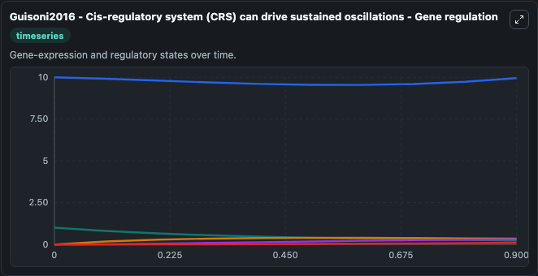
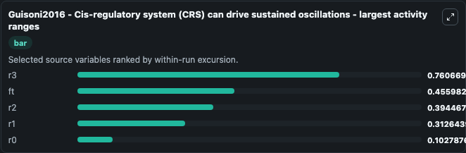
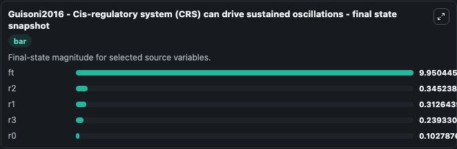
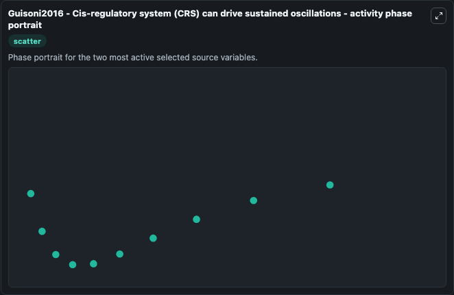

# Guisoni2016 Cis Regulatory System Can Drive Sustained Oscillations

This Biosimulant lab wraps `Guisoni2016 Cis Regulatory System Can Drive Sustained Oscillations` as a runnable systems biology model with a companion visualization module.
Guisoni2016 - Cis-regulatory system (CRS) candrive sustained oscillations This model is described in the article: Promoters Architecture-Based Mechanism for Noise-Induced Oscillations in a Single-Gene. It can be used to explore the configured dynamics and compare scenario outcomes across configurations.

## What You'll See

The lab asks: Which gene-regulatory states dominate the source model trajectory? Source model: Guisoni2016 - Cis-regulatory system (CRS) can drive sustained oscillations. It runs for 1.0 time units with a communication step of 0.1. The run uses the model defaults declared by the curated SBML wrapper. The generated visualizations focus on ft, r3, r2, r1, and r0, combining trajectory, endpoint-comparison, and summary-table views from one completed dark-mode run.

In this captured run, **r3** moved from 1.000 to 0.2393 across 1.0 simulation windows.


### Output Visualizations



*Summary table for Guisoni2016 Cis Regulatory System Can Drive Sustained Oscillations, reporting the scientific question, observed answer, dominant module, and caveat.*



*Trajectories of r3, ft, r2, r1, and r0 across the 1.0 simulation. In this run **r2** climbed from 0 to 0.3452 and **r3** fell from 1.000 to 0.2393 — the largest movements among the focused observables.*



*Largest-excursion ranking of the focused observables — the absolute movement magnitude during the run. Top 3: **r3** = 0.7607, **ft** = 0.4560, **r2** = 0.3945, with 2 more observables below.*



*Endpoint snapshot of the focused observables — final values from the captured run. Top 3 by value: **ft** = 9.950, **r2** = 0.3452, **r1** = 0.3126, with 2 more observables below.*



*Visualization card from the Guisoni2016 Cis Regulatory System Can Drive Sustained Oscillations dark-mode run.*


## Model Context

- Core model: `models/core`
- Visualization model: `models/visualisation`
- Standard: `other`
- Upstream source: `biomodels_ebi:MODEL1611030000`
- License: `CC0`

## Inputs

| Input | Maps To | Default | Notes |
|---|---|---|---|
| Initial Model State Ft | `systemsbiology_sbml_guisoni2016_cis_regulatory_system_crs_can_drive_model1611030000_model.initial_model_state_ft` | | Source state initial condition exposed as a model-specific control because no explicit intervention parameter is identifiable. Maps to SBML symbol `ft`. |
| Initial Model State R3 | `systemsbiology_sbml_guisoni2016_cis_regulatory_system_crs_can_drive_model1611030000_model.initial_model_state_r3` | | Source state initial condition exposed as a model-specific control because no explicit intervention parameter is identifiable. Maps to SBML symbol `r3`. |
| Initial Model State R2 | `systemsbiology_sbml_guisoni2016_cis_regulatory_system_crs_can_drive_model1611030000_model.initial_model_state_r2` | | Source state initial condition exposed as a model-specific control because no explicit intervention parameter is identifiable. Maps to SBML symbol `r2`. |
| Initial Model State R1 | `systemsbiology_sbml_guisoni2016_cis_regulatory_system_crs_can_drive_model1611030000_model.initial_model_state_r1` | | Source state initial condition exposed as a model-specific control because no explicit intervention parameter is identifiable. Maps to SBML symbol `r1`. |
| Initial Model State R0 | `systemsbiology_sbml_guisoni2016_cis_regulatory_system_crs_can_drive_model1611030000_model.initial_model_state_r0` | | Source state initial condition exposed as a model-specific control because no explicit intervention parameter is identifiable. Maps to SBML symbol `r0`. |

## Outputs

| Output | Maps To | Role |
|---|---|---|
| `state` | `systemsbiology_sbml_guisoni2016_cis_regulatory_system_crs_can_drive_model1611030000_model.state` | Available to the visualization model and downstream workflows. |
| `summary` | `systemsbiology_sbml_guisoni2016_cis_regulatory_system_crs_can_drive_model1611030000_model.summary` | Available to the visualization model and downstream workflows. |
| `species_labels` | `systemsbiology_sbml_guisoni2016_cis_regulatory_system_crs_can_drive_model1611030000_model.species_labels` | Available to the visualization model and downstream workflows. |
| `model_state_ft` | `systemsbiology_sbml_guisoni2016_cis_regulatory_system_crs_can_drive_model1611030000_model.model_state_ft` | Available to the visualization model and downstream workflows. |
| `model_state_r3` | `systemsbiology_sbml_guisoni2016_cis_regulatory_system_crs_can_drive_model1611030000_model.model_state_r3` | Available to the visualization model and downstream workflows. |
| `model_state_r2` | `systemsbiology_sbml_guisoni2016_cis_regulatory_system_crs_can_drive_model1611030000_model.model_state_r2` | Available to the visualization model and downstream workflows. |
| `model_state_r1` | `systemsbiology_sbml_guisoni2016_cis_regulatory_system_crs_can_drive_model1611030000_model.model_state_r1` | Available to the visualization model and downstream workflows. |
| `model_state_r0` | `systemsbiology_sbml_guisoni2016_cis_regulatory_system_crs_can_drive_model1611030000_model.model_state_r0` | Available to the visualization model and downstream workflows. |

## Runtime

- Duration: `1.0`
- Communication step: `0.1`

## Running Locally

```bash
biosimulant labs serve
```
