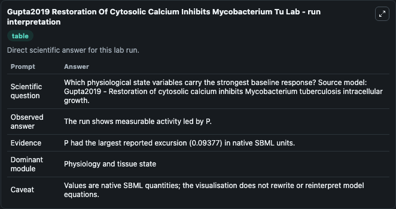
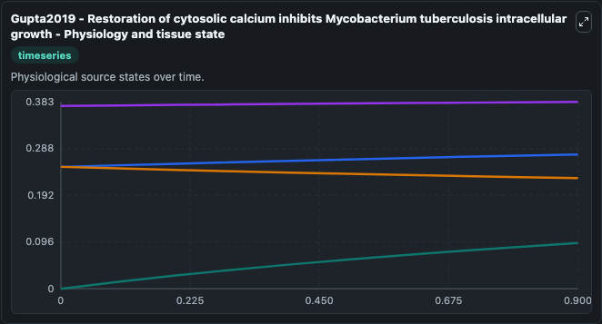
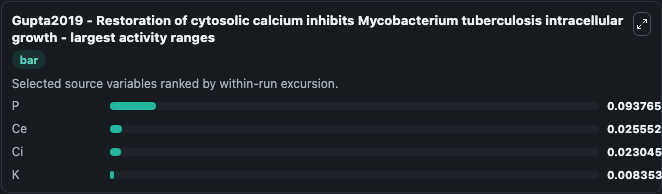
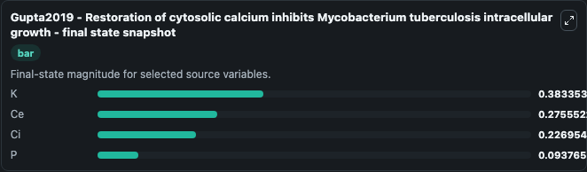
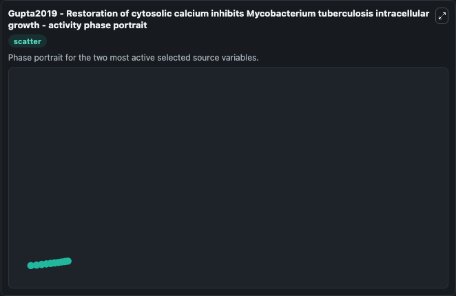

# Gupta2019 Restoration Of Cytosolic Calcium Inhibits Mycobacterium Tu

This Biosimulant lab wraps `Gupta2019 Restoration Of Cytosolic Calcium Inhibits Mycobacterium Tu` as a runnable systems biology model with a companion visualization module.
This is a four dimensionsal ordinary differential equation mathematical model that explores the contribution of PI3P during Mycobacterium tuberculosis (Mtb) phagocytosis. It can be used to explore the configured dynamics and compare scenario outcomes across configurations.

## What You'll See

The lab asks: Which physiological state variables carry the strongest baseline response? Source model: Gupta2019 - Restoration of cytosolic calcium inhibits Mycobacterium tuberculosis intracellular growth. It runs for 1.0 time units with a communication step of 0.1. The run uses the model defaults declared by the curated SBML wrapper. The generated visualizations focus on Ci, Ce, K, and P, combining trajectory, endpoint-comparison, and summary-table views from one completed dark-mode run.

In this captured run, **P** moved from 0 to 0.0938 across 1.0 simulation windows.


### Output Visualizations



*Summary table for Gupta2019 Restoration Of Cytosolic Calcium Inhibits Mycobacterium Tu, reporting the scientific question, observed answer, dominant module, and caveat.*



*Trajectories of P, Ce, Ci, and K across the 1.0 simulation. In this run **P** climbed from 0 to 0.0938 and **Ci** fell from 0.2500 to 0.2270 — the largest movements among the focused observables.*



*Largest-excursion ranking of the focused observables — the absolute movement magnitude during the run. Top 3: **P** = 0.0938, **Ce** = 0.0256, **Ci** = 0.0230, with 1 more observable below.*



*Endpoint snapshot of the focused observables — final values from the captured run. Top 3 by value: **K** = 0.3834, **Ce** = 0.2756, **Ci** = 0.2270, with 1 more observable below.*



*Visualization card from the Gupta2019 Restoration Of Cytosolic Calcium Inhibits Mycobacterium Tu dark-mode run.*


## Model Context

- Core model: `models/core`
- Visualization model: `models/visualisation`
- Standard: `other`
- Upstream source: `biomodels_ebi:MODEL1911120004`
- License: `CC0`

## Inputs

| Input | Maps To | Default | Notes |
|---|---|---|---|
| Initial Model State Ci | `systemsbiology_sbml_gupta2019_restoration_of_cytosolic_calcium_inhib_model1911120004_model.initial_model_state_ci` | | Source state initial condition exposed as a model-specific control because no explicit intervention parameter is identifiable. Maps to SBML symbol `Ci`. |
| Initial Model State Ce | `systemsbiology_sbml_gupta2019_restoration_of_cytosolic_calcium_inhib_model1911120004_model.initial_model_state_ce` | | Source state initial condition exposed as a model-specific control because no explicit intervention parameter is identifiable. Maps to SBML symbol `Ce`. |
| Initial Model State K | `systemsbiology_sbml_gupta2019_restoration_of_cytosolic_calcium_inhib_model1911120004_model.initial_model_state_k` | | Source state initial condition exposed as a model-specific control because no explicit intervention parameter is identifiable. Maps to SBML symbol `K`. |
| Initial Model State P | `systemsbiology_sbml_gupta2019_restoration_of_cytosolic_calcium_inhib_model1911120004_model.initial_model_state_p` | | Source state initial condition exposed as a model-specific control because no explicit intervention parameter is identifiable. Maps to SBML symbol `P`. |

## Outputs

| Output | Maps To | Role |
|---|---|---|
| `state` | `systemsbiology_sbml_gupta2019_restoration_of_cytosolic_calcium_inhib_model1911120004_model.state` | Available to the visualization model and downstream workflows. |
| `summary` | `systemsbiology_sbml_gupta2019_restoration_of_cytosolic_calcium_inhib_model1911120004_model.summary` | Available to the visualization model and downstream workflows. |
| `species_labels` | `systemsbiology_sbml_gupta2019_restoration_of_cytosolic_calcium_inhib_model1911120004_model.species_labels` | Available to the visualization model and downstream workflows. |
| `model_state_ci` | `systemsbiology_sbml_gupta2019_restoration_of_cytosolic_calcium_inhib_model1911120004_model.model_state_ci` | Available to the visualization model and downstream workflows. |
| `model_state_ce` | `systemsbiology_sbml_gupta2019_restoration_of_cytosolic_calcium_inhib_model1911120004_model.model_state_ce` | Available to the visualization model and downstream workflows. |
| `model_state_k` | `systemsbiology_sbml_gupta2019_restoration_of_cytosolic_calcium_inhib_model1911120004_model.model_state_k` | Available to the visualization model and downstream workflows. |
| `model_state_p` | `systemsbiology_sbml_gupta2019_restoration_of_cytosolic_calcium_inhib_model1911120004_model.model_state_p` | Available to the visualization model and downstream workflows. |

## Runtime

- Duration: `1.0`
- Communication step: `0.1`

## Running Locally

```bash
biosimulant labs serve
```
