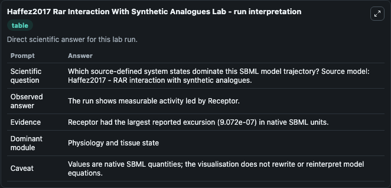
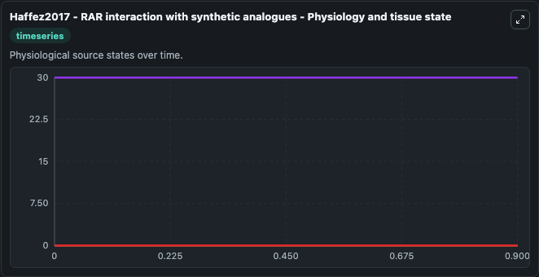
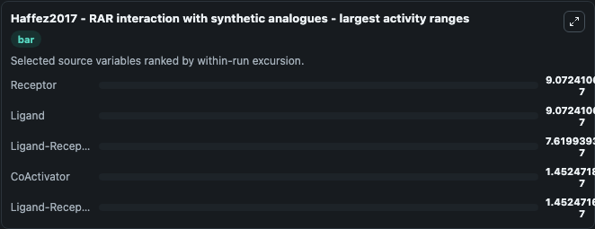
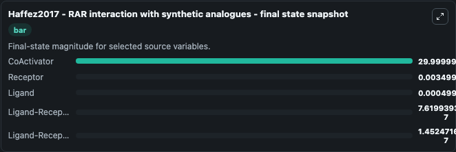
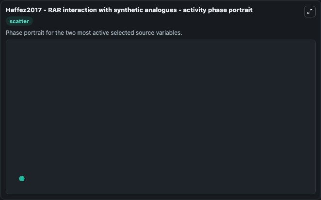

# Haffez2017 Rar Interaction With Synthetic Analogues

This Biosimulant lab wraps `Haffez2017 Rar Interaction With Synthetic Analogues` as a runnable systems biology model with a companion visualization module.
Haffez2017 - RAR interaction with syntheticanalogues This model is described in the article: The molecular basis of the interactions between synthetic retinoic acid analogues and the retinoic acid rec. It can be used to explore the configured dynamics and compare scenario outcomes across configurations.

## What You'll See

The lab asks: Which source-defined system states dominate this SBML model trajectory? Source model: Haffez2017 - RAR interaction with synthetic analogues. It runs for 1.0 time units with a communication step of 0.1. The run uses the model defaults declared by the curated SBML wrapper. The generated visualizations focus on CoActivator, Ligand-Receptor-CoActivator, Ligand-Receptor, Receptor, and Ligand, combining trajectory, endpoint-comparison, and summary-table views from one completed dark-mode run.

In this captured run, **Receptor** moved from 0.0035 to 0.0035 across 1.0 simulation windows.


### Output Visualizations



*Summary table for Haffez2017 Rar Interaction With Synthetic Analogues, reporting the scientific question, observed answer, dominant module, and caveat.*



*Trajectories of Receptor, Ligand, Ligand-Receptor, CoActivator, and Ligand-Receptor-CoActivator across the 1.0 simulation. In this run **Ligand-Receptor** climbed from 0 to 7.62e-07 and **Receptor** fell from 0.0035 to 0.0035 — the largest movements among the focused observables.*



*Largest-excursion ranking of the focused observables — the absolute movement magnitude during the run. Top 3: **Receptor** = 9.07e-07, **Ligand** = 9.07e-07, **Ligand-Receptor** = 7.62e-07, with 2 more observables below.*



*Endpoint snapshot of the focused observables — final values from the captured run. Top 3 by value: **CoActivator** = 30.000, **Receptor** = 0.0035, **Ligand** = 0.000499, with 2 more observables below.*



*Visualization card from the Haffez2017 Rar Interaction With Synthetic Analogues dark-mode run.*


## Model Context

- Core model: `models/core`
- Visualization model: `models/visualisation`
- Standard: `other`
- Upstream source: `biomodels_ebi:BIOMD0000000629`
- License: `CC0`

## Inputs

| Input | Maps To | Default | Notes |
|---|---|---|---|
| Initial Co Activator | `systemsbiology_sbml_haffez2017_rar_interaction_with_synthetic_analog_biomd0000000629_model.initial_co_activator` | | Source state initial condition exposed as a model-specific control because no explicit intervention parameter is identifiable. Maps to SBML symbol `CA`. |
| Initial Ligand Receptor Co Activator | `systemsbiology_sbml_haffez2017_rar_interaction_with_synthetic_analog_biomd0000000629_model.initial_ligand_receptor_co_activator` | | Source state initial condition exposed as a model-specific control because no explicit intervention parameter is identifiable. Maps to SBML symbol `LRCA`. |
| Initial Ligand Receptor | `systemsbiology_sbml_haffez2017_rar_interaction_with_synthetic_analog_biomd0000000629_model.initial_ligand_receptor` | | Source state initial condition exposed as a model-specific control because no explicit intervention parameter is identifiable. Maps to SBML symbol `LR`. |
| Initial Receptor | `systemsbiology_sbml_haffez2017_rar_interaction_with_synthetic_analog_biomd0000000629_model.initial_receptor` | | Source state initial condition exposed as a model-specific control because no explicit intervention parameter is identifiable. Maps to SBML symbol `R`. |
| Initial Ligand | `systemsbiology_sbml_haffez2017_rar_interaction_with_synthetic_analog_biomd0000000629_model.initial_ligand` | | Source state initial condition exposed as a model-specific control because no explicit intervention parameter is identifiable. Maps to SBML symbol `L`. |

## Outputs

| Output | Maps To | Role |
|---|---|---|
| `state` | `systemsbiology_sbml_haffez2017_rar_interaction_with_synthetic_analog_biomd0000000629_model.state` | Available to the visualization model and downstream workflows. |
| `summary` | `systemsbiology_sbml_haffez2017_rar_interaction_with_synthetic_analog_biomd0000000629_model.summary` | Available to the visualization model and downstream workflows. |
| `species_labels` | `systemsbiology_sbml_haffez2017_rar_interaction_with_synthetic_analog_biomd0000000629_model.species_labels` | Available to the visualization model and downstream workflows. |
| `co_activator` | `systemsbiology_sbml_haffez2017_rar_interaction_with_synthetic_analog_biomd0000000629_model.co_activator` | Available to the visualization model and downstream workflows. |
| `ligand_receptor_co_activator` | `systemsbiology_sbml_haffez2017_rar_interaction_with_synthetic_analog_biomd0000000629_model.ligand_receptor_co_activator` | Available to the visualization model and downstream workflows. |
| `ligand_receptor` | `systemsbiology_sbml_haffez2017_rar_interaction_with_synthetic_analog_biomd0000000629_model.ligand_receptor` | Available to the visualization model and downstream workflows. |
| `receptor` | `systemsbiology_sbml_haffez2017_rar_interaction_with_synthetic_analog_biomd0000000629_model.receptor` | Available to the visualization model and downstream workflows. |
| `ligand` | `systemsbiology_sbml_haffez2017_rar_interaction_with_synthetic_analog_biomd0000000629_model.ligand` | Available to the visualization model and downstream workflows. |

## Runtime

- Duration: `1.0`
- Communication step: `0.1`

## Running Locally

```bash
biosimulant labs serve
```
