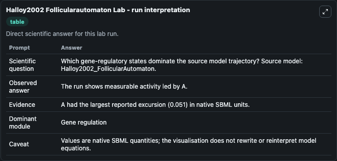
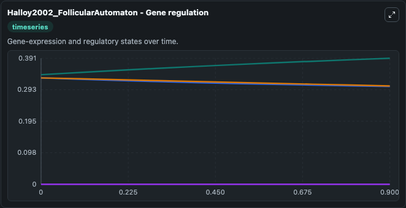
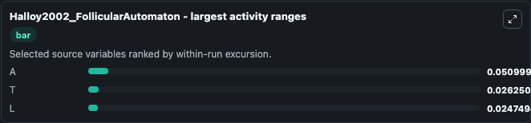
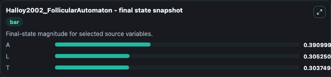
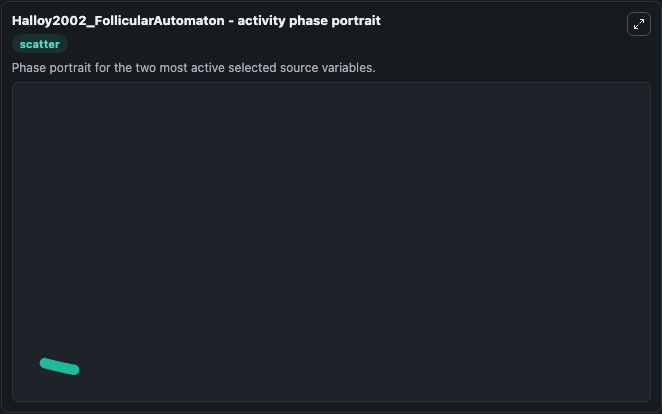

# Halloy2002 Follicularautomaton

This Biosimulant lab wraps `Halloy2002 Follicularautomaton` as a runnable systems biology model with a companion visualization module.
This a model from the article: The follicular automaton model: effect of stochasticity and of synchronizationof hair cycles. It can be used to explore the configured dynamics and compare scenario outcomes across configurations.

## What You'll See

The lab asks: Which gene-regulatory states dominate the source model trajectory? Source model: Halloy2002_FollicularAutomaton. It runs for 1.0 time units with a communication step of 0.1. The run uses the model defaults declared by the curated SBML wrapper. The generated visualizations focus on T, M, L, and A, combining trajectory, endpoint-comparison, and summary-table views from one completed dark-mode run.

In this captured run, **A** moved from 0.3400 to 0.3910 across 1.0 simulation windows.


### Output Visualizations



*Summary table for Halloy2002 Follicularautomaton, reporting the scientific question, observed answer, dominant module, and caveat.*



*Trajectories of A, T, L, and M across the 1.0 simulation. In this run **A** climbed from 0.3400 to 0.3910 and **T** fell from 0.3300 to 0.3037 — the largest movements among the focused observables.*



*Largest-excursion ranking of the focused observables — the absolute movement magnitude during the run. Top 3: **A** = 0.0510, **T** = 0.0263, **L** = 0.0247.*



*Endpoint snapshot of the focused observables — final values from the captured run. Top 3 by value: **A** = 0.3910, **L** = 0.3053, **T** = 0.3037.*



*Visualization card from the Halloy2002 Follicularautomaton dark-mode run.*


## Model Context

- Core model: `models/core`
- Visualization model: `models/visualisation`
- Standard: `other`
- Upstream source: `biomodels_ebi:MODEL1006230014`
- License: `CC0`

## Inputs

| Input | Maps To | Default | Notes |
|---|---|---|---|
| Initial Model State T | `systemsbiology_sbml_halloy2002_follicularautomaton_model1006230014_model.initial_model_state_t` | | Source state initial condition exposed as a model-specific control because no explicit intervention parameter is identifiable. Maps to SBML symbol `T`. |
| Initial Model State M | `systemsbiology_sbml_halloy2002_follicularautomaton_model1006230014_model.initial_model_state_m` | | Source state initial condition exposed as a model-specific control because no explicit intervention parameter is identifiable. Maps to SBML symbol `M`. |
| Initial Model State L | `systemsbiology_sbml_halloy2002_follicularautomaton_model1006230014_model.initial_model_state_l` | | Source state initial condition exposed as a model-specific control because no explicit intervention parameter is identifiable. Maps to SBML symbol `L`. |
| Initial Model State A | `systemsbiology_sbml_halloy2002_follicularautomaton_model1006230014_model.initial_model_state_a` | | Source state initial condition exposed as a model-specific control because no explicit intervention parameter is identifiable. Maps to SBML symbol `A`. |

## Outputs

| Output | Maps To | Role |
|---|---|---|
| `state` | `systemsbiology_sbml_halloy2002_follicularautomaton_model1006230014_model.state` | Available to the visualization model and downstream workflows. |
| `summary` | `systemsbiology_sbml_halloy2002_follicularautomaton_model1006230014_model.summary` | Available to the visualization model and downstream workflows. |
| `species_labels` | `systemsbiology_sbml_halloy2002_follicularautomaton_model1006230014_model.species_labels` | Available to the visualization model and downstream workflows. |
| `model_state_t` | `systemsbiology_sbml_halloy2002_follicularautomaton_model1006230014_model.model_state_t` | Available to the visualization model and downstream workflows. |
| `model_state_m` | `systemsbiology_sbml_halloy2002_follicularautomaton_model1006230014_model.model_state_m` | Available to the visualization model and downstream workflows. |
| `model_state_l` | `systemsbiology_sbml_halloy2002_follicularautomaton_model1006230014_model.model_state_l` | Available to the visualization model and downstream workflows. |
| `model_state_a` | `systemsbiology_sbml_halloy2002_follicularautomaton_model1006230014_model.model_state_a` | Available to the visualization model and downstream workflows. |

## Runtime

- Duration: `1.0`
- Communication step: `0.1`

## Running Locally

```bash
biosimulant labs serve
```
