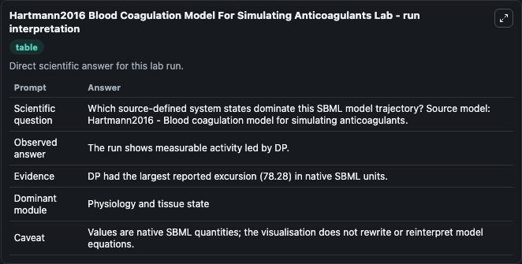
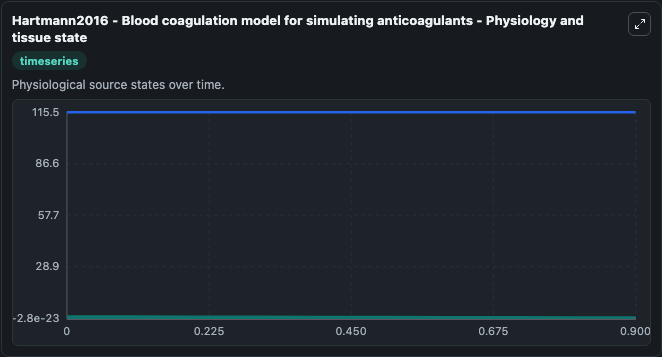
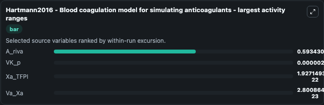
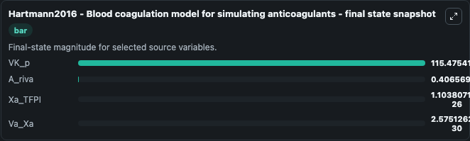
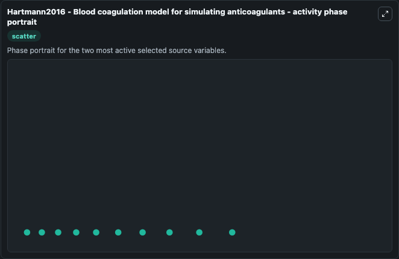

# Hartmann2016 Blood Coagulation Model For Simulating Anticoagulants

This Biosimulant lab wraps `Hartmann2016 Blood Coagulation Model For Simulating Anticoagulants` as a runnable systems biology model with a companion visualization module.
Mathematical model of blood coagulation. It can be used to explore the configured dynamics and compare scenario outcomes across configurations.

## What You'll See

The lab asks: Which source-defined system states dominate this SBML model trajectory? Source model: Hartmann2016 - Blood coagulation model for simulating anticoagulants. It runs for 1.0 time units with a communication step of 0.1. The run uses the model defaults declared by the curated SBML wrapper. The generated visualizations focus on VK_p, A_riva, Xa_TFPI, Xa_ATIII_Heparin, Va_Xa, and VIIa_TF_Xa_TFPI, combining trajectory, endpoint-comparison, and summary-table views from one completed dark-mode run.

In this captured run, **A_riva** moved from 1.000 to 0.4066 across 1.0 simulation windows.


### Output Visualizations



*Summary table for Hartmann2016 Blood Coagulation Model For Simulating Anticoagulants, reporting the scientific question, observed answer, dominant module, and caveat.*



*Trajectories of A_riva, VK_p, Xa_TFPI, Va_Xa, Xa_ATIII_Heparin, and VIIa_TF_Xa_TFPI across the 1.0 simulation. In this run **VK_p** climbed from 115.5 to 115.5 and **A_riva** fell from 1.000 to 0.4066 — the largest movements among the focused observables.*



*Largest-excursion ranking of the focused observables — the absolute movement magnitude during the run. Top 3: **A_riva** = 0.5934, **VK_p** = 2.58e-06, **Xa_TFPI** = 1.93e-22, with 1 more observable below.*



*Trajectories of A_riva, VK_p, Xa_TFPI, Va_Xa, Xa_ATIII_Heparin, and VIIa_TF_Xa_TFPI across the 1.0 simulation. In this run **VK_p** climbed from 115.5 to 115.5 and **A_riva** fell from 1.000 to 0.4066 — the largest movements among the focused observables.*



*Visualization card from the Hartmann2016 Blood Coagulation Model For Simulating Anticoagulants dark-mode run.*


## Model Context

- Core model: `models/core`
- Visualization model: `models/visualisation`
- Standard: `other`
- Upstream source: `biomodels_ebi:MODEL1807180004`
- License: `CC0`

## Inputs

| Input | Maps To | Default | Notes |
|---|---|---|---|
| Riva Daily Dose | `systemsbiology_sbml_hartmann2016_blood_coagulation_model_for_simulat_model1807180004_model.riva_daily_dose` | | Source parameter exposed because its SBML label indicates a boundary, stimulus, dose, ligand, protocol, substrate, or environmental control. Maps to SBML symbol `Riva_daily_dose`. |
| Warfarin Daily Dose | `systemsbiology_sbml_hartmann2016_blood_coagulation_model_for_simulat_model1807180004_model.warfarin_daily_dose` | | Source parameter exposed because its SBML label indicates a boundary, stimulus, dose, ligand, protocol, substrate, or environmental control. Maps to SBML symbol `warfarin_daily_dose`. |

## Outputs

| Output | Maps To | Role |
|---|---|---|
| `state` | `systemsbiology_sbml_hartmann2016_blood_coagulation_model_for_simulat_model1807180004_model.state` | Available to the visualization model and downstream workflows. |
| `summary` | `systemsbiology_sbml_hartmann2016_blood_coagulation_model_for_simulat_model1807180004_model.summary` | Available to the visualization model and downstream workflows. |
| `species_labels` | `systemsbiology_sbml_hartmann2016_blood_coagulation_model_for_simulat_model1807180004_model.species_labels` | Available to the visualization model and downstream workflows. |
| `vk_p` | `systemsbiology_sbml_hartmann2016_blood_coagulation_model_for_simulat_model1807180004_model.vk_p` | Available to the visualization model and downstream workflows. |
| `a_riva` | `systemsbiology_sbml_hartmann2016_blood_coagulation_model_for_simulat_model1807180004_model.a_riva` | Available to the visualization model and downstream workflows. |
| `xa_tfpi` | `systemsbiology_sbml_hartmann2016_blood_coagulation_model_for_simulat_model1807180004_model.xa_tfpi` | Available to the visualization model and downstream workflows. |
| `xa_atiii_heparin` | `systemsbiology_sbml_hartmann2016_blood_coagulation_model_for_simulat_model1807180004_model.xa_atiii_heparin` | Available to the visualization model and downstream workflows. |
| `va_xa` | `systemsbiology_sbml_hartmann2016_blood_coagulation_model_for_simulat_model1807180004_model.va_xa` | Available to the visualization model and downstream workflows. |
| `vi_ia_tf_xa_tfpi` | `systemsbiology_sbml_hartmann2016_blood_coagulation_model_for_simulat_model1807180004_model.vi_ia_tf_xa_tfpi` | Available to the visualization model and downstream workflows. |

## Runtime

- Duration: `1.0`
- Communication step: `0.1`

## Running Locally

```bash
biosimulant labs serve
```
