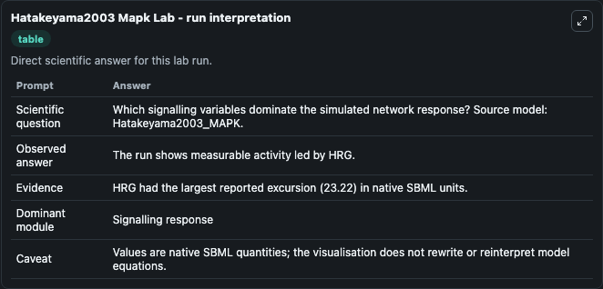
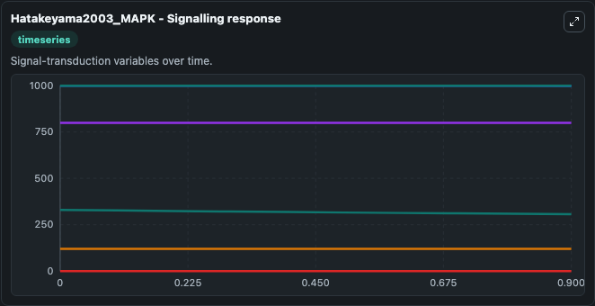
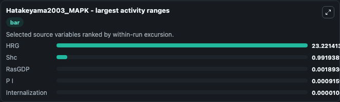
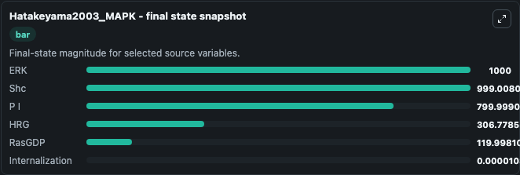
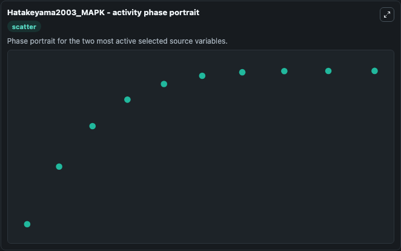

# Hatakeyama2003 Mapk

This Biosimulant lab wraps `Hatakeyama2003 Mapk` as a runnable systems biology model with a companion visualization module.
Figure4 and Figure5 can be simulated by Copasi. It can be used to explore the configured dynamics and compare scenario outcomes across configurations.

## What You'll See

The lab asks: Which signalling variables dominate the simulated network response? Source model: Hatakeyama2003_MAPK. It runs for 1.0 time units with a communication step of 0.1. The run uses the model defaults declared by the curated SBML wrapper. The generated visualizations focus on Internalization, Shc, ERK, P I, HRG, and RasGDP, combining trajectory, endpoint-comparison, and summary-table views from one completed dark-mode run.

In this captured run, **HRG** moved from 330.0 to 306.8 across 1.0 simulation windows.


### Output Visualizations



*Summary table for Hatakeyama2003 Mapk, reporting the scientific question, observed answer, dominant module, and caveat.*



*Trajectories of HRG, Shc, RasGDP, P I, Internalization, and ERK across the 1.0 simulation. In this run **Internalization** climbed from 0 to 1.03e-05 and **HRG** fell from 330.0 to 306.8 — the largest movements among the focused observables.*



*Largest-excursion ranking of the focused observables — the absolute movement magnitude during the run. Top 3: **HRG** = 23.221, **Shc** = 0.9919, **RasGDP** = 0.00189, with 2 more observables below.*



*Endpoint snapshot of the focused observables — final values from the captured run. Top 3 by value: **ERK** = 1000.0, **Shc** = 999.0, **P I** = 800.0, with 3 more observables below.*



*Visualization card from the Hatakeyama2003 Mapk dark-mode run.*


## Model Context

- Core model: `models/core`
- Visualization model: `models/visualisation`
- Standard: `other`
- Upstream source: `biomodels_ebi:BIOMD0000000146`
- License: `CC0`

## Inputs

| Input | Maps To | Default | Notes |
|---|---|---|---|
| Initial Internalization | `systemsbiology_sbml_hatakeyama2003_mapk_biomd0000000146_model.initial_internalization` | | Source state initial condition exposed as a model-specific control because no explicit intervention parameter is identifiable. Maps to SBML symbol `internalization`. |
| Initial Model State Shc | `systemsbiology_sbml_hatakeyama2003_mapk_biomd0000000146_model.initial_model_state_shc` | | Source state initial condition exposed as a model-specific control because no explicit intervention parameter is identifiable. Maps to SBML symbol `Shc`. |
| Initial Model State ERK | `systemsbiology_sbml_hatakeyama2003_mapk_biomd0000000146_model.initial_model_state_erk` | | Source state initial condition exposed as a model-specific control because no explicit intervention parameter is identifiable. Maps to SBML symbol `ERK`. |
| Initial Model State P I | `systemsbiology_sbml_hatakeyama2003_mapk_biomd0000000146_model.initial_model_state_p_i` | | Source state initial condition exposed as a model-specific control because no explicit intervention parameter is identifiable. Maps to SBML symbol `P_I`. |
| Initial Model State Hrg | `systemsbiology_sbml_hatakeyama2003_mapk_biomd0000000146_model.initial_model_state_hrg` | | Source state initial condition exposed as a model-specific control because no explicit intervention parameter is identifiable. Maps to SBML symbol `HRG`. |
| Initial RAS Gdp | `systemsbiology_sbml_hatakeyama2003_mapk_biomd0000000146_model.initial_ras_gdp` | | Source state initial condition exposed as a model-specific control because no explicit intervention parameter is identifiable. Maps to SBML symbol `RasGDP`. |

## Outputs

| Output | Maps To | Role |
|---|---|---|
| `state` | `systemsbiology_sbml_hatakeyama2003_mapk_biomd0000000146_model.state` | Available to the visualization model and downstream workflows. |
| `summary` | `systemsbiology_sbml_hatakeyama2003_mapk_biomd0000000146_model.summary` | Available to the visualization model and downstream workflows. |
| `species_labels` | `systemsbiology_sbml_hatakeyama2003_mapk_biomd0000000146_model.species_labels` | Available to the visualization model and downstream workflows. |
| `internalization` | `systemsbiology_sbml_hatakeyama2003_mapk_biomd0000000146_model.internalization` | Available to the visualization model and downstream workflows. |
| `shc` | `systemsbiology_sbml_hatakeyama2003_mapk_biomd0000000146_model.shc` | Available to the visualization model and downstream workflows. |
| `erk` | `systemsbiology_sbml_hatakeyama2003_mapk_biomd0000000146_model.erk` | Available to the visualization model and downstream workflows. |
| `p_i` | `systemsbiology_sbml_hatakeyama2003_mapk_biomd0000000146_model.p_i` | Available to the visualization model and downstream workflows. |
| `hrg` | `systemsbiology_sbml_hatakeyama2003_mapk_biomd0000000146_model.hrg` | Available to the visualization model and downstream workflows. |
| `ras_gdp` | `systemsbiology_sbml_hatakeyama2003_mapk_biomd0000000146_model.ras_gdp` | Available to the visualization model and downstream workflows. |

## Runtime

- Duration: `1.0`
- Communication step: `0.1`

## Running Locally

```bash
biosimulant labs serve
```
