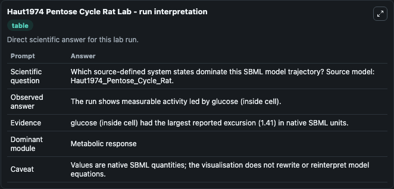
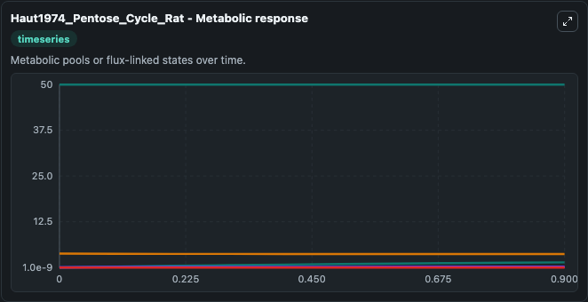
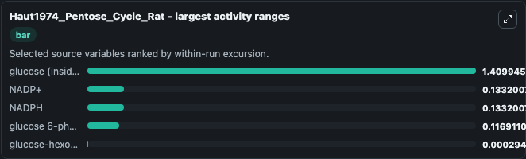
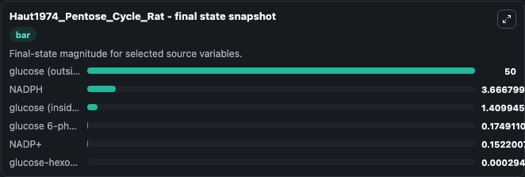
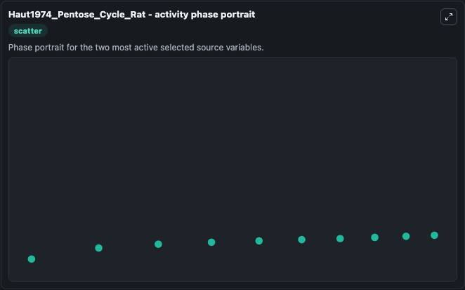

# Haut1974 Pentose Cycle Rat

This Biosimulant lab wraps `Haut1974 Pentose Cycle Rat` as a runnable systems biology model with a companion visualization module.
This is the Unlabelled model as described in: Simulation of the Pentose Cycle in Lactating Rat Mammary Gland Haut MJ , London JW , Garfinkel D Biochem J. It can be used to explore the configured dynamics and compare scenario outcomes across configurations.

## What You'll See

The lab asks: Which source-defined system states dominate this SBML model trajectory? Source model: Haut1974_Pentose_Cycle_Rat. It runs for 1.0 time units with a communication step of 0.1. The run uses the model defaults declared by the curated SBML wrapper. The generated visualizations focus on glucose (outside cell), glucose 6-phosphate, NADP+, glucose-hexokinase, glucose (inside cell), and NADPH, combining trajectory, endpoint-comparison, and summary-table views from one completed dark-mode run.

In this captured run, **glucose (inside cell)** moved from 1e-09 to 1.410 across 1.0 simulation windows.


### Output Visualizations



*Summary table for Haut1974 Pentose Cycle Rat, reporting the scientific question, observed answer, dominant module, and caveat.*



*Trajectories of glucose (inside cell), NADP+, NADPH, glucose 6-phosphate, glucose-hexokinase, and glucose (outside cell) across the 1.0 simulation. In this run **glucose (inside cell)** climbed from 1e-09 to 1.410 and **NADPH** fell from 3.800 to 3.667 — the largest movements among the focused observables.*



*Largest-excursion ranking of the focused observables — the absolute movement magnitude during the run. Top 3: **glucose (inside cell)** = 1.410, **NADP+** = 0.1332, **NADPH** = 0.1332, with 2 more observables below.*



*Endpoint snapshot of the focused observables — final values from the captured run. Top 3 by value: **glucose (outside cell)** = 50.000, **NADPH** = 3.667, **glucose (inside cell)** = 1.410, with 3 more observables below.*



*Visualization card from the Haut1974 Pentose Cycle Rat dark-mode run.*


## Model Context

- Core model: `models/core`
- Visualization model: `models/visualisation`
- Standard: `other`
- Upstream source: `biomodels_ebi:MODEL1004070000`
- License: `CC0`

## Inputs

| Input | Maps To | Default | Notes |
|---|---|---|---|
| Initial Glucose Outside Cell | `systemsbiology_sbml_haut1974_pentose_cycle_rat_model1004070000_model.initial_glucose_outside_cell` | | Source state initial condition exposed as a model-specific control because no explicit intervention parameter is identifiable. Maps to SBML symbol `glucose_outside_cell`. |
| Initial Glucose 6 Phosphate | `systemsbiology_sbml_haut1974_pentose_cycle_rat_model1004070000_model.initial_glucose_6_phosphate` | | Source state initial condition exposed as a model-specific control because no explicit intervention parameter is identifiable. Maps to SBML symbol `glucose_6_phosphate`. |
| Initial Nadp | `systemsbiology_sbml_haut1974_pentose_cycle_rat_model1004070000_model.initial_nadp` | | Source state initial condition exposed as a model-specific control because no explicit intervention parameter is identifiable. Maps to SBML symbol `NADP`. |
| Initial Glucose Hexokinase | `systemsbiology_sbml_haut1974_pentose_cycle_rat_model1004070000_model.initial_glucose_hexokinase` | | Source state initial condition exposed as a model-specific control because no explicit intervention parameter is identifiable. Maps to SBML symbol `glucose_hexokinase`. |
| Initial Glucose Inside Cell | `systemsbiology_sbml_haut1974_pentose_cycle_rat_model1004070000_model.initial_glucose_inside_cell` | | Source state initial condition exposed as a model-specific control because no explicit intervention parameter is identifiable. Maps to SBML symbol `glucose_inside_cell`. |
| Initial Nadph | `systemsbiology_sbml_haut1974_pentose_cycle_rat_model1004070000_model.initial_nadph` | | Source state initial condition exposed as a model-specific control because no explicit intervention parameter is identifiable. Maps to SBML symbol `NADPH`. |

## Outputs

| Output | Maps To | Role |
|---|---|---|
| `state` | `systemsbiology_sbml_haut1974_pentose_cycle_rat_model1004070000_model.state` | Available to the visualization model and downstream workflows. |
| `summary` | `systemsbiology_sbml_haut1974_pentose_cycle_rat_model1004070000_model.summary` | Available to the visualization model and downstream workflows. |
| `species_labels` | `systemsbiology_sbml_haut1974_pentose_cycle_rat_model1004070000_model.species_labels` | Available to the visualization model and downstream workflows. |
| `glucose_outside_cell` | `systemsbiology_sbml_haut1974_pentose_cycle_rat_model1004070000_model.glucose_outside_cell` | Available to the visualization model and downstream workflows. |
| `glucose_6_phosphate` | `systemsbiology_sbml_haut1974_pentose_cycle_rat_model1004070000_model.glucose_6_phosphate` | Available to the visualization model and downstream workflows. |
| `nadp` | `systemsbiology_sbml_haut1974_pentose_cycle_rat_model1004070000_model.nadp` | Available to the visualization model and downstream workflows. |
| `glucose_hexokinase` | `systemsbiology_sbml_haut1974_pentose_cycle_rat_model1004070000_model.glucose_hexokinase` | Available to the visualization model and downstream workflows. |
| `glucose_inside_cell` | `systemsbiology_sbml_haut1974_pentose_cycle_rat_model1004070000_model.glucose_inside_cell` | Available to the visualization model and downstream workflows. |
| `nadph` | `systemsbiology_sbml_haut1974_pentose_cycle_rat_model1004070000_model.nadph` | Available to the visualization model and downstream workflows. |

## Runtime

- Duration: `1.0`
- Communication step: `0.1`

## Running Locally

```bash
biosimulant labs serve
```
